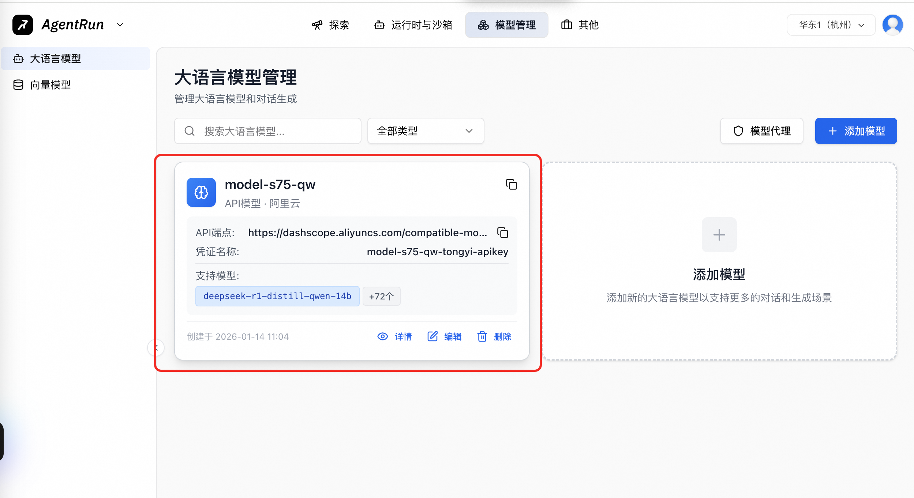
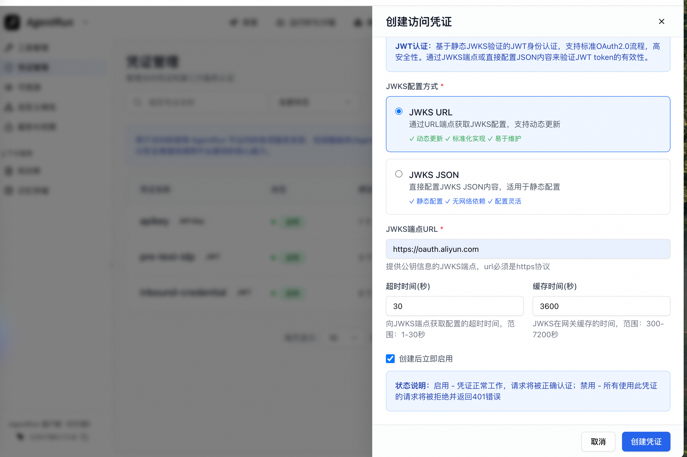
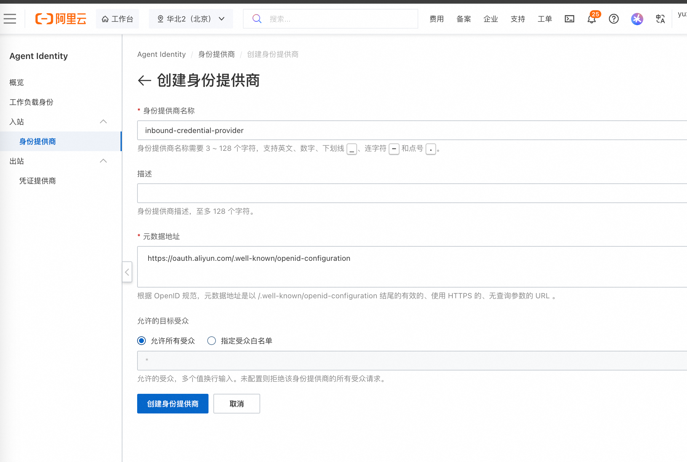
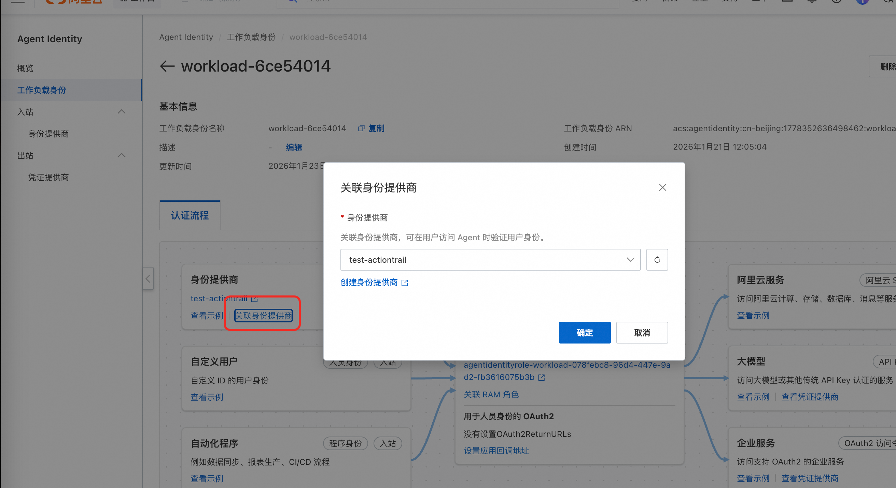
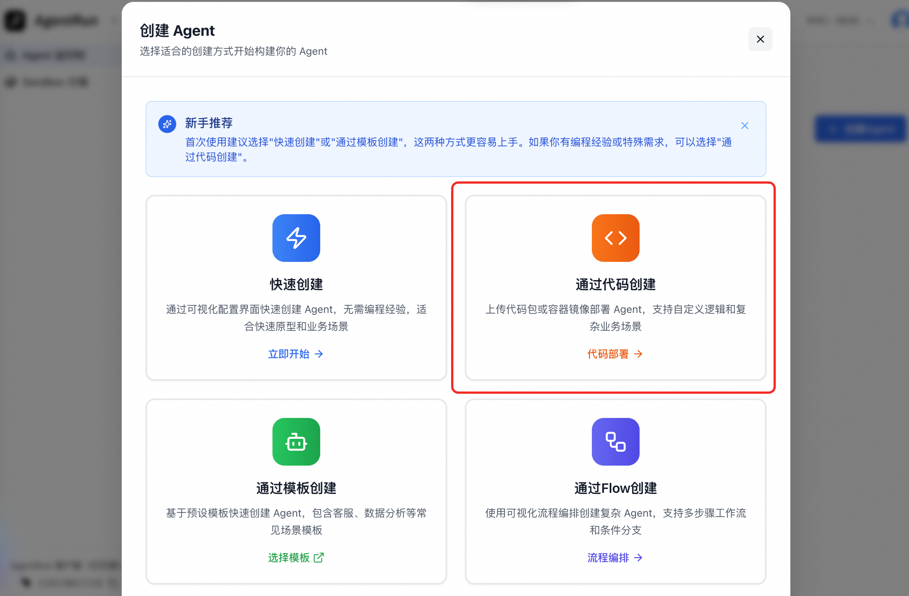
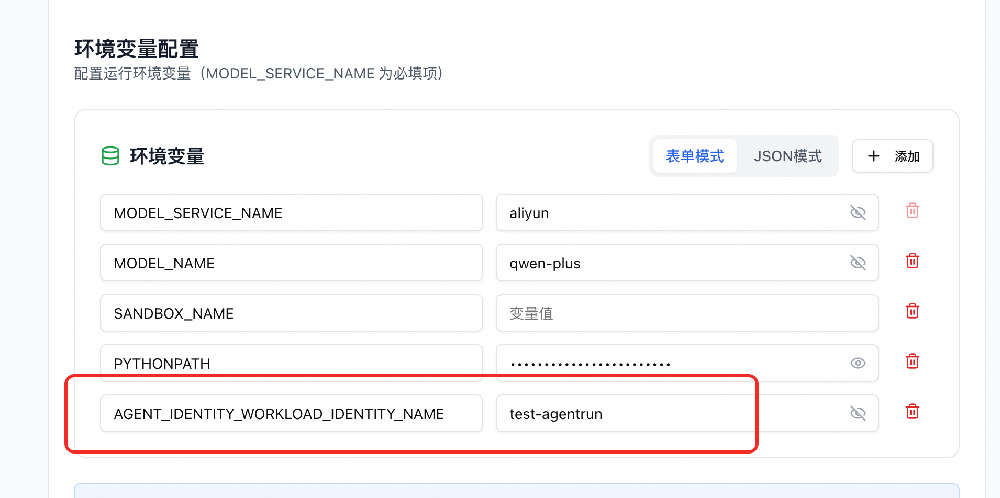
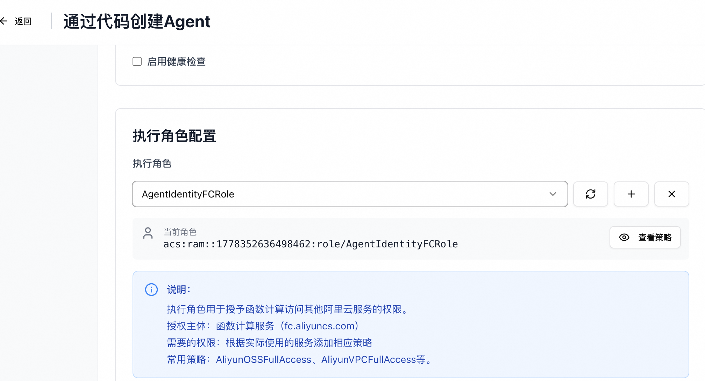

# Agent Identity Python SDK Sample

Example of outbound credential management for AgentRun based on Agent Identity Python SDK.

## 🚀 Overview

This sample demonstrates how to integrate Agent Identity SDK with Alibaba Cloud AgentRun, implement tool calls based on OAuth2 authentication, and obtain temporary Alibaba Cloud STS credentials through Agent identity to call Alibaba Cloud services.

## ⚙️ Prerequisites

### System Requirements
- Python ≥ 3.10
- pip package manager

### Resource Preparation

#### 1. OAuth2 Identity Provider Endpoint
Prepare an identity provider (IdP) that supports the OAuth2 protocol as inbound credential issuer, such as GitHub, Google, Alibaba Cloud, etc. It is recommended to use Alibaba Cloud OAuth2 application.

Obtain the OAuth2 service endpoint of the identity provider, for example, the Alibaba Cloud OAuth2 service endpoint is `https://oauth.aliyun.com`. The subsequent steps require:
1. Register this OAuth2 service endpoint as AgentRun's inbound credential.
2. Use the JWT (JSON Web Token) issuing capability of this OAuth2 service endpoint to issue tokens for end users to access the Agent.

#### 2. Create AgentRun Language Model
Use your model service provider information, such as Alibaba Cloud, etc., to create a large language model in the AgentRun console.



#### 3. Create AgentRun Access Credential
Use your OAuth2 endpoint, for example `https://oauth.aliyun.com`, to create an Agent access credential. This identity provider needs to support issuing valid, verifiable JWT (JSON Web Token) as inbound credentials for the Agent.

In the AgentRun console, go to: Others --> Credential Management, use your OAuth2 URL endpoint to create an inbound credential with authentication type as `JWT (JSON Web Token)`. You can refer to [AgentRun Product Documentation](https://help.aliyun.com/zh/functioncompute/fc/voucher-management?spm=a2c4g.11186623.help-menu-2508973.d_3_7.73ee14eex9CNet#9a2fdcfcfatut).
> Note: The address to configure is not the .well-known/openid-configuration address, but the address corresponding to jwks_uri in it.



#### 4. Create Agent Identity

First install agent-identity-cli:

```bash
pip install agent-identity-cli
```

Inject Alibaba Cloud Access Key information into environment variables:
```bash
export ALIBABA_CLOUD_ACCESS_KEY_ID=<your-access-key-id>
export ALIBABA_CLOUD_ACCESS_KEY_SECRET=<your-access-key-secret>
```
Note: Please ensure that the Access Key executing the command has the following permissions:
```json
{
  "Version": "1",
  "Statement": [
    {
      "Effect": "Allow",
      "Action": "agentidentity:CreateWorkloadIdentity",
      "Resource": "*"
    },
    {
      "Effect": "Allow",
      "Action": [
        "ram:CreateRole",
        "ram:AttachPolicyToRole",
        "ram:CreatePolicy"
      ],
      "Resource": "*"
    }
  ]
}
```

Run Agent Identity CLI to create workload identity and role:

```bash
agent-identity-cli create-workload-identity --workload-identity-name <your-workload-identity-name>
```

The CLI will **create the following workload identity and role**:
   - Workload identity name: `<your-workload-identity-name>`
   - Role name: `AgentIdentityRole-${workloadIdentityName}`
   - Role trust policy: Allow assume role requests from this workload identity
   - Role permission policy: Allow the role to call Agent Identity data plane APIs

Go to Agent Identity console and create an inbound identity provider:


Go to the workload identity page and associate the workload identity with the created inbound identity provider:


## 📦 Installation and Deployment to AgentRun

### 1. Clone Repository
```bash
git clone https://github.com/aliyun/agent-identity-dev-kit
cd agent_identity_python_samples/agentrun-langchain_sample
```

### 2. Install Dependencies Locally
```bash
pip install -r requirements.txt -t ./python
```

Note: Please ensure that the environment where you execute the installation command is consistent with the AgentRun deployment environment, including operating system and Python version.

### 3. Package as zip
Package the current directory as a zip file for creating an agent via zip package:
```bash
zip -r agentrun-langchain_sample.zip .
```

### 4. Create Agent
Go to AgentRun console and create an Agent through code:


When setting environment variables, add the following environment variables:
```bash
export AGENT_IDENTITY_WORKLOAD_IDENTITY_NAME=<your-workload-identity-name>
```
Where `MODEL_SERVICE_NAME` is the model service name specified when creating the AgentRun language model, for example in this sample the name is: `model-s75-qw`, and `MODEL_NAME` is the specific model name, for example in this sample the name is: `qwen-plus`.


When configuring the instance role, ensure the role permission policy includes `AgentIdentityFullAccess`:


Configure inbound access credentials and select the inbound access credential created in the resource preparation.

Then click Deploy to complete the Agent deployment.

### Invocation

You can invoke via curl command:
```bash
curl -N \
  -X POST "https://<agent-endpoint>/openai/v1/chat/completions?sessionId=<your-session-id>" \
  -H "Content-Type: application/json" \
  -H "Authorization: Bearer <json-web-token>" \
  -d '{
    "messages": [
      {
        "role": "user",
        "content": [
          { "type": "text", "text": "Help me write 'Helloworld' to DingTalk document, document ID: 9bN7RYPWdM***********", "user_id": "seeq" }
        ]
      }
    ],
    "stream":true
  }'


```

`<your-session-id>` is the session ID, which can be customized.
`<json-web-token>` is the user JWT obtained from the OAuth2 identity provider. For example, if configured as Alibaba Cloud OAuth2 service, you can refer to [Alibaba Cloud Official Documentation](https://help.aliyun.com/zh/ram/access-alibaba-cloud-apis-from-a-web-application?spm=a2c4g.11186623.help-menu-28625.d_4_1_0.29707ec3U1MC9m#info-o5u-utp-d6l) to obtain the user id_token (JWT).
`<agent-endpoint>` is the Agent access endpoint deployed by AgentRun, which can be viewed in the AgentRun console by entering the Agent details page.

When accessing third-party services, such as accessing DingTalk documents in this example, you need to pre-configure the DingTalk application access. Specific configuration can refer to the document: [Secure Access to DingTalk in Agent](https://help.aliyun.com/zh/agentidentity/secure-access-to-dingtalk-in-agent).

The authorization URL for accessing DingTalk needs to be manually entered into the browser and accessed for authorization. Authorization response reference:
```bash
data: {"id": "chatcmpl-74b9c01d5100", "object": "chat.completion.chunk", "created": 1769765835, "model": "agentrun", "choices": [{"index": 0, "delta": {"role": "assistant", "content": "Please click the link to authorize Write to DingTalk document: https://agentidentitydata.cn-beijing.aliyuncs.com/oauth2/authorize?request_uri=urn:ietf:params:oauth:request_uri_parameter \n\n"}, "finish_reason": null}]}
```

After authorization is completed, the default redirect local application address. In this example, the application address is `http://localhost:8090/callback`, which can be replaced with the Endpoint through the environment variable `APP_REDIRECT_URI`, for example:
```bash
export APP_REDIRECT_URI=http://localhost:8090
```
> Note: The local application address needs to be manually configured in the application callback address of WorkloadIdentity. Refer to the section "Setting Application Callback Address for Workload Identity" in the [Workload Identity Management](https://help.aliyun.com/zh/agentidentity/workload-identity-management) documentation.

After the redirect is completed, get the `session_uir` parameter from the callback link, and actively call `CompleteResourceTokenAuth` to complete the authorization process. Call reference SDK `IdentityClient.confirm_user_auth` method.

## 🤝 Support

For questions or inquiries about Agent Identity SDK:
- Refer to [Official Documentation](https://help.aliyun.com/product/agent-identity)
- Contact Alibaba Cloud support
- Submit an issue in the repository

---