# AI Gateway MCP 鉴权与凭据注入 Sample

一个端到端示例，演示基于最新 AI 网关插件（AgentIdentity WASM 插件）的 **AI 网关 MCP 鉴权与凭据注入**能力：用户通过 OIDC 登录，经由 AI 网关托管的 MCP Server 与订单服务对话，网关插件验证 Workload Access Token、执行 Cedar 策略鉴权，并在转发请求时透明地注入下游 OAuth2 凭据。

> 📖 完整的一步步部署指南请参阅 [DEPLOY_GUIDE.md](./DEPLOY_GUIDE.md)。

## 🚀 Overview（概述）

本示例基于 Agent Identity 服务与阿里云 AI 网关（APIG），演示端到端的**网关侧凭据注入**流程：

1. 终端用户通过 **OIDC Authorization Code + PKCE** 登录（经由 Agent Identity 用户池）获取 ID Token。
2. Chatbot 通过 Agent Identity SDK 用 ID Token 换取 **Workload Access Token (WAT)**。
3. Chatbot 以 `Authorization: Bearer <WAT>` 连接 **AI 网关托管的 MCP Server**。
4. 网关上的 **AgentIdentity WASM 插件** 验证 WAT、执行 **Cedar 策略鉴权**，并进行**凭据注入** —— 从 Agent Identity 获取下游 OAuth2 Token（`USER_FEDERATION` 流程），以 `Authorization: Bearer <下游Token>` 注入到转发请求中。
5. 请求被转发到部署在 ECS 上的上游**订单服务**（内置 OAuth2 端点的 FastAPI 服务）；鉴权拒绝则返回 `403`。

核心价值：**Chatbot 全程不接触、不持有下游服务凭据**。所有下游 OAuth2 Token 的获取与注入都在网关插件内完成，并由 Cedar 策略管控。

## 🏗️ Architecture（架构）

```
┌─────────┐     ┌─────────────────────────┐     ┌──────────────────┐
│ Chatbot │────>│  AI 网关 (APIG)         │────>│  ECS 订单服务     │
│ (本地)  │     │       (VPC 内)          │     │ (order_service/  │
│         │     │                         │     │  FastAPI)        │
│  OIDC   │     │  AgentIdentity WASM 插件│     │                  │
│  登录   │     │  (认证 + Cedar 鉴权 +   │     │  ├─ OAuth2 端点  │
│         │     │   凭据注入)             │     │  └─ 订单 CRUD    │
└─────────┘     └─────────────────────────┘     └──────────────────┘
                          │
                          ▼
                ┌──────────────────┐
                │  Agent Identity  │
                │ (用户池 + 策略集) │
                └──────────────────┘
```

**请求流程（5 步）：**

1. 用户通过 OIDC 登录获取 ID Token。
2. Chatbot 用 ID Token 换取 Workload Access Token (WAT)。
3. Chatbot 以 `Authorization: Bearer <WAT>` 请求 AI 网关。
4. 网关上的 AgentIdentity WASM 插件：
   - 验证 WAT（身份认证）。
   - 基于绑定到网关的策略集执行 Cedar 策略鉴权；未授权的工具也会从 `tools/list` 响应中被过滤掉。
   - **凭据注入**：从 Agent Identity 获取下游 OAuth2 Token（使用 `USER_FEDERATION` 类型的 OAuth2 凭据提供商），并注入到转发请求头中。
5. 鉴权通过则转发到 ECS 上的订单服务；拒绝则返回 `403`。

**凭据注入原理：**

插件配置了在 Agent Identity 中创建的 OAuth2 凭据提供商 ARN（授权类型 `USER_FEDERATION`）。每次鉴权通过的请求，插件会请求 Agent Identity 为联合用户身份签发下游 OAuth2 Token，并以 `{injectHeaderPrefix} {token}` 的形式注入到上游请求的 `{injectHeaderName}` 头中（默认即 `Authorization: Bearer <token>`）。下游服务像校验普通 OAuth2 Bearer Token 一样校验该 Token。

## ⚙️ Prerequisites（前置条件）

| 条件 | 说明 |
|------|------|
| Python 3.11+ | Chatbot 运行环境 |
| 阿里云账号 | 开通 Agent Identity 和 AI 网关（APIG）服务 |
| 阿里云 VPC | 一个 VPC（推荐 `cn-beijing`），用于部署 AI 网关实例 |
| 阿里云 ECS | 一台带公网 IP 的 ECS 实例（推荐 Ubuntu 24.04），用于部署订单服务 |
| DashScope API Key | 从[百炼控制台](https://bailian.console.aliyun.com/?tab=model#/api-key)获取，或使用任意 OpenAI 兼容 LLM 端点 |
| RAM 权限 | 为 Chatbot 使用的 RAM 身份附加 `AliyunAgentIdentityFullAccess` 权限 |

## 📦 Installation（安装）

### 1. 克隆仓库

```bash
git clone https://github.com/aliyun/agent-identity-dev-kit
cd agent_identity_python_samples/ai-gateway-mcp-auth-credential-injection_sample
```

### 2. 安装依赖

```bash
pip install -r requirements.txt
```

### 3. 配置环境变量

```bash
cp .env.example .env
```

在 `.env` 中填入你的实际值：

| 变量 | 来源 | 说明 |
|------|------|------|
| `OIDC_DISCOVERY_URL` | Agent Identity 控制台 → 用户池 | 用户池的 OIDC 发现文档地址 |
| `OIDC_CLIENT_ID` | Agent Identity 控制台 → 客户端管理 | 用户池客户端的 Client ID |
| `OIDC_CLIENT_SECRET` | Agent Identity 控制台 → 客户端密钥 | 为客户端创建的密钥 |
| `AGENT_IDENTITY_WORKLOAD_IDENTITY_NAME` | Agent Identity 控制台 → Workload Identity | 在 Agent Identity 控制台创建的 Workload Identity 名称，用于以 ID Token 换取 WAT |
| `LLM_API_KEY` | [百炼控制台](https://bailian.console.aliyun.com) | DashScope API Key |
| `LLM_BASE_URL` | 百炼控制台 | OpenAI 兼容端点，如 `https://dashscope.aliyuncs.com/compatible-mode/v1` |
| `MCP_SERVER_URL` | AI 网关控制台 → MCP 管理 | MCP 服务接入地址，如 `http://{网关入口地址}/mcp-servers/test-order-agent-identity` |
| `AGENT_IDENTITY_REGION_ID` | —（可选，默认 `cn-beijing`） | Agent Identity Region |
| `LLM_MODEL` | —（可选，默认 `qwen-max`） | LLM 模型名称 |

## 🔧 Resource Setup（资源配置）

所有云资源均在控制台中手工配置。带截图的详细步骤请参阅 [DEPLOY_GUIDE.md](./DEPLOY_GUIDE.md)。**建议先通读 [DEPLOY_GUIDE.md §十 Troubleshooting](./DEPLOY_GUIDE.md)**，其中汇总了全链路的全部已知坑位。预计耗时 2～4 小时，部分步骤有严格顺序依赖（尤其步骤三与步骤四之间的"先占位、后回填"）。步骤概览：

### 步骤一 — 部署订单服务（`order_service/`）

若还没有 ECS，先创建一台（Ubuntu 24.04、与后续 AI 网关同 VPC、带公网 IP、ESSD 系统盘），并在安全组放行 TCP **22** 与 **8001**（见 DEPLOY_GUIDE §1.1）。然后将 `order_service/`（内置 OAuth2 端点的 FastAPI 订单 CRUD 服务，仅用于测试）部署到 ECS，以端口 `8001` 启动（nohup 命令末尾加 `</dev/null`，避免 SSH 会话挂起），并将 `OAUTH_BASE_URL` 指向 ECS 公网地址。详见 [DEPLOY_GUIDE.md §一](./DEPLOY_GUIDE.md)；在 ECS 上执行 `order_service/test_oauth.sh` 可验证完整 OAuth 流程。

### 步骤二 — Agent Identity 入站配置

创建用户池（`mcp-chatbot-demo`）与 OIDC 客户端（`mcp-chatbot`，回调地址 `http://localhost:18080/callback`），创建客户端密钥，并配置登录方式。**阻断级坑位**：新用户池默认 `EnablePasswordLogin=false`，需通过 SDK `UpdateLoginPreference` 启用密码登录（aliyun CLI force 模式会静默忽略嵌套参数），否则 OIDC 登录报 `NO_LOGIN_METHOD_ENABLED`。然后创建测试用户、入站 OIDC 身份提供商（Discovery URL = 用户池 discovery，AllowedAudience = 客户端 ID）、RAM 角色（信任 `workload.agentidentity.aliyuncs.com` + WI ARN 条件）与 Workload Identity。

> 注意：推荐创建 Workload Identity 时**关闭 session binding（`SessionBindingEnabled=false`）**，此时插件无需配置 `oauthReturnURL`、也无需配置回调地址白名单（AllowedResourceOAuth2ReturnURLs）；仅当开启 session binding 时，才需在**允许 OAuth2 回调地址白名单**中包含插件配置中的 `oauthReturnURL`（见步骤六）。Workload Identity 绑定的 **RAM 角色**需具备**策略评估权限**（`agentidentitydata:EvaluatePolicy`，如 `AliyunAgentIdentityDataFullAccess`）**与凭据获取权限**（`agentidentitydata:GetCredential`），否则 `tools/list` 正常但所有 `tools/call` 返回 403（reasons 为空）。另：策略集建议通过控制台绑定网关（控制台会自动创建带 TLS 的数据面 service，CLI/API 路径需手动在控制台开启 TLS，否则报 `InvalidProtocol.NeedSsl`）。注意 Agent Identity 的 CLI 产品名为 **`agentidentity`**（API 版本 `2025-09-01`），而非 `agentidentitycontrol`。详见 [DEPLOY_GUIDE.md §二](./DEPLOY_GUIDE.md)。

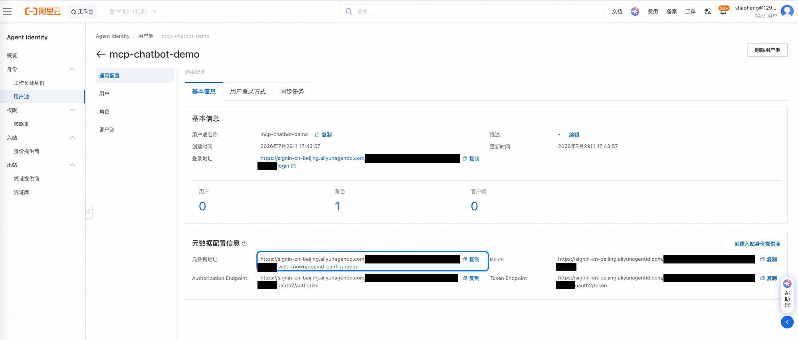
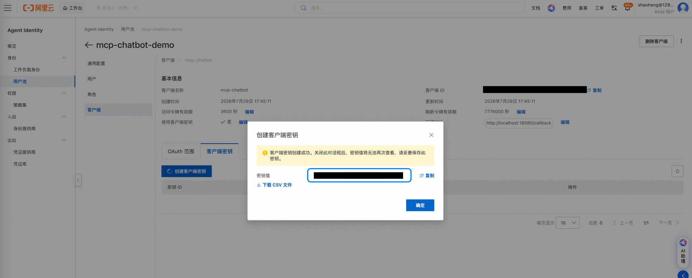
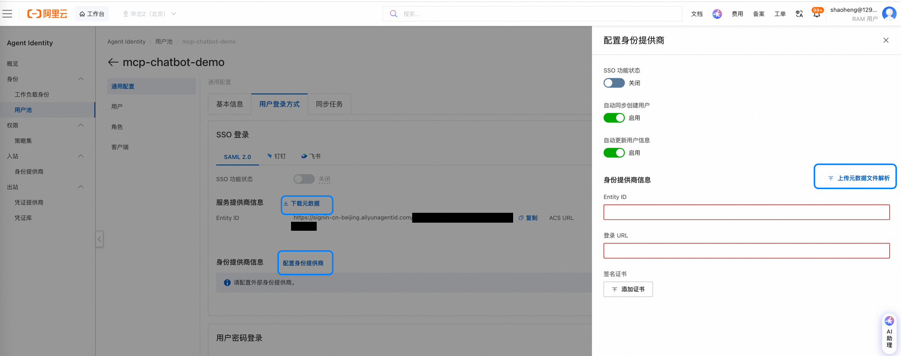

### 步骤三 — Agent Identity 出站 OAuth2 凭据提供商

创建 OAuth2 凭据提供商（名称 `mcp-order-oauth2`，授权类型 `USER_FEDERATION`），其客户端 ID/密钥与令牌端点指向订单服务的 OAuth2 端点，并记录其 ARN。注意：颁发者/授权/令牌端点必须能被 **Agent Identity 数据面**访问，数据面无法直连 ECS 公网 IP（报 `InvalidOAuthDiscoveryURL: Unreachable`），须经 AI 网关透传。**顺序说明**：此时网关尚未创建——先用 ECS 直连地址（`http://<ECS公网IP>:8001`）占位创建 provider，待网关与 OAuth 透传路由（步骤四）就绪后，再将 provider 的 Issuer/DiscoveryURL/各端点**回填**为网关入口域名，并以同一 `OAUTH_BASE_URL` 重启订单服务。详见 [DEPLOY_GUIDE.md §三](./DEPLOY_GUIDE.md)。

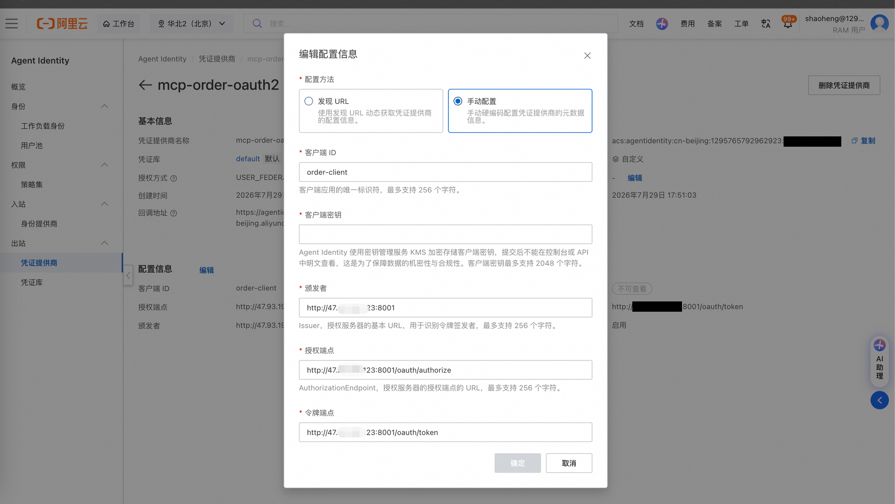

### 步骤四 — AI 网关配置（NAT/EIP、后端服务、MCP 托管、工具 YAML、OAuth 透传）

在 VPC 内创建 AI 网关实例，通过 NAT 网关 + EIP + SNAT 条目开通公网访问，创建指向 ECS **私网 IP** 端口 `8001` 的后端服务（网关无法连通 ECS 公网 IP；`IP:端口` 形式的地址需选 IP 地址/VIP 类型服务来源），在其上创建 HTTP 转 MCP 服务（随后**部署**使其生效并生成入口域名），编辑 MCP 工具元数据 YAML（工具：`createOrder`、`deleteOrder`、`getOrder`、`listOrders`），用 curl 验证连通性，并创建步骤三回填所需的 `/.well-known`、`/oauth` 透传路由。详见 [DEPLOY_GUIDE.md §四](./DEPLOY_GUIDE.md)。

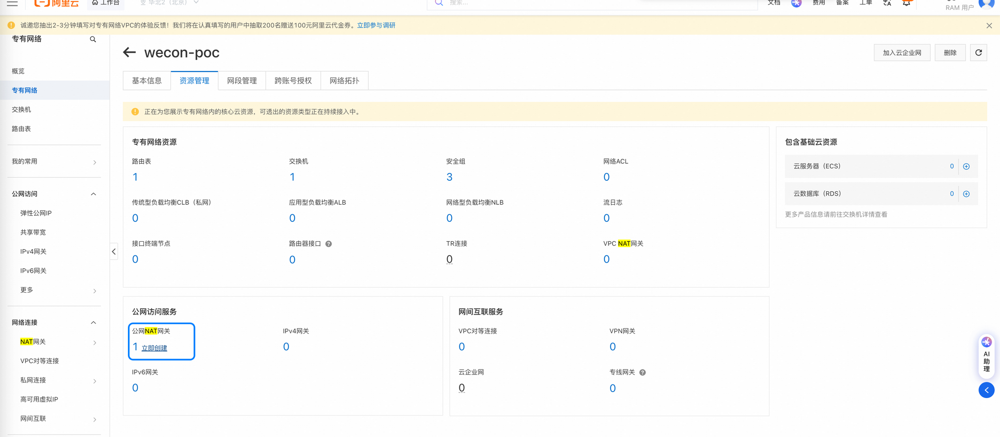
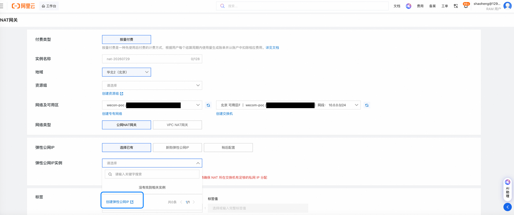
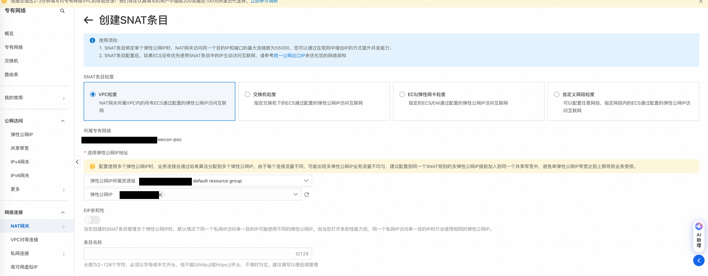
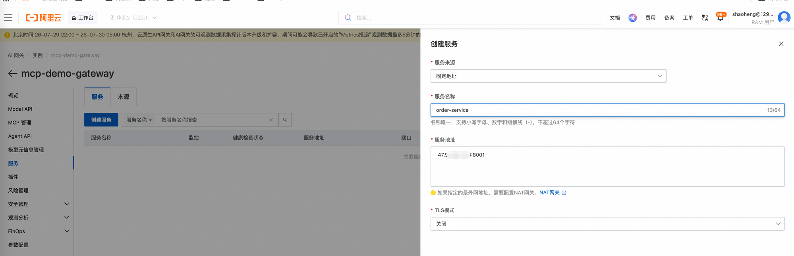
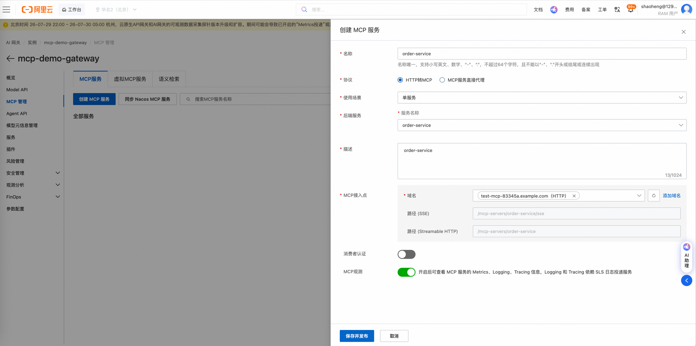
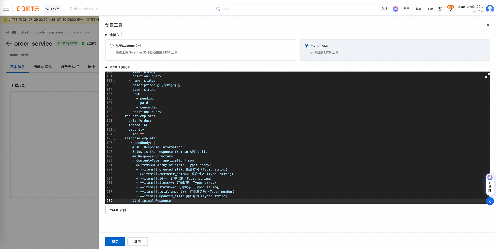

### 步骤五 — 策略集绑定网关

在 Agent Identity 中创建策略集（`mcp-gateway-policies`）并绑定到 AI 网关实例（`AIGateway::Gateway`）。控制台绑定会自动创建带 TLS 的 `agentidentitydata` 数据面服务；走 CLI/API 路径时需自行创建——服务**名称必须为 `agentidentitydata`，不能带 `.dns` 后缀**（FQDN 会自动追加 `.dns`，命名为 `agentidentitydata.dns` 会变成 `.dns.dns`，所有请求泛化 401），且上游 TLS 只能在控制台开启。详见 [DEPLOY_GUIDE.md §五](./DEPLOY_GUIDE.md)。

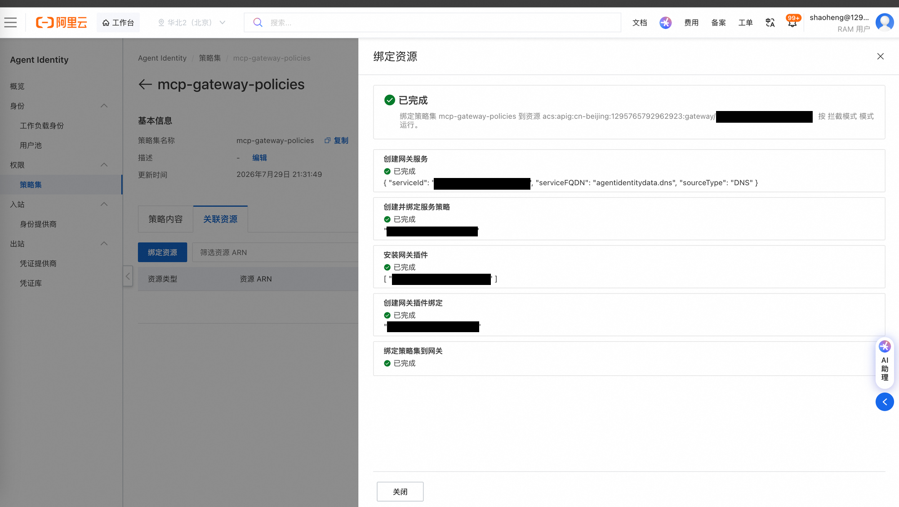

### 步骤六 — 插件配置（凭据注入 YAML 要点）

在网关上安装/配置 AgentIdentity 插件，并添加 MCP 级规则。凭据注入的关键配置：

```yaml
credential:
  enabled: true            # 启用凭据注入
  type: oauth2
  arn: <步骤三创建的 OAuth2 凭据提供商 ARN>
  oauthFlow: USER_FEDERATION
  # 推荐（WI 关闭 session binding 时）不配置 oauthReturnURL；开启 session binding 时必填且需在 WI 回调白名单内
  # oauthReturnURL: <OAuth 回调地址>
  injectHeaderName: Authorization
  injectHeaderPrefix: Bearer
  injectHeaderPrefixEnabled: true
```

插件会将下游 OAuth2 Token 以 `Bearer <token>` 的形式注入到转发给订单服务的请求的 `Authorization` 头中。CLI/API 路径下，插件规则（attachment）不能直接以 `McpServer` 为生效目标（`attach-resource-type` 仅支持 `GatewayRoute`/`Gateway`/`GatewayDomain`/`HttpApi`/`Operation`），需改为以 MCP 服务的底层网关路由按 `GatewayRoute` 类型挂载。完整 YAML 与字段说明见 [DEPLOY_GUIDE.md §六](./DEPLOY_GUIDE.md)；插件完整配置参考与常见问题 FAQ 见 [DEPLOY_GUIDE.md 附录](./DEPLOY_GUIDE.md#附录配置参考)。

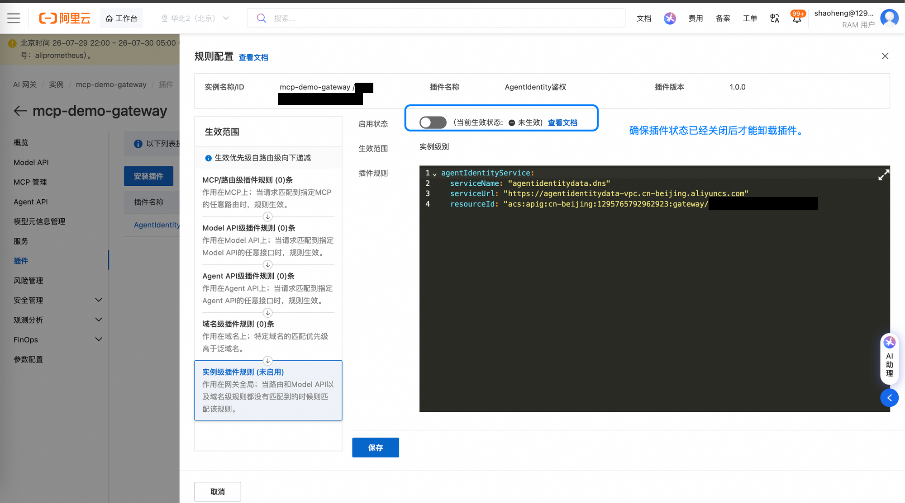
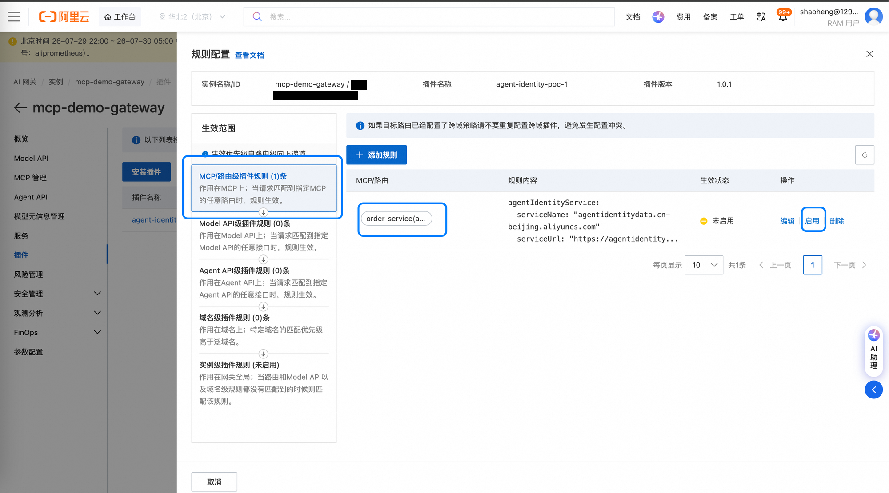

### 步骤七 — Cedar 策略

在策略集中编辑 Cedar 策略，按用户、按工具控制访问（可结合 `principal has actor`、`context.input` 等 `when` 条件）。注意：经 OIDC 联邦的用户实体类型为 `AgentIdentity::OAuthUser`，属性键为大写 `Issuer`/`actor`（无 `iss`/`sub`），且 `actor` 必须为**完整目录形式** WI ARN（`acs:agentidentity:{region}:{accountId}:workloadidentitydirectory/default/workloadidentity/{名称}`），否则 `when` 条款恒假。**实体 ID 形态存在环境差异（已确认）**：可能是短 `user_id`（形如 `user_xxxx`）也可能是完整用户 ARN，写错会静默 403（reasons 为空）且 `tools/list` 被过滤为空——先用全放开探针策略确认链路，再通过 LOG_ONLY 评估日志或两种形态各试一次来判定。两种形态示例与完整判定方法见 [DEPLOY_GUIDE.md §七](./DEPLOY_GUIDE.md)。

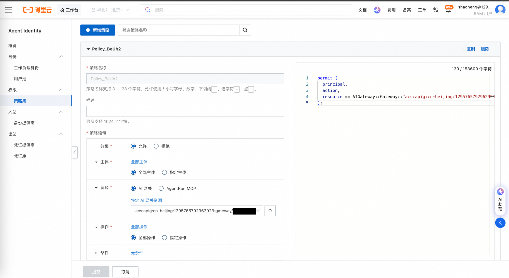

### WASM 插件获取方式

- 插件在 AI 网关插件市场正式发布后，可直接从插件市场安装使用，无需手动上传。
- 过渡期内，可从 `agent-identity-go-wasm` 源码仓库构建插件后手动上传。构建产物 `main.wasm` **不**纳入本仓库。

## ▶️ Running（运行）

```bash
./run_chatbot.sh
```

脚本会自动加载同目录下的 `.env` 并校验必需变量，然后：

1. 运行 `oidc_login.py` —— 打开浏览器进行 OIDC 登录，通过本地回调服务（`http://localhost:18080/callback`）捕获 ID Token。
2. 以 ID Token 启动 `mcp_chatbot.py`，换取 Workload Access Token，连接网关托管的 MCP Server，仅加载已授权的工具，并进入交互式对话。

也可以直接通过 `--help`（如 `python3 mcp_chatbot.py --help`）手动传入 Token 或端点运行各组件。

## ✅ End-to-End Verification（端到端验证）

参照 [DEPLOY_GUIDE.md §九](./DEPLOY_GUIDE.md)，在对话中依次测试以下场景：

1. **基础对话** —— 输入"你好"，LLM 正常回复，无 MCP 调用。
2. **已授权工具** —— "帮我列出所有订单"，Chatbot 调用 `listOrders`，网关鉴权通过并注入凭据，返回订单列表。
3. **鉴权拒绝（ENFORCE 模式）** —— "帮我删除订单 order-001"，若 Cedar 策略未允许 `deleteOrder`，网关返回 `403`。
4. **工具列表过滤** —— 启动时，插件会自动将未授权的工具从 `tools/list` 中过滤掉。

诊断工具：使用 [test_mcp.py](./test_mcp.py)，它会执行 OIDC 登录 → ID Token → WAT → 连接 MCP → 列出工具，并逐步打印状态：

```bash
python3 test_mcp.py                      # 使用同目录（或上层目录）的 .env
python3 test_mcp.py --mcp-url "http://..." --region cn-beijing
python3 test_mcp.py --bearer-token "eyJ..."   # 跳过 OIDC 登录，直接传入 ID Token
```

订单服务自身的 OAuth 流程可在 ECS 上执行 `bash order_service/test_oauth.sh` 验证（授权获取 code → 换 token → 创建订单 → 列出订单 → 无 token 401 → refresh 续期）。

## 🤝 Support（支持）

关于 Agent Identity SDK 的问题或咨询：
- 参阅[官方文档](https://help.aliyun.com/product/agent-identity)
- 联系阿里云支持
- 在仓库中提交 issue

---

## 📄 License（许可证）

本项目基于 Apache License 2.0 许可开源 —— 详见仓库根目录的 [LICENSE](../../LICENSE) 文件。
