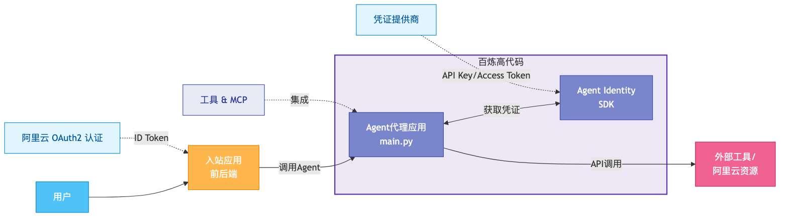
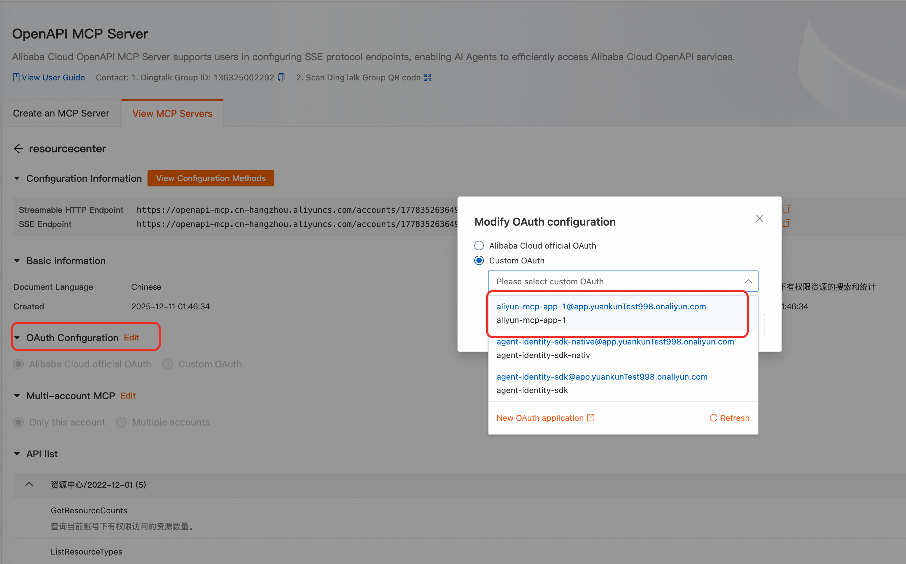
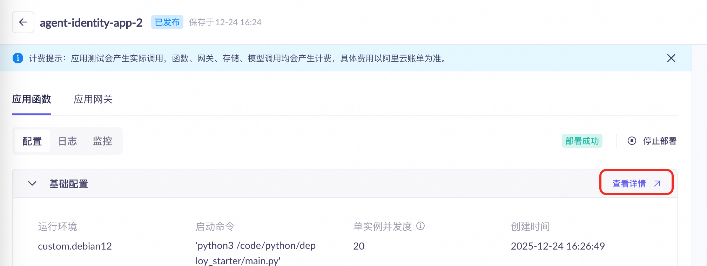
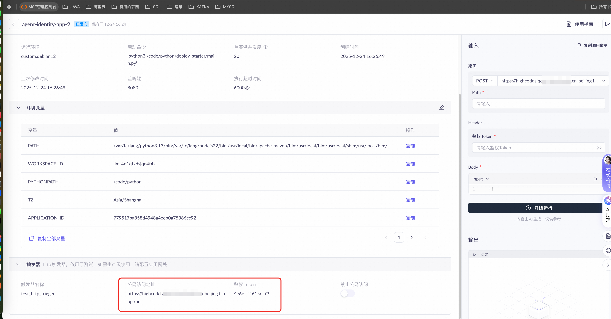

# Agent Identity Python SDK 示例

Agent Identity Python SDK 的完整演示，用于构建安全的、具备身份感知能力的AI代理。

## 🚀 概述

本示例展示了如何构建一个基于[AgentScope](https://github.com/alibaba/agentscope)运行时框架，并集成了Agent Identity SDK的LLM Agent服务。
包括Inbound认证，Outbound凭据获取和工具调用，会话管理，用户身份管理，云凭证获取，MCP集成等功能。 部署结构上包括AI Agent服务，前端应用以及后端应用三个模块。

前端应用与后端应用构成了一个完整的入站应用，集成了阿里云OAuth2.0认证流程，可以通过浏览器进行身份验证，并获取阿里云ID Token。在获得凭据之后，前端应用可通过后端应用与Agent进行交互，使用Agent Identity的凭据托管能力进行工具使用。

整体功能点包括：

- 集成了阿里云OAuth 2.0流程对用户进行身份验证
- 获取阿里云OAuth2.0用户身份令牌作为Agent入站身份
- 集成了AgentScope Runtime框架和QwenLLM的Agent服务
- 接入了多个不同的凭证类型的工具，包括
  - 阿里云MCP服务（OAuth2令牌）
  - 写入钉钉文档（OAuth2令牌）
  - 阿里云OSS读取文件（STS Token）
  - 获取系统时间（模拟：OAuth2令牌）
  - 模拟获取天气（模拟：API Key）
  - 模拟获取今日日程（模拟：STS Token）

## 🏗️ 架构


### 核心组件

- **身份客户端**：管理用户身份验证和令牌生命周期
- **凭证管理**：OAuth2、API密钥和STS凭证管理
- **工作负载身份**：基于Agent Identity服务的Agent身份管理
- **MCP/工具集成**：用于实时工具执行的可流式HTTP端点
- **会话管理**：跨交互的内存状态持久化

## ⚙️ 先决条件

### 系统要求
- Python ≥ 3.10
- pip包管理器

### 所需云资源

#### 1. RAM身份设置
创建一个具有以下权限的RAM子账户：

```json
{
  "Version": "1",
  "Statement": [
    {
      "Effect": "Allow",
      "Action": "agentidentity:*",
      "Resource": "*"
    },
    {
      "Effect": "Allow",
      "Action": "agentidentitydata:*",
      "Resource": "*"
    },
    {
      "Effect": "Allow",
      "Action": "ram:CreateServiceLinkedRole",
      "Resource": "*",
      "Condition": {
        "StringEquals": {
          "ram:ServiceName": ["agentidentity.aliyuncs.com"]
        }
      }
    },
    {
      "Effect": "Allow",
      "Action": [
        "ram:CreateApplication",
        "ram:CreateRole", 
        "ram:CreatePolicy",
        "ram:AttachPolicyToRole", 
        "ram:CreateAppSecret",
        "ram:DeleteApplication"
      ],
      "Resource": "*"
    }
  ]
}
```

#### 2. DashScope API密钥
获取具有模型调用权限的[DashScope API密钥](https://bailian.console.aliyun.com/?tab=model#/api-key)。

## 📦 安装

### 1. 克隆仓库
```bash
git clone https://github.com/aliyun/agent-identity-dev-kit
cd agent_identity_python_samples/end-to-end_sample
```

### 2. 安装依赖
```bash
pip install -r requirements.txt
```

### 3. 配置环境变量

为前文中创建的RAM用户创建Access Key，并在控制台创建Dashscope API Key后，注入到环境变量中：

```bash
# 阿里云凭证
export ALIBABA_CLOUD_ACCESS_KEY_ID=<your-access-key-id>
export ALIBABA_CLOUD_ACCESS_KEY_SECRET=<your-access-key-secret>
export AGENT_IDENTITY_REGION_ID=cn-beijing # 当前Agent Identity仅开放北京地域
# DashScope API
export DASHSCOPE_API_KEY=<your-api-key>
```

## 🔧 资源初始化

### 自动化设置脚本
运行准备脚本来自动创建所需的云资源：

```bash
python -m prepare
```

此脚本执行以下操作：

1. **创建身份提供者**
   - 发现URL：`https://oauth.aliyun.com/.well-known/openid-configuration`
   - 受众：`12345678`

2. **创建阿里云OAuth 2.1入站应用**
   - 作用域：`aliuid;profile;openid`

3. **创建阿里云MCP服务所需的OAuth 2.1 Native应用**
   - 作用域：`aliuid;profile;openid;/acs/mcp-server`

4. **创建工作负载身份和角色**
   - 工作负载身份名称：`workload-${UUID}`
   - 角色名称：`AgentIdentityRole-${workloadIdentityName}`
   - 角色信任策略：允许来自该工作负载身份的扮演请求
   - 角色权限策略：允许该角色调用Agent Identity数据面API

5. **配置凭证提供者**
   - 用于MCP服务器集成/获取系统时间的OAuth2提供者
   - 用于天气工具的API密钥提供者

> **注意**：脚本会输出创建的资源信息到根目录下的.config.json中，其中包含"mcp_app_name"，需要在后续使用到。

> **注意**：如果执行过程中出现异常失败（如网络问题、资源超过quota等）需要清除创建的资源后再重新运行prepare，清除创建的资源请运行：
> ```bash
> python -m clear
> ```
> 脚本会将.config.json中的Agent Identity相关的资源进行删除。
> 
> **为避免对账号下的RAM资源造成影响，清理逻辑不会删除角色/自定义策略，需要手动删除**。

### MCP服务器配置

1. 导航到[阿里云MCP服务器](https://api.aliyun.com/mcp/servers)
2. 选择"resourcecenter"官方MCP服务
3. 用您创建的`${mcp_app_name}`替换默认的OAuth应用（该值在执行prepare之后会输出在".config.json"文件中）
4. 使用您的MCP服务器可流式HTTP端点更新`config.yml`：

```yaml
MCP_SERVER: "<your-mcp-server-endpoint>"
```



## ▶️ 运行代理

### 启动代理服务

#### 本地启动

在根目录下执行：
```bash
python -m deploy_starter.main
```

代理在`http://localhost:8080`上运行，包含以下端点：
- `/process` - 主要代理交互端点
- `/health` - 健康检查端点

#### 部署为百炼高代码应用

如果需要部署到百炼高代码应用，这里参照[百炼高代码部署说明](https://bailian.console.aliyun.com/?tab=api#/api/?type=app&url=2983030)给出具体的部署流程。

1. 首先请执行以下命令安装依赖：
```bash
pip install rich
pip install alibabacloud-bailian20231229
```

2. 在项目根目录执行下面命令进行打包：
```bash
python setup.py bdist_wheel
```
这将会在根目录的dist目录下生成一个whl文件。

3. 部署前请确保已配置对应账号有权限的access key等必要的环境变量：
```bash
export ALIBABA_CLOUD_ACCESS_KEY_ID=<your-access-key-id>      
export ALIBABA_CLOUD_ACCESS_KEY_SECRET=<your-access-key-secret>
export MODELSTUDIO_WORKSPACE_ID=<your-workspace-id>                 #可选，替换为百炼的业务空间ID，该空间将部署高代码应用，不设置将使用默认业务空间
```

4. 使用CLI工具将打包出来的whl文件部署到百炼：
```bash
runtime-fc-deploy --deploy-name agent-identity-sample  --whl-path <PATH_TO_YOUR_NEW_WHL_FILE> --telemetry enable
```

5. 进入[百炼控制台](https://bailian.console.aliyun.com/?tab=app#/app-center)，在控制台上为高代码应用配置环境变量，需要配置如下两个环境变量，其中`AGENT_IDENTITY_WORKLOAD_IDENTITY_NAME`为前文中执行prepare操作时创建的workload identity的名称，输出在项目根目录.config.json中，key为`workload_identity_name`。
```bash
export AGENT_IDENTITY_WORKLOAD_IDENTITY_NAME=<your-workload-identity-name>
export DASHSCOPE_API_KEY=<your-api-key>
```

6. 在高代码应用控制台上，点击查看详情，进入高代码应用所在函数计算实例的控制台。


7. 在函数计算控制台上为高代码应用对应的函数计算实例创建并配置实例角色（需要选择"阿里云服务"，并且"受信服务"需要选择"函数计算"），为角色赋予`AliyunAgentIdentityDataFullAccess`系统策略。


### 启动前后端服务

#### 代理服务部署在本地的情况
在根目录下执行启动服务：
```bash
python -m application.backend.app
```
后端服务在`http://localhost:8090`上运行，包含以下端点：
- `/chat` - 主要交互端点，与代理的process连接，并增加了入站身份
- `/callback` - 用于接收Agent Identity服务确认获取OAuth令牌时的回调 
- `/callback_for_oauth` - 用于入站身份获取OAuth令牌时的回调

#### 代理服务部署在百炼平台的情况

如果在上一步中选择将代理服务部署到百炼，则需要在启动服务前配置代理服务的地址和访问Token。

进入[百炼控制台](https://bailian.console.aliyun.com/?tab=app#/app-center)，找到刚才部署的高代码应用，找到触发器的公网访问地址和鉴权Token，如图所示：


将公网访问地址和鉴权Token配置到config.yml中：
```bash
AGENT_BEARER_TOKEN: "<鉴权Token>"
AGENT_ENDPOINT: "<公网地址>/process"
```

启动服务：

```bash
python -m application.backend.app
```

### 与代理交互

#### 工具功能汇总

| 命令                   | 功能      | 凭证类型    |
|----------------------|---------|---------|
| 查询今天的天气              | 天气API查询 | API密钥   |
| 查询今日日程               | 日历/日程访问 | STS令牌   |
| 查询当前系统时间             | 系统时间获取  | OAuth令牌 |
| 调用阿里云MCP服务，查询全部ECS实例 | 阿里云资源查询 | OAuth令牌 |
| 读取阿里云OSS文件           | OSS文件查询 | STS令牌   |
| 读取钉钉文档中的文件           | 钉钉文档读取  | OAuth令牌 |


#### 获取用户身份令牌

进入前端页面（http://localhost:8090），点击"登录"按钮，将引导您完成阿里云OAuth授权流程（授权用户需要与创建的OAuth应用在同一阿里云账号下）。

#### 向代理发送请求

完成OAuth授权后，可以通过前端页面聊天框与Agent进行交互。


### 示例 Prompt

以下是一些可以用来测试不同工具功能的简单示例：

- "今天天气怎么样？"- 测试天气API（API密钥认证）
- "我今天的日程安排是什么？" - 测试日历/日程工具（STS令牌认证）
- "现在几点了？" - 测试系统时间获取（OAuth令牌认证）
- "帮我查询我的ECS实例列表" - 测试阿里云MCP服务（OAuth令牌认证）
- "读取我的OSS文件" - 测试OSS文件查询（STS令牌认证）


## 🤝 支持

关于Agent Identity SDK的问题或疑问：
- 参考[官方文档](https://help.aliyun.com/product/agent-identity)
- 联系阿里云支持
- 在仓库中提交问题

---
