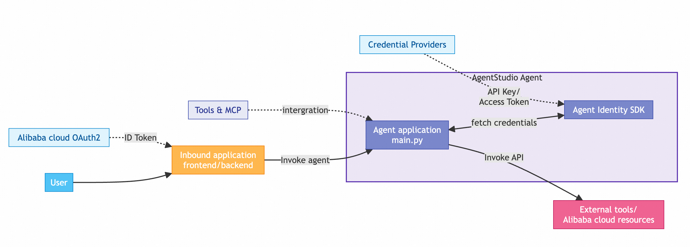

# Agent Identity Python SDK Sample

Complete demonstration of Agent Identity Python SDK for building secure, identity-aware AI agents.

## 🚀 Overview

This example demonstrates how to build an LLM Agent service based on the [AgentScope](https://github.com/alibaba/agentscope) runtime framework with integrated Agent Identity SDK. It includes Inbound authentication, Outbound credential acquisition and tool invocation, session management, user identity management, cloud credential acquisition, and MCP integration. The deployment structure includes AI Agent service, frontend application, and backend application in three modules.

The frontend application and backend application form a complete inbound application that integrates the Alibaba Cloud OAuth 2.0 authentication flow, enabling identity verification through browsers and obtaining Alibaba Cloud ID tokens. After obtaining credentials, the frontend application can interact with the Agent through the backend application, using Agent Identity's credential hosting capabilities for tool usage.

Key features include:

- Integration of Alibaba Cloud OAuth 2.0 flow for user identity authentication
- Obtaining Alibaba Cloud OAuth2.0 user identity tokens as Agent inbound identity
- Integration of AgentScope Runtime framework and QwenLLM Agent service
- Access to multiple different credential-type tools, including:
  - Alibaba Cloud MCP service (OAuth2 token)
  - Writing DingTalk documents (OAuth2 token)
  - Reading Alibaba Cloud OSS files (STS Token)
  - Getting system time (simulated: OAuth2 token)
  - Simulated weather acquisition (simulated: API Key)
  - Simulated daily schedule retrieval (simulated: STS Token)

## 🏗️ Architecture



### Core Components

- **Identity Client**: Manages user identity authentication and token lifecycle
- **Credential Management**: OAuth2, API keys, and STS credential management
- **Workload Identity**: Agent identity management based on Agent Identity service
- **MCP/Tool Integration**: Streaming HTTP endpoints for real-time tool execution
- **Session Management**: Cross-interaction memory state persistence

## ⚙️ Prerequisites

### System Requirements
- Python ≥ 3.10
- pip package manager

### Required Cloud Resources

#### 1. RAM Identity Setup
Create a RAM sub-account with the following permissions:

```json
{
  "Version": "1",
  "Statement": [
    {
      "Effect": "Allow",
      "Action": "agentidentity:*",
      "Resource": "*"
    },
    {
      "Effect": "Allow",
      "Action": "agentidentitydata:*",
      "Resource": "*"
    },
    {
      "Effect": "Allow",
      "Action": "ram:CreateServiceLinkedRole",
      "Resource": "*",
      "Condition": {
        "StringEquals": {
          "ram:ServiceName": ["agentidentity.aliyuncs.com"]
        }
      }
    },
    {
      "Effect": "Allow",
      "Action": [
        "ram:CreateApplication",
        "ram:CreateRole", 
        "ram:CreatePolicy",
        "ram:AttachPolicyToRole", 
        "ram:CreateAppSecret",
        "ram:DeleteApplication"
      ],
      "Resource": "*"
    }
  ]
}
```

#### 2. DashScope API Key
Obtain a [DashScope API key](https://bailian.console.aliyun.com/?tab=model#/api-key) with model invocation permissions.

## 📦 Installation

### 1. Clone Repository
```bash
git clone https://github.com/aliyun/agent-identity-dev-kit
cd agent_identity_python_samples/end-to-end_sample
```

### 2. Install Dependencies
```bash
pip install -r requirements.txt
```

### 3. Configure Environment Variables

Create Access Key for the RAM user created earlier, and after creating a Dashscope API Key in the console, inject them into environment variables:

```bash
# Alibaba Cloud Credentials
export ALIBABA_CLOUD_ACCESS_KEY_ID=<your-access-key-id>
export ALIBABA_CLOUD_ACCESS_KEY_SECRET=<your-access-key-secret>
export AGENT_IDENTITY_REGION_ID=cn-beijing # Agent Identity is currently only available in Beijing region
# DashScope API
export DASHSCOPE_API_KEY=<your-api-key>
```

## 🔧 Resource Initialization

### Automated Setup Script
Run the preparation script to automatically create required cloud resources:

```bash
python -m prepare
```

This script performs the following operations:

1. **Create Identity Provider**
   - Discovery URL: `https://oauth.aliyun.com/.well-known/openid-configuration`
   - Audience: `12345678`

2. **Create Alibaba Cloud OAuth 2.1 Inbound Application**
   - Scopes: `aliuid;profile;openid`

3. **Create OAuth 2.1 Native Application Required for Alibaba Cloud MCP Service**
   - Scopes: `aliuid;profile;openid;/acs/mcp-server`

4. **Create Workload Identity and Role**
   - Workload Identity Name: `workload-${UUID}`
   - Role Name: `AgentIdentityRole-${workloadIdentityName}`
   - Role trust policy: Allows assume requests from this workload identity
   - Role permission policy: Allows the role to call Agent Identity data plane APIs

5. **Configure Credential Providers**
   - OAuth2 provider for MCP server integration/getting system time
   - API key provider for weather tool

> **Note**: The script outputs resource information to `.config.json` in the root directory, which includes "mcp_app_name" that will be used later.

> **Note**: If execution fails due to exceptions (such as network issues, resource quota exceeded, etc.), you need to clear created resources before running prepare again. To clear created resources, run:
> ```bash
> python -m clear
> ```
> The script will delete Agent Identity related resources in `.config.json`.
> 
> **To avoid affecting RAM resources under the account, cleanup logic will not delete roles/custom policies, which need to be deleted manually**.

### MCP Server Configuration

1. Navigate to [Alibaba Cloud MCP Server](https://api.aliyun.com/mcp/servers)
2. Select the "resourcecenter" official MCP service
3. Replace the default OAuth application with your created `${mcp_app_name}` (this value will be output in the ".config.json" file after executing prepare)
4. Update `config.yml` with your MCP server streaming HTTP endpoint:

```yaml
MCP_SERVER: "<your-mcp-server-endpoint>"
```


## ▶️ Running the Agent

### Starting Agent Service

#### Local Startup

Execute in the root directory:
```bash
python -m deploy_starter.main
```

The agent runs on `http://localhost:8080` with the following endpoints:
- `/process` - Main agent interaction endpoint
- `/health` - Health check endpoint

#### Deployment as BAILIAN High-Code Application

If deploying to BAILIAN high-code application, refer to [BAILIAN High-Code Deployment Instructions](https://bailian.console.aliyun.com/?tab=api#/api/?type=app&url=2983030) for specific deployment process.

1. First execute the following command to install dependencies:
```bash
pip install rich
pip install alibabacloud-bailian20231229
```

2. Execute the following command in the project root directory for packaging:
```bash
python setup.py bdist_wheel
```
This will generate a whl file in the dist directory under the root directory.

3. Before deployment, ensure environment variables for access keys with appropriate permissions are configured:
```bash
export ALIBABA_CLOUD_ACCESS_KEY_ID=<your-access-key-id>      
export ALIBABA_CLOUD_ACCESS_KEY_SECRET=<your-access-key-secret>
export MODELSTUDIO_WORKSPACE_ID=<your-workspace-id>                 # Optional, replace with BAILIAN business space ID where the high-code application will be deployed, if not set, the default business space will be used
```

4. Use CLI tool to deploy the packaged whl file to BAILIAN:
```bash
runtime-fc-deploy --deploy-name agent-identity-sample  --whl-path <PATH_TO_YOUR_NEW_WHL_FILE> --telemetry enable
```

5. Enter [BAILIAN Console](https://bailian.console.aliyun.com/?tab=app#/app-center) and configure environment variables for the high-code application on the console. Configure the following two environment variables, where `AGENT_IDENTITY_WORKLOAD_IDENTITY_NAME` is the name of the workload identity created when executing prepare operation earlier, output in the project root `.config.json` file, with key `workload_identity_name`.
```bash
export AGENT_IDENTITY_WORKLOAD_IDENTITY_NAME=<your-workload-identity-name>
export DASHSCOPE_API_KEY=<your-api-key>
```

6. On the high-code application console, click "View Details" to enter the console of the function compute instance where the high-code application resides.


7. On the function compute console, create and configure an instance role for the corresponding function compute instance of the high-code application (need to select "Alibaba Cloud Service" and "Trusted Service" needs to select "Function Compute"), and assign the `AliyunAgentIdentityDataFullAccess` system policy to the role.

### Starting Frontend and Backend Services

#### When Agent Service is Deployed Locally
Execute to start service in the root directory:
```bash
python -m application.backend.app
```
Backend service runs on `http://localhost:8090` with the following endpoints:
- `/chat` - Main interaction endpoint, connects with agent's process and adds inbound identity
- `/callback` - Used to receive callbacks from Agent Identity service for OAuth token confirmation
- `/callback_for_oauth` - Used for OAuth token acquisition for inbound identity

#### When Agent Service is Deployed on BAILIAN Platform

If in the previous step you chose to deploy the agent service to BAILIAN, you need to configure the agent service address and access token before starting the service.

Enter the [BAILIAN Console](https://bailian.console.aliyun.com/?tab=app#/app-center), find the high-code application deployed earlier, find the trigger's public network access address and authentication token, as shown in the figure:


Configure the public network access address and authentication token in config.yml:
```bash
AGENT_BEARER_TOKEN: "<Authentication Token>"
AGENT_ENDPOINT: "<Public Address>/process"
```

Start the service:

```bash
python -m application.backend.app
```

### Interacting with the Agent

#### Tool Function Summary

| Command | Function | Credential Type |
|---------|----------|-----------------|
| Query today's weather | Weather API query | API Key |
| Query today's schedule | Calendar/schedule access | STS Token |
| Query current system time | System time retrieval | OAuth Token |
| Call Alibaba Cloud MCP service to query all ECS instances | Alibaba Cloud resource query | OAuth Token |
| Read Alibaba Cloud OSS file | OSS file query | STS Token |
| Read files from DingTalk documents | DingTalk document read | OAuth Token |

#### Obtain User Identity Token

Enter the frontend page (http://localhost:8090) and click the "Login" button, which will guide you through the Alibaba Cloud OAuth authorization process (the authorized user needs to be in the same Alibaba Cloud account as the created OAuth application).

#### Send Requests to the Agent

After completing OAuth authorization, you can interact with the Agent through the frontend page chat box.

### Sample Prompts

Here are some simple examples that can be used to test different tool functions:

- "How's the weather today?" - Test weather API (API key authentication)
- "What's my schedule for today?" - Test calendar/schedule tool (STS token authentication)
- "What time is it now?" - Test system time retrieval (OAuth token authentication)
- "Help me query my ECS instance list" - Test Alibaba Cloud MCP service (OAuth token authentication)
- "Read my OSS file" - Test OSS file query (STS token authentication)

## 🤝 Support

For questions or inquiries about Agent Identity SDK:
- Refer to [Official Documentation](https://help.aliyun.com/product/agent-identity)
- Contact Alibaba Cloud support
- Submit issues in the repository

---