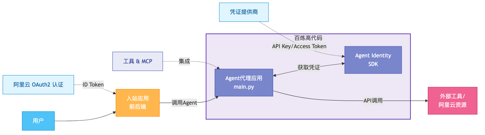

# Agent Identity 本地服务自动化部署 Demo

Agent Identity 本地服务自动化部署 Demo，用于一键创建云资源、启动本地 Agent 和前后端服务，并演示 Agent Identity 对 MCP 工具调用的权限管控能力。

## 🚀 概述

本示例展示了如何通过脚本自动完成资源初始化和本地服务启动，构建一个基于[AgentScope](https://github.com/alibaba/agentscope)运行时框架，并集成 Agent Identity 能力的 LLM Agent 服务。
包括 Inbound 认证，Outbound 凭据获取和工具调用，会话管理，用户身份管理，云凭证获取，MCP 集成，以及通过 Agent Identity 策略集管控 MCP 工具调用等功能。部署结构上包括 AI Agent 服务、前端应用以及后端应用三个模块。

前端应用与后端应用构成了一个完整的入站应用，集成了阿里云OAuth2.0认证流程，可以通过浏览器进行身份验证，并获取阿里云ID Token。在获得凭据之后，前端应用可通过后端应用与Agent进行交互，使用Agent Identity的凭据托管能力进行工具使用。

整体功能点包括：

- 集成了阿里云OAuth 2.0流程对用户进行身份验证
- 获取阿里云OAuth2.0用户身份令牌作为Agent入站身份
- 集成了AgentScope Runtime框架和QwenLLM的Agent服务
- 在 AI 网关上注册并发布 MCP 服务，并通过 Agent Identity 策略集进行调用权限管控
- 接入了多个不同的凭证类型的工具，包括
  - 阿里云MCP服务（OAuth2令牌）
  - 阿里云OSS读取文件（STS Token）
  - 获取系统时间（模拟：OAuth2令牌）
  - 模拟获取天气（模拟：API Key）
  - 模拟获取今日日程（模拟：STS Token）

## 🏗️ 架构


### 核心组件

- **身份客户端**：管理用户身份验证和令牌生命周期
- **凭证管理**：OAuth2、API密钥和STS凭证管理
- **工作负载身份**：基于Agent Identity服务的Agent身份管理
- **AI 网关 MCP 发布**：在 AI 网关上发布 MCP 服务，并通过 Agent Identity 策略集控制 Agent 的调用权限
- **MCP/工具集成**：用于实时工具执行的可流式HTTP端点
- **会话管理**：跨交互的内存状态持久化

## ⚙️ 先决条件

### 系统要求
- Python ≥ 3.10
- pip包管理器

### 所需云资源

#### 1. RAM身份设置
准备一个具备管理员权限的 RAM 用户，并为该 RAM 用户创建 AccessKey。

该 AccessKey 将用于 demo 自动创建和清理 Agent Identity、APIG、VPC、IMS、RAM 等云资源。请仅在测试账号或受控环境中使用管理员权限凭证，并在体验完成后执行清理脚本。

#### 2. DashScope API密钥
获取具有模型调用权限的[DashScope API密钥](https://bailian.console.aliyun.com/?tab=model#/api-key)。

#### 3. AI 网关服务
请先开通 AI 网关服务：[AI 网关控制台](https://apig.console.aliyun.com/#/ai-gateway-overview)。

本 demo 运行过程中会创建 AI 网关实例，该实例为付费实例。体验完成后请执行 `./clear_services.sh` 清理资源。

## 📦 安装

### 1. 克隆仓库
```bash
git clone https://github.com/aliyun/agent-identity-dev-kit
cd agent_identity_python_samples/end-to-end_sample_local_automation
```

### 2. 一键初始化
首次执行时，直接使用引导脚本。该脚本会自动创建虚拟环境、安装依赖、校验必需凭证并创建 demo 所需云资源。

```bash
export ALIBABA_CLOUD_ACCESS_KEY_ID=<your-admin-access-key-id>
export ALIBABA_CLOUD_ACCESS_KEY_SECRET=<your-admin-access-key-secret>
export DASHSCOPE_API_KEY=<your-dashscope-api-key>
./bootstrap.sh
```

## 🔧 资源初始化

`bootstrap.sh` 会执行以下操作：

1. **创建身份提供者**
   - 发现URL：`https://oauth.aliyun.com/.well-known/openid-configuration`
   - 受众：`12345678`

2. **创建阿里云OAuth 2.1入站应用**
   - 作用域：`aliuid;profile;openid`

3. **创建阿里云MCP服务所需的OAuth 2.1 Native应用**
   - 作用域：`aliuid;profile;openid;/acs/mcp-server`

4. **创建工作负载身份和角色**
   - 工作负载身份名称：`workload-${UUID}`
   - 角色名称：`AgentIdentityRole-${workloadIdentityName}`
   - 角色信任策略：允许来自该工作负载身份的扮演请求
   - 角色权限策略：允许该角色调用Agent Identity数据面API

5. **配置凭证提供者**
   - 用于MCP服务器集成和模拟工具的OAuth2提供者
   - 用于模型调用和模拟工具的API密钥提供者

6. **配置 AI 网关相关资源**
   - 创建 APIG 网关、服务、策略、插件、MCP 服务
   - 在 AI 网关上注册并发布 MCP 服务
   - 创建 Agent Identity 策略集，并绑定到网关以管控 MCP 调用权限

### Agent Identity MCP 权限管控示例

`bootstrap.sh` 会在 AI 网关上注册并发布一个包含 `maps-geo` 经纬度查询工具的 MCP 服务作为示例，并将初始权限策略配置为全部拒绝。该配置用于展示 Agent Identity 策略集如何对 MCP 工具发现和工具调用进行权限管控。

示例流程分为三个阶段：

1. **初始状态：全部拒绝**
   - `bootstrap.sh` 完成后，包含 `maps-geo` 工具的 MCP 服务已经注册并发布到 AI 网关。
   - 策略集默认拒绝全部请求。
   - 表现：Agent 无法获取该 MCP 上的工具。

2. **策略修改为允许全部**
   - 将策略调整为允许全部请求。
   - 表现：Agent 可以获取到 `maps-geo` 工具，并且调用不受入参限制，任意 `address` 入参都可以调用该工具。

3. **策略修改为按入参精细管控**
   - 将策略调整为只允许 `address` 等于 `杭州西湖` 的调用请求。
   - 表现：查询 `杭州西湖` 时可以正常调用 `maps-geo` 工具；查询其他 `address` 时，请求会被拦截并返回 `403` 错误。

演示视频：

- [阶段一：默认全部拒绝](video/demo_phase1.mp4)
- [阶段二：策略允许全部](video/demo_phase2.mp4)
- [阶段三：按 `address` 精细管控](video/demo_phase3.mp4)

> **注意**：如果执行过程中出现异常失败（如网络问题、资源超过quota等）需要清除创建的资源后再重新运行。清除创建的资源请使用与 `bootstrap.sh`、`deploy_services.sh` 一致的 bash 入口：
> ```bash
> ./clear_services.sh
> ```
> 脚本会读取 `.config.json`，停止本地服务，按依赖顺序清理 MCP 服务、AI 网关绑定、策略/策略集、APIG/VPC、Agent Identity、IMS 应用以及由 demo 创建的 RAM 角色/用户/策略，并将 `.config.json` 归档为 `.config.json.cleared.<timestamp>`。

## ▶️ 运行代理

### 一键启动本地服务

初始化完成后，在根目录下执行：
```bash
./deploy_services.sh
```

脚本会读取 `.config.json`，解析 MCP 服务地址，并启动：

- Agent 服务：`http://localhost:8080`
- 前后端服务：`http://localhost:8090`

启动成功后，访问 `http://localhost:8090` 体验 demo。

### 与代理交互

#### 工具功能汇总

| 命令                   | 功能      | 凭证类型    |
|----------------------|---------|---------|
| 查询今天的天气              | 天气API查询 | API密钥   |
| 查询今日日程               | 日历/日程访问 | STS令牌   |
| 查询当前系统时间             | 系统时间获取  | OAuth令牌 |
| 调用阿里云MCP服务，查询拥有的资源类型 | 阿里云资源查询 | OAuth令牌 |
| 读取阿里云OSS文件           | OSS文件查询 | STS令牌   |


#### 获取用户身份令牌

进入前端页面（http://localhost:8090），点击"登录"按钮，将引导您完成阿里云OAuth授权流程（授权用户需要与创建的OAuth应用在同一阿里云账号下）。

#### 向代理发送请求

完成OAuth授权后，可以通过前端页面聊天框与Agent进行交互。


### 示例 Prompt

以下是一些可以用来测试不同工具功能的简单示例：

- "今天天气怎么样？"- 测试天气API（API密钥认证）
- "我今天的日程安排是什么？" - 测试日历/日程工具（STS令牌认证）
- "现在几点了？" - 测试系统时间获取（OAuth令牌认证）
- "帮我查询我的账号下持有哪些类型的资源" - 测试阿里云MCP服务（OAuth令牌认证）
- "读取我的OSS文件" - 测试OSS文件查询（STS令牌认证）


## 🤝 支持

关于Agent Identity SDK的问题或疑问：
- 参考[官方文档](https://help.aliyun.com/product/agent-identity)
- 联系阿里云支持
- 在仓库中提交问题

---
