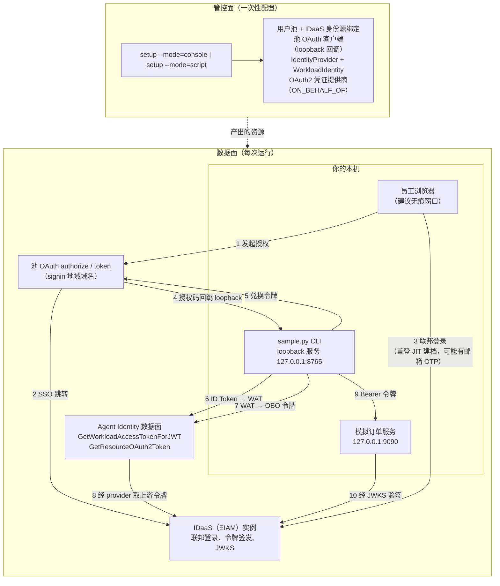

# Agent Identity × IDaaS：入站联邦登录 + OBO 出站（CLI 样例）

一个零依赖的 CLI 样例，完整演示 **Agent Identity × IDaaS** 全链路：企业员工经 IDaaS 联邦登录进入 Agent Identity 用户池，身份从「人」升维为「工作负载」（Workload Access Token），再以 on-behalf-of 方式换取下游 OAuth2 令牌，由模拟订单服务按调用者身份返回**差异化数据**。纯 Python 3.9+ 标准库实现，**零第三方运行时依赖**。

> 📖 深入阅读：[docs/architecture.md](./docs/architecture.md)（令牌时序、API 映射、RPC 签名）· [docs/control-plane-console.md](./docs/control-plane-console.md)（控制台手把手引导；截图补充中，见该文档顶部说明）· [docs/troubleshooting.md](./docs/troubleshooting.md)（全部已知坑位）。

## 🚀 Overview（概述）

**一句话叙事**：企业员工经企业 IDaaS 登录 → 身份升维为 WAT → 以用户名义（OBO）出站换取令牌 → 订单服务按「是谁」（sub）与「有什么权限」（scope）返回不同的数据。



数据面四步（每步可独立运行，令牌落盘 `.tokens/`，支持单步调试）：

| 步骤 | 命令 | 发生什么 |
|---|---|---|
| 1 | `python3 sample.py login` | 浏览器联邦登录 → loopback 回调 → 池 ID Token |
| 2 | `python3 sample.py exchange-wat` | ID Token → WAT（身份升维：人 → 工作负载） |
| 3 | `python3 sample.py obo` | WAT → 订单服务访问令牌（on-behalf-of 出站） |
| 4 | `python3 sample.py serve-orders` | 本地模拟订单服务：验签后按 `sub` / `scope` 返回数据 |

一键串联全部步骤：`python3 sample.py demo`。

## ⚙️ Prerequisites（前置条件）

| 条件 | 说明 |
|------|------|
| Python 3.9+ | CLI 与模拟订单服务均为纯标准库实现，**零第三方运行时依赖** |
| 操作系统 | 已在 macOS 与 Linux 上验证；Windows 理论可用（纯标准库）但未验证 |
| 阿里云账号 | 已在目标地域开通 Agent Identity 服务 |
| AccessKey 一对 | `setup --mode=script` 与数据面 RPC 调用（`exchange-wat`、`obo`）需要；建议使用最小权限 RAM 子账号 |
| 一个 IDaaS（EIAM）实例 | 至少有一个能完成登录的员工账号 |
| aliyun CLI（可选） | 仅用于诊断与等价 API 调用——**非必需**：样例自行实现了阿里云 RPC V1 签名 |

## 📦 Installation（安装）

### 1. 克隆仓库

```bash
git clone https://github.com/aliyun/agent-identity-dev-kit
cd agent_identity_python_samples/idaas-cli-obo_sample
```

### 2. 生成本地 `.env`

```bash
cp env.template .env
chmod 600 .env
```

### 3. 填写 `.env`

所有 `<YOUR_...>` 占位符都要替换。各值的来源（`env.template` 注释里有同样的说明，`python3 sample.py --check` 可逐项体检）：

| 变量 | 来源 | 说明 |
|------|------|------|
| `REGION` | 控制台右上角 | 地域 ID，如 `cn-hangzhou` |
| `ALIYUN_ACCESS_KEY_ID` / `ALIYUN_ACCESS_KEY_SECRET` | RAM 控制台 → AccessKey 管理 | AK 对；`setup --mode=script`、`exchange-wat`、`obo` 使用 |
| `ALIYUN_SECURITY_TOKEN` | （可选）STS | 使用临时凭证时填写 |
| `CONTROL_ENDPOINT` | —（通用形态） | 控制面端点，`agentidentity.<region>.aliyuncs.com` |
| `DATA_ENDPOINT` | —（通用形态） | 数据面端点，`agentidentitydata.<region>.aliyuncs.com` |
| `SIGNIN_BASE_URL` | 用户池详情页 | 池 OAuth 登录根地址，`https://signin.<region>.aliyuncs.com` |
| `USER_POOL_ID` | setup 产出 / 控制台 | 用户池 ID（`up_...`） |
| `OAUTH_CLIENT_ID` | setup 产出 / 控制台 | 池 OAuth 客户端 ID（`client_...`） |
| `OAUTH_CLIENT_SECRET` | setup 产出 / 控制台 | 池 OAuth 客户端密钥（也可用 `OAUTH_CLIENT_SECRET_FILE` 指向 0600 文件） |
| `OAUTH_REDIRECT_URI` | — | 回调地址，默认 `http://127.0.0.1:8765/callback` |
| `WI_NAME` | setup 产出 / 控制台 | 工作负载身份名——必须开启会话绑定 |
| `OBO_PROVIDER_NAME` | setup 产出 / 控制台 | 出站 OAuth2 凭证提供商名 |
| `ORDER_SERVICE_AUDIENCE` | IDaaS 控制台 → 订单服务应用 | 受众，形态 `agent-<出站应用clientId>` |
| `ORDER_SERVICE_SCOPES` | —（可选） | 逗号分隔，默认 `read,write.all` |
| `ORDER_SERVICE_ISSUER` / `ORDER_SERVICE_JWKS_URI` | IDaaS discovery 文档 | `GET {IDAAS_ORIGIN}/api/v2/iauths_system/oauth2/.well-known/openid-configuration` 返回的 `issuer` / `jwks_uri`（公网可达） |
| `SETUP_*` | —（仅模式 B） | `setup --mode=script` 的资源命名与 provider 配置，见 `env.template` 注释 |

> 模拟订单服务用纯标准库实现了 RS256 验签（教学实现）；生产代码请使用 PyJWT + cryptography。

## 🔧 Resource Setup（管控面资源配置——两种方式二选一）

管控面是一次性配置：建用户池 → 绑 IDaaS → 池 OAuth 客户端 → 出站 provider → 工作负载身份。两种模式任选其一：

### 方式一：控制台点选（推荐给想理解原理的用户）

运行 `python3 sample.py setup --mode=console` 打印编号清单，然后照着
**[docs/control-plane-console.md](./docs/control-plane-console.md)** 操作——
带打码截图的 6 大步手把手引导（截图补充中，见该文档顶部说明）：

1. 创建用户池 → 记录 `USER_POOL_ID`（同时在用户池详情页取 `SIGNIN_BASE_URL`）。
2. 绑定 IDaaS 身份源，等待编排相位（绑定 → SCIM → SSO）达到已启用。
3. （可选）开启 SCIM provisioning——主线不需要。
4. 创建池 OAuth 客户端；redirect_uri 白名单必须包含 loopback 条目
   `http://127.0.0.1:8765/callback` → 记录 `OAUTH_CLIENT_ID` / `OAUTH_CLIENT_SECRET`。
5. 先在 IDaaS 侧创建订单服务企业应用，再在 Agent Identity 侧创建 OAuth2
   凭证提供商（厂商 IDaaS、类型 ON_BEHALF_OF）→ 记录 `OBO_PROVIDER_NAME` /
   `ORDER_SERVICE_AUDIENCE`。
6. 创建 IdentityProvider（discovery 指向本池）与 WorkloadIdentity（**务必开启会话绑定**）
   → 记录 `WI_NAME` 及 IDaaS discovery 里的订单服务 issuer/JWKS。

### 方式二：脚本一键（推荐给想快速跑通的用户）

```bash
python3 sample.py setup --mode=script          # --with-scim 仅打印 SCIM 配置指引
```

脚本**幂等**：每步先按名查重（`[CREATE]` / `[REUSE]` 分明），轮询等待 SSO
编排达到 Enabled，合并 loopback 白名单时保留原有条目并做写后必读校验，
全部成功才把产出回写 `.env`（0600、原子替换）。中途失败不会写入半份
`.env`——按报错指引处理后重跑即可，已完成步骤会自动跳过。

**已知限制（预发实测的诚实说明）**：`SetSpecificIdentityProvider` 的 CLI
帮助当前仅标注支持 **DingTalk** 类型；若脚本绑定 IDaaS 报
`InvalidParameter`，请单独在控制台完成该步绑定（方式一第 2 步）后重跑
setup，其余步骤会接着跑。另外：`SETUP_OBO_PROVIDER_CONFIG`（指向 IDaaS
订单服务应用的 JSON 配置）需提前填好；凭证提供商**配额 = 1**（已存在则复用）。

**脚本回写什么——以及不回写什么**：脚本只回写其创建的资源（`USER_POOL_ID`、
`OAUTH_CLIENT_ID`、`OAUTH_CLIENT_SECRET`、`WI_NAME`、`OBO_PROVIDER_NAME`）。
`SIGNIN_BASE_URL`、`ORDER_SERVICE_AUDIENCE`、`ORDER_SERVICE_ISSUER` 与
`ORDER_SERVICE_JWKS_URI` 仍需你按上文表格自行补齐（后三项需先在 IDaaS 侧
创建订单服务应用——见方式一第 5/6 步）。跑 demo 前先执行
`python3 sample.py --check` 确认配置齐备。

### SCIM（v1 不在范围内）

本样例不做 SCIM provisioning 自动化，预发亦未验证。主线不依赖 SCIM——
**首次联邦登录会自动 JIT 建档**。SCIM 预置（`externalId` = IDaaS `sub`）
适合需要在首登前控制用户组/账号状态的进阶场景，详见
[docs/architecture.md](./docs/architecture.md#scim-positioning)。

配置完成后体检：

```bash
python3 sample.py --check
```

## 🏃 Running（数据面四步走）

> 令牌打印一律脱敏（`eyJhbGci…(len=1498)` 风格），完整令牌只落盘
> `.tokens/`（0600）。

### 第 1 步 — `login`：浏览器联邦登录 → 池 ID Token

```bash
python3 sample.py login              # 端口被占用时 --port 8766；超时默认 300 秒
```

**开始前提示（两个场景看似相反，按场景选用）**：

- **首次登录（或换账号）：用无痕/隐私窗口**——复用浏览器旧池会话会导致
  `session_id` 与托管凭证不匹配，后续 OBO 报 `Forbidden.InboundCredentialMissing`。
- **同一账号重跑 demo：保持普通（非无痕）窗口登录态**——SSO 会话直通，
  无需重新走邮箱 OTP/MFA；无痕窗口每次从零开始，反而要重打一遍 OTP。
- IDaaS 登录可能要求**邮箱 OTP / MFA 二次验证**（预发实测在策略变更后出现）
  ——在浏览器内按页面引导完成即可，属预期交互不是故障。

预期输出（节选，值已脱敏）：

```
[login] 回调服务已就绪：http://127.0.0.1:8765/callback（超时 300s）
[login] 正在打开浏览器完成 IDaaS 联邦登录 …
[login] 提示：建议使用无痕/隐私窗口——复用浏览器旧池会话会导致 session_id 不匹配，
        后续 OBO 报 Forbidden.InboundCredentialMissing。
[login] 提示：IDaaS 登录若启用邮箱 OTP/MFA，请在浏览器内按页面引导完成。
……（在浏览器内完成登录与授权）
[login] 授权码已收到（state 校验通过），正在兑换池令牌 …
[login] 池 ID Token 已获取（eyJhbGci…(len=1536)）
[login] claims 教学断言（仅解码，不验签——JWKS 公网路径见 docs/troubleshooting.md）：
        sub        = user_xxxxxxxx…
        iss        = https://agentidentitydata.<region>.aliyuncs.com/up_xxxxxxxx…
        aud        = client_xxxxxxxx…（应含 OAUTH_CLIENT_ID）
        session_id = 0f3ec1a2-…（示意）
                   └─ session_id 是 OBO 的定位键：region 按 (pool, user, session_id) 查托管入站凭证
        nonce      = k9Xm…（回显校验：通过）
[login] 已落盘 .tokens/id_token（0600）→ 下一步：python3 sample.py exchange-wat
```

### 第 2 步 — `exchange-wat`：身份升维（ID Token → WAT）

```bash
python3 sample.py exchange-wat
```

> 真实场景中这一步由 Agent 框架自动完成（用户无感）；此处用 CLI 直接调用，
> 仅为演示身份从「人」升维为「工作负载」。WAT 是 JWE 加密令牌——本地不可
> 解码属设计行为——且**实测有效期仅约 5 分钟**，拿到后立即进入第 3 步。

```
[exchange-wat] 调用 GetWorkloadAccessTokenForJWT（endpoint=agentidentitydata.<region>.aliyuncs.com）…
[exchange-wat] 说明：真实场景中这一步由 Agent 框架自动完成（用户无感）；
                此处用 CLI 直接调用，仅为演示身份从「人」升维为「工作负载」。
[exchange-wat] 成功（RequestId=xxxxxxxx-xxxx-xxxx-xxxx-xxxxxxxxxxxx）
[exchange-wat] WAT 已落盘（eyJhbGci…(len=892)）。注意：WAT 为 JWE 加密令牌，本地不可解码，
        属设计行为；有效期很短（实测约 5 分钟）→ 请立即执行 obo
```

### 第 3 步 — `obo`：以用户名义出站换令牌

```bash
python3 sample.py obo
```

```
[obo] 调用 GetResourceOAuth2Token（OAuth2Flow=ON_BEHALF_OF）…
      Provider=idaas-obo-sample-provider Audience=agent-<出站应用clientId> Scopes=["read", "write.all"]
      契约：业务参数必须全部放 formData body（Scopes 传 JSON 数组字符串，禁止逐个传参）
[obo] 成功（RequestId=xxxxxxxx-xxxx-xxxx-xxxx-xxxxxxxxxxxx）：订单服务 AT 已落盘（eyJhbGci…(len=1498)）
[obo] 订单服务 RT 已落盘（eyJhbGci…(len=743)）；刷新令牌仅作演示，sample 不实现刷新流程
[obo] AT claims（on-behalf-of 委托语义）：
        iss     = https://<your-eiam-instance>…（令牌由 IDaaS 签发）
        aud     = agent-<出站应用clientId>（受众=订单服务应用）
        scope   = read write.all
        sub     = user_xxxxxxxx…（主体=登录员工）
        act.sub = acs:agentidentity:<region>:<account-id>:workloadidentitydirectory/default/workloadidentity/idaas-obo-sample-wi
                  （实际执行者=工作负载身份 ARN：Agent 以用户名义行事）
        exp     = 2026-08-29 18:00:00（余 3599 秒）
[obo] 下一步：python3 sample.py serve-orders（或直接 python3 sample.py demo 全链路）
```

`act.sub` 是**工作负载身份 ARN**、`sub` 仍是登录员工——这正是 on-behalf-of
委托语义的核心，详见
[docs/architecture.md](./docs/architecture.md#on-behalf-of-delegation-semantics)。

> **若 `obo` 报 `EntityNotExists`**：`.env` 里 `OBO_PROVIDER_NAME` 指向的
> provider 已不存在（可能被清理，或配额=1 被其他 provider 占用）。先用
> `ListOAuth2CredentialProviders`（或控制台「凭证提供商」页）查现存 provider：
> 若配额空闲，重跑 `setup --mode=script` 重建（产出会回写 `.env`）；若配额
> 被占用，先确认旧 provider 可删再重建。

### 第 4 步 — `serve-orders`：本地模拟订单服务

```bash
python3 sample.py serve-orders          # 默认端口 9090；Ctrl+C 停止
```

```
[orders] 模拟订单服务已启动：http://127.0.0.1:9090（GET /health | GET /orders | POST /orders）
[orders] Ctrl+C 停止。demo 命令会在后台自动起停本服务。
```

路由：`GET /health`（免鉴权探活）· `GET /orders`（Bearer 验签通过后：scope
含 `read.all` 返回全部订单，否则只返回本人订单）· `POST /orders`（需要
`write.all`，否则 403）。

### 一键串联 — `demo`

```bash
python3 sample.py demo              # --port 8766 当登录回调端口 8765 被占用时
```

在后台临时端口起订单服务，依次执行 login → exchange-wat → obo（**第 2→3
步自动衔接不等待输入**，确保落在 5 分钟 WAT 窗口内），再调 `GET /orders` 与
`POST /orders` 演示差异化数据，结束后自动停服务。登录 loopback 端口默认
从 `OAUTH_REDIRECT_URI` 提取（通常是 8765）；可用 `--port` 显式覆盖——
redirect_uri 白名单忽略 loopback 端口差异，无需改控制台配置：

```
[demo] 第 1 步：login（浏览器联邦登录，loopback 端口 8765）
[demo] 第 2 步：exchange-wat（WAT 有效期仅约 5 分钟，立即进入第 3 步）
[demo] 第 3 步：obo（on-behalf-of 换取订单服务令牌）
[demo] 第 4 步：用订单服务 AT 调用本地模拟服务
[demo GET /orders] HTTP 200 →
        scope_view=own sub=user_xxxxxxxx… 订单数=0
        （当前 scope 无 read.all → 只能看到本人订单；把你的 sub 配置到
          orders/mock_data.py 的 SUB_ALIAS / ORDERS_BY_SUB 即可看到数据）
[demo POST /orders (write.all)] HTTP 201 →
        scope_view=- sub=- 订单数=-
[demo] 全链路完成：入站联邦登录 → WAT 身份升维 → OBO 出站 → 订单服务按身份返回差异化数据。
[demo] 换一个用户（或无痕窗口换账号）重跑 demo，可见 /orders 返回不同数据。
```

想看到「本人订单」，把登录后打印的真实 `sub` 映射进
`orders/mock_data.py`（如 `SUB_ALIAS = {"user_xxxxxxxx…": "employee-alice"}`），
或直接换一个账号重跑 `demo`。

## ✅ Verification（验证）

demo（或四步走）成功的标志，全部满足即通过：

1. **demo 打出最终总结行**——入站联邦登录 → WAT 身份升维 → OBO 出站 →
   订单服务按身份返回差异化数据。
2. **`GET /orders` 返回 200 且数据差异化**：scope 含 `read.all` 时看到全部
   订单（`scope_view=all`）；不含时只看到本人订单（`scope_view=own`）；全新
   sub 返回 `count=0` 属预期。换一个账号重跑，返回的数据不同。
3. **`POST /orders` 带 `write.all` 返回 201**，缺 `write.all` 返回 403
   `insufficient_scope`。
4. **`obo` 打印的 `act.sub` = 工作负载身份 ARN**（Agent 以用户名义行事），
   `sub` = 联邦登录的员工。
5. 反向校验（可选）：`curl http://127.0.0.1:9090/orders` 不带令牌 → 401
   `invalid_request`；带篡改令牌 → 401 `invalid_token`（响应不回显令牌本体）。
6. **离线测试套件**（无网络、零第三方依赖）：样例目录内执行
   `python3 -m unittest discover -s tests`——全绿即样例自身逻辑完好。

演示结束后的清理——cleanup **只删除 `.tokens/created_resources.json` 清单内**
（由 `setup --mode=script` 记录）的资源，绝不直接按 `.env` 名称删，手动配置的
资源不会被波及：

```bash
python3 sample.py cleanup            # 打印清单并确认；--yes 跳过确认；幂等可重跑
```

加 `--keep-pool` 可跳过（并保留在清单中）用户池条目——演示迭代时很实用：
重建用户池意味着重新等待 SSO 编排。

清单不存在时 cleanup 会拒绝删除并给出控制台手动清理指引；显式逃生通道为
`python3 sample.py cleanup --from-env --yes`——按 `.env` 当前值构造删除清单，
需要 `--from-env` 与 `--yes` 双确认（不校验资源归属，危险）。

## 🤝 Support（支持）

关于 Agent Identity SDK 的问题或咨询：
- 参阅[官方文档](https://help.aliyun.com/product/agent-identity)
- 联系阿里云支持
- 在仓库中提交 issue

---

## 📄 License（许可证）

本项目基于 Apache License 2.0 许可开源 —— 详见仓库根目录的 [LICENSE](../../LICENSE) 文件。
