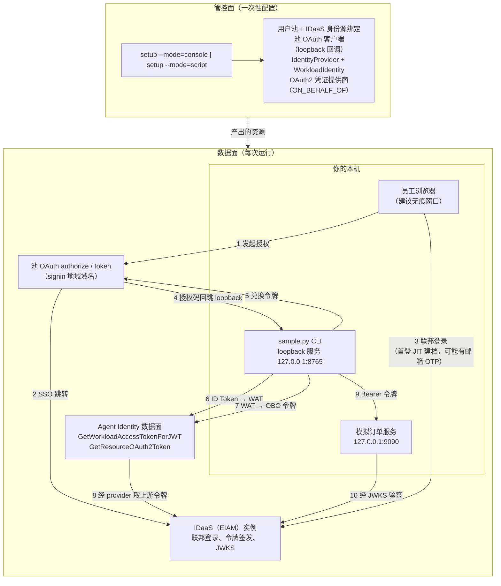

# Agent Identity × IDaaS：入站联邦登录 + OBO 出站（CLI 样例）

一个 CLI 样例，完整演示 **Agent Identity × IDaaS** 全链路：企业员工经 IDaaS 联邦登录进入 Agent Identity 用户池，身份从「人」升维为「工作负载」（Workload Access Token），再以 on-behalf-of 方式换取下游 OAuth2 令牌，由模拟订单服务按调用者身份返回**差异化数据**。纯 Python 3.9+ 标准库即可独立运行；可选安装 `alibabacloud-credentials`（Python 3.10+）启用 aliyun CLI 凭据链自动后台刷新。

> 📖 深入阅读：[docs/architecture.md](./docs/architecture.md)（令牌时序、API 映射、RPC 签名）· [docs/control-plane-console.md](./docs/control-plane-console.md)（控制台手把手引导，含打码截图）· [docs/troubleshooting.md](./docs/troubleshooting.md)（全部已知坑位）。

## 🚀 Overview（概述）

**一句话叙事**：企业员工经企业 IDaaS 登录 → 身份升维为 WAT → 以用户名义（OBO）出站换取令牌 → 订单服务按「是谁」（sub）与「有什么权限」（scope）返回不同的数据。



数据面四步（每步可独立运行，令牌落盘 `.tokens/`，支持单步调试）：

| 步骤 | 命令 | 发生什么 |
|---|---|---|
| 1 | `python3 sample.py login` | 浏览器联邦登录 → loopback 回调 → 池 ID Token |
| 2 | `python3 sample.py exchange-wat` | ID Token → WAT（身份升维：人 → 工作负载） |
| 3 | `python3 sample.py obo` | WAT → 订单服务访问令牌（on-behalf-of 出站） |
| 4 | `python3 sample.py serve-orders` | 本地模拟订单服务：验签后按 `sub` / `scope` 返回数据 |

一键串联全部步骤：`python3 sample.py demo`。

## ⚙️ Prerequisites（前置条件）

| 条件 | 说明 |
|------|------|
| Python 3.9+ | CLI 与模拟订单服务纯标准库即可独立运行；可选的凭据链 SDK 需 Python 3.10+ |
| 操作系统 | 已在 macOS 与 Linux 上验证；Windows 理论可用（纯标准库）但未验证 |
| 阿里云账号 | 已在目标地域开通 Agent Identity 服务 |
| aliyun CLI | **推荐**：`aliyun configure` 一次 → 样例经凭据链自动取凭据，**无需在 `.env` 填 AK/SK**。也可用于诊断 / 等价 API 调用。非硬性必需——样例自行实现了阿里云 RPC V1 签名 |
| `alibabacloud-credentials`（推荐、可选） | `pip install -r requirements.txt` 启用凭据链**OAuth 自动后台刷新**；不装则自动降级为纯标准库读 `~/.aliyun/config.json`。详见下文**凭据链**一节 |
| 一个 IDaaS（EIAM）实例 | 至少有一个能完成登录的员工账号 |

## 📦 Installation（安装）

### 1. 克隆仓库

```bash
git clone https://github.com/aliyun/agent-identity-dev-kit
cd agent_identity_python_samples/idaas-cli-obo_sample
```

### 2.（推荐）配置凭据 + 安装可选 SDK

```bash
aliyun configure                   # 一次登录（OAuth / AK）→ 写入 ~/.aliyun/config.json
pip install -r requirements.txt     # 可选：启用凭据链自动刷新
```

凭据只需 `aliyun configure` 一次——样例经**凭据链**自动读取，**无需在
`.env` 填 AK/SK**。装 `requirements.txt`（可选的 `alibabacloud-credentials`
SDK）可开启 OAuth 自动后台刷新；不装则降级为纯标准库读
`~/.aliyun/config.json`。详见下文 **🔑 凭据链（三选一）** 一节。

### 3. 生成本地 `.env`

```bash
cp env.template .env
chmod 600 .env
```

### 4. 填写 `.env`——只需 **3 项必填**

你手工只需填 **三** 项：

| 变量 | 来源 | 说明 |
|------|------|------|
| `REGION` | 控制台右上角 | 地域 ID，如 `ap-southeast-1` |
| `ORDER_SERVICE_AUDIENCE` | IDaaS 控制台 → 该企业服务应用详情页 | 企业服务应用**自身的 audience 标识**（如 `test-aud`）——**不是** OBO provider 的 OutboundAudience（`agent-…` 形态） |
| `IDAAS_ORIGIN` | 你的 IDaaS 实例域名根 | 如 `https://xxx.cloud-idaas.com`；用于自动拉 OIDC discovery 文档填充 `ORDER_SERVICE_ISSUER` / `ORDER_SERVICE_JWKS_URI` |

其余全部**自动**：

- `REGION` + `ENVIRONMENT` 派生端点（`CONTROL_ENDPOINT`、`DATA_ENDPOINT`、`SIGNIN_BASE_URL`）。
  `POOL_JWKS_BASE` **仅在用户显式声明 `ENVIRONMENT=production`** 时才镜像为
  `SIGNIN_BASE_URL`；若该行缺失或为 `pre-release`，`POOL_JWKS_BASE` 保持留空，
  池 discovery/JWKS 走 `DATA_ENDPOINT`（存量向后兼容行为）。
- `IDAAS_ORIGIN` → 运行时拉 OIDC discovery 文档自动填充 `ORDER_SERVICE_ISSUER`
  / `ORDER_SERVICE_JWKS_URI`（懒触发——仅 `demo` / `serve-orders` / `setup`
  末尾；`login`、`--check`、`exchange-wat`、`obo` 不触发）。
  discovery 响应经同源校验（防 SSRF / issuer 混淆）：`issuer`/`jwks_uri` 的
  `(host, port)` 必须与 `IDAAS_ORIGIN` 归一后一致。语义等价写法（显式 `:443`、
  末尾点 FQDN、punycode、IPv6）均接受；跨 host、http、`user:password@` 嵌入均拒绝。
- `USER_POOL_ID`、`OAUTH_CLIENT_ID`、`OAUTH_CLIENT_SECRET`、`WI_NAME`、
  `OBO_PROVIDER_NAME` 由 `setup --mode=script` 自动回写 `.env`（连同 discovery
  拉到的 issuer/JWKS）。
- 凭据走凭据链——`ALIYUN_ACCESS_KEY_*` 留空即可。
- `OAUTH_REDIRECT_URI`、`ORDER_SERVICE_SCOPES`、`SETUP_*` 维持默认值。

完整变量参考（除标 **必填** 外均为可选；`env.template` 注释里有同样说明，
`python3 sample.py --check` 可逐项体检）：

| 变量 | 必填 | 说明 |
|------|------|------|
| `REGION` | **是** | 地域 ID，如 `ap-southeast-1`（控制台右上角） |
| `ORDER_SERVICE_AUDIENCE` | **是** | 企业服务应用**自身的 audience 标识**（如 `test-aud`）；**不是** OBO provider 的 OutboundAudience（`agent-…` 形态）——误传报 `Forbidden.IdaasRsNotAuthorized`（正式环境实测） |
| `IDAAS_ORIGIN` | **是** | IDaaS 实例域名根（如 `https://xxx.cloud-idaas.com`）；自动拉 discovery 文档填充 `ORDER_SERVICE_ISSUER`/`JWKS_URI`。若已显式填 `ORDER_SERVICE_ISSUER` 可留空（会反向推导） |
| `ENVIRONMENT` | 否 | `production` / `pre-release`（大小写不敏感、自动去首尾空格；其余值报 `EnvError`）。决定 `SIGNIN_BASE_URL` 的派生形态。**`POOL_JWKS_BASE` 仅在本键被「显式声明」为 `production` 时才镜像**；缺失/留空 = 存量行为（POOL_JWKS_BASE 留空）。显式填 `SIGNIN_BASE_URL`/`POOL_JWKS_BASE` 则覆盖 |
| `ALIYUN_ACCESS_KEY_ID` / `ALIYUN_ACCESS_KEY_SECRET` | 否 | **可选**：两项留空走 aliyun CLI 凭据链（推荐）；显式填写最高优先（向后兼容/CI）。**两项必须同时填或同时留空**——只填一项直接报 `CredentialError`（不再静默降级）。详见 **🔑 凭据链** |
| `ALIYUN_SECURITY_TOKEN` | 否 | 仅显式分支的 STS 令牌（用长期 AK 则留空） |
| `CONTROL_ENDPOINT` / `DATA_ENDPOINT` | 否 | 留空→由 `REGION` 自动派生（`agentidentity.<region>.aliyuncs.com` / `agentidentitydata.<region>.aliyuncs.com`） |
| `SIGNIN_BASE_URL` | 否 | 留空→由 `REGION` + `ENVIRONMENT` 自动派生（production：`https://signin-<region>.aliyunagentid.com`；pre-release：`https://signin.<region>.aliyuncs.com`） |
| `POOL_JWKS_BASE` | 否 | 留空→**仅当 `ENVIRONMENT=production` 被显式声明时**自动镜像为 `SIGNIN_BASE_URL`；否则（缺失/pre-release）保持留空，池 discovery/JWKS 走 `DATA_ENDPOINT`（向后兼容）。显式填写则最高优先 |
| `USER_POOL_ID` / `OAUTH_CLIENT_ID` / `OAUTH_CLIENT_SECRET` | 自动 | 由 `setup --mode=script` 回写，或控制台抄录（也可用 `OAUTH_CLIENT_SECRET_FILE` 指向 0600 文件） |
| `OAUTH_REDIRECT_URI` | 自动（有默认值） | 默认 `http://127.0.0.1:8765/callback` |
| `WI_NAME` / `OBO_PROVIDER_NAME` | 自动 | 由 `setup --mode=script` 回写，或控制台抄录（WI 须开启会话绑定） |
| `ORDER_SERVICE_SCOPES` | 否 | 逗号分隔，默认 `write:all`；必须与控制台授权 scope **逐字一致**且为其子集——超出报 `Forbidden.ScopeNotGranted`（正式环境实测）。德国实测控制台授权为 `read:all` 与 `write:all` |
| `ORDER_SERVICE_ISSUER` / `ORDER_SERVICE_JWKS_URI` | 否 | 留空→运行时由 `IDAAS_ORIGIN` discovery 文档自动填充，**无需手工抄**；若 IDaaS 实例自定义了 issuer 路径，discovery 会取到权威值 |
| `SETUP_*` | 否 | `setup --mode=script` 的资源命名与 provider 配置；维持默认——除 `SETUP_OBO_PROVIDER_CONFIG` 需指向 IDaaS 侧订单服务应用 |

> 模拟订单服务用纯标准库实现了 RS256 验签（教学实现）；生产代码请使用 PyJWT + cryptography。

## 🔑 凭据链（三选一）

样例通过**三级降级链**解析阿里云 RPC 凭据（`lib/credentials.py` →
`resolve_creds`），越靠前优先级越高，命中即返回：

| # | 级别 | 前提 | 行为 |
|---|---|---|---|
| 1 | `.env` **显式 AK/SK** | `ALIYUN_ACCESS_KEY_ID` / `ALIYUN_ACCESS_KEY_SECRET` 非占位 | 直接使用；`ALIYUN_SECURITY_TOKEN` 非空则并入。**最高优先**——向后兼容 / CI / 教学固定凭证 |
| 2 | **SDK 默认链**（`alibabacloud_credentials`） | 已 `pip install -r requirements.txt` | `CredentialClient()` 默认链：读 `~/.aliyun/config.json`；OAuth profile 凭 refresh_token **非交互后台刷新**。推荐 |
| 3 | **标准库降级** | 上两级都未命中 | 纯标准库解析 `~/.aliyun/config.json`（`current` profile）：`AK` / `StsToken` / `OAuth` 三种 mode。无需任何第三方包 |

**OAuth 降级边界**：第 3 级（标准库）**不做刷新**。若缓存的 OAuth/StsToken
STS 凭据已过期，会抛带指引的 `CredentialError`，而非静默用过期凭据。两条
出路：`pip install -r requirements.txt` 让 SDK 自动刷新（第 2 级），或重跑
`aliyun configure` 重新登录。

**环境变量命名差异**（分层不同，勿混淆）：

- 显式层（第 1 级）认 sample 的 `ALIYUN_ACCESS_KEY_ID` /
  `ALIYUN_ACCESS_KEY_SECRET` / `ALIYUN_SECURITY_TOKEN`。
- SDK 链（第 2 级）内部认 `ALIBABA_CLOUD_ACCESS_KEY_ID` /
  `ALIBABA_CLOUD_ACCESS_KEY_SECRET` / `ALIBABA_CLOUD_SECURITY_TOKEN`
  （`ALIBABA_CLOUD_*` 前缀，由 SDK 自行处理）。

**推荐做法**：`aliyun configure` 一次（OAuth 登录）**+** `pip install -r
requirements.txt`——样例即可自动后台刷新认证，**`.env` 无任何私密信息**。

**半填硬失败**：`ALIYUN_ACCESS_KEY_ID` 与 `ALIYUN_ACCESS_KEY_SECRET`
**两项必须同时填或同时留空**。只填一项直接报 `CredentialError`（消息含缺失项名
+ 两条出路：补齐另一项 / 两项都清空以显式声明走凭据链），**不再静默降级**——
因为静默降级可能让管控面用另一个账号的身份执行创建/删除。

**`--check` 凭据链报告**（默认离线口径）：`python3 sample.py --check` 是
**纯离线体检**（亚秒级返回，实测约 0.3–0.4s，含解释器启动；不触发网络 / OAuth
刷新 / 不回写 `~/.aliyun/config.json`）。并列报告各级「能力」——第 1 级只读判定 .env 显式
配置；第 2 级只报 SDK 是否已安装（不调 `get_credential()`）；第 3 级只读解析
`~/.aliyun/config.json` + STS 过期判定。**不判定最终生效级**。
叠加 `--creds-live` 做真实解析：`python3 sample.py --check --creds-live`
执行完整凭据链，报告**精确命中级别 + 人读来源**（SDK 级显示
`provider_name`，标准库级显示 `~/.aliyun/config.json(profile=X, mode=Y)`），
可能触发网络 / OAuth 续期 / 回写 `~/.aliyun/config.json`。

**退出码语义**：`--check` 仅在「必填项齐全」**且**「凭据链体检无确定性
配置错误」时返回 `0`，否则返回 `1`（便于 CI 门禁据退出码拦截）。确定性配置错误
仅指：显式 AK/SK 半填（离线与 `--creds-live` 两模式**一致**计入）、标准库
`~/.aliyun/config.json` profile 的 STS 凭据已过期**且该级可达**（Level 1 命中时
Level 3 的陈旧过期状态不计入——三级链是短路语义，不可达级不影响生效凭据）。
两项显式 AK/SK 都留空（推荐的走凭据链姿势）、SDK 已安装但未调用，均返回 `0`。
完整 `--check` 样例输出与退出码细则见 [docs/troubleshooting.md](./docs/troubleshooting.md)。

`--check` 报告还会用「（已派生）」后缀标记程序派生的值（非用户实填）。排查
404 / NXDOMAIN / 域名不符时，优先怀疑带「（已派生）」的值。

## 🔧 Resource Setup（管控面资源配置——两种方式二选一）

管控面是一次性配置：建用户池 → 接入 IDaaS + 用户同步 → 池 OAuth 客户端 → 授权企业服务（平台自动创建 provider）→ 工作负载身份 + RAM 角色。两种模式任选其一：

### 方式一：控制台点选（推荐给想理解原理的用户）

运行 `python3 sample.py setup --mode=console` 打印编号清单，然后照着
**[docs/control-plane-console.md](./docs/control-plane-console.md)** 操作——
带打码截图的 6 大步手把手引导（打码截图已入库 `docs/images/`）：

1. 创建用户池（**勾选「自动创建入站身份提供商」**）→ 记录 `USER_POOL_ID`。
2. 用户池详情 →「身份源」页签 →「接入 IDaaS」（平台一键创建 IDaaS 实例与入站应用）。
   随后在 IDaaS 控制台建演示账户、开启 SSO 与用户同步、设置同步范围（ou_root）、
   执行同步，验证池用户列表出现该账户。
3. （可选）开启 SCIM provisioning——主线不需要。
4. 创建池 OAuth 客户端；redirect_uri 白名单必须包含 loopback 条目
   `http://127.0.0.1:8765/callback` → 记录 `OAUTH_CLIENT_ID` / `OAUTH_CLIENT_SECRET`。
5. 「企业服务」→「授权企业服务」：平台自动创建 ON_BEHALF_OF/IDaaS 凭证提供商
   （配额 1，名称为平台自动生成 UUID，无需手建）。随后在 IDaaS 添加 M2M
   应用、填受众 `test-aud`、增 `read:all` + `write:all` 并选自动授权，回
   Agent Identity「编辑授权范围」勾选用户池+双 Scope 提交 → 记录
   `OBO_PROVIDER_NAME` 与 `ORDER_SERVICE_AUDIENCE`（M2M 应用的受众标识，
   **不是** provider 的 OutboundAudience `agent-…` 形态）。
6. 创建 IdentityProvider（discovery 指向本池）与 WorkloadIdentity（**务必开启会话绑定**）；
   关联入站 IdP、关联运行时 RAM 角色并「快速授权」挂 AgentIdentityData 类策略
   （OBO 数据面权限前提）→ 记录 `WI_NAME`。`SIGNIN_BASE_URL` /
   `ORDER_SERVICE_ISSUER` / `ORDER_SERVICE_JWKS_URI` 由样例自动派生或
   discovery 拉取，无需手工抄录（仅显式覆盖时才填）。

### 方式二：脚本一键（推荐给想快速跑通的用户）

```bash
python3 sample.py setup --mode=script          # --with-scim 仅打印 SCIM 配置指引
```

脚本**幂等**：每步先按名查重（`[CREATE]` / `[REUSE]` 分明），轮询等待 SSO
编排达到 Enabled，合并 loopback 白名单时保留原有条目并做写后必读校验，
全部成功才把产出回写 `.env`（0600、原子替换）。中途失败不会写入半份
`.env`——按报错指引处理后重跑即可，已完成步骤会自动跳过。

**身份回显**：`setup` 在第一个写操作之前会打印本次使用的凭据来源与掩码 AK
（`[setup] 本次使用凭据：…（AK=LTAI…(len=24)，含 STS=否）`），
便于确认是哪个账号在执行资源创建。

**已知限制（预发 + 新加坡正式环境实测的诚实说明）**：`SetSpecificIdentityProvider`
的 CLI 帮助当前仅标注支持 **DingTalk** 类型（正式环境实测该 API 仅接受
DingTalk / Feishu / WeCom，**IDaaS 类型无 API，必须控制台人工绑定**）。脚本
绑定 IDaaS 报 `InvalidParameter` 时会打印兑底指引并继续后续步骤；请在控制台
完成该步绑定（方式一第 2 步）后重跑 setup（幂等），其余步骤会接着跑。另外：
`SETUP_OBO_PROVIDER_CONFIG`（指向 IDaaS
订单服务应用的 JSON 配置）需提前填好；凭证提供商**配额 = 1**（已存在则复用）。

**脚本回写什么**：脚本回写其创建的资源（`USER_POOL_ID`、`OAUTH_CLIENT_ID`、
`OAUTH_CLIENT_SECRET`、`WI_NAME`、`OBO_PROVIDER_NAME`）——另外，若配了
`IDAAS_ORIGIN`，运行末尾还会把 discovery 拉到的 `ORDER_SERVICE_ISSUER` /
`ORDER_SERVICE_JWKS_URI` 一并回写（两段回写：核心产出**先落盘**，然后
discovery 成功后第二次只回写 issuer/jwks；任何 discovery 异常不会丢失
已落盘的 `client_secret`）。端点（`CONTROL_ENDPOINT`、`DATA_ENDPOINT`、
`SIGNIN_BASE_URL`）由 `REGION` + `ENVIRONMENT` 自动派生；`POOL_JWKS_BASE`
仅在显式声明 `ENVIRONMENT=production` 时镜像。你手工要填的只有 **3 项必填**（`REGION`、
`ORDER_SERVICE_AUDIENCE`、`IDAAS_ORIGIN`）——其中订单服务应用需先在 IDaaS 侧
创建（见方式一第 5/6 步；audience 注意别填成 provider 的 OutboundAudience）。
跑 demo 前先执行 `python3 sample.py --check` 确认配置齐备。

### SCIM（v1 不在范围内）

本样例不做 SCIM provisioning 自动化，预发亦未验证。主线不依赖 SCIM——
**首次联邦登录会自动 JIT 建档**。SCIM 预置（`externalId` = IDaaS `sub`）
适合需要在首登前控制用户组/账号状态的进阶场景，详见
[docs/architecture.md](./docs/architecture.md#scim-positioning)。

配置完成后体检：

```bash
python3 sample.py --check
```

## 🏃 Running（数据面四步走）

> 令牌打印一律脱敏（`eyJhbGci…(len=1498)` 风格），完整令牌只落盘
> `.tokens/`（0600）。

### 第 1 步 — `login`：浏览器联邦登录 → 池 ID Token

```bash
python3 sample.py login              # 端口被占用时 --port 8766；超时默认 300 秒
```

**开始前提示（两个场景看似相反，按场景选用）**：

- **首次登录（或换账号）：用无痕/隐私窗口**——复用浏览器旧池会话会导致
  `session_id` 与托管凭证不匹配，后续 OBO 报 `Forbidden.InboundCredentialMissing`。
- **同一账号重跑 demo：保持普通（非无痕）窗口登录态**——SSO 会话直通，
  无需重新走邮箱 OTP/MFA；无痕窗口每次从零开始，反而要重打一遍 OTP。
- IDaaS 登录可能要求**邮箱 OTP / MFA 二次验证**（预发实测在策略变更后出现）
  ——在浏览器内按页面引导完成即可，属预期交互不是故障。

预期输出（节选，值已脱敏）：

```
[login] 回调服务已就绪：http://127.0.0.1:8765/callback（超时 300s）
[login] 正在打开浏览器完成 IDaaS 联邦登录 …
[login] 提示：建议使用无痕/隐私窗口——复用浏览器旧池会话会导致 session_id 不匹配，
        后续 OBO 报 Forbidden.InboundCredentialMissing。
[login] 提示：IDaaS 登录若启用邮箱 OTP/MFA，请在浏览器内按页面引导完成。
……（在浏览器内完成登录与授权）
[login] 授权码已收到（state 校验通过），正在兑换池令牌 …
[login] 池 ID Token 已获取（eyJhbGci…(len=1536)）
[login] claims 教学断言（仅解码，不验签——JWKS 公网路径见 docs/troubleshooting.md）：
        sub        = user_xxxxxxxx…
        iss        = https://agentidentitydata.<region>.aliyuncs.com/up_xxxxxxxx…
        aud        = client_xxxxxxxx…（应含 OAUTH_CLIENT_ID）
        session_id = 0f3ec1a2-…（示意）
                   └─ session_id 是 OBO 的定位键：region 按 (pool, user, session_id) 查托管入站凭证
        nonce      = k9Xm…（回显校验：通过）
[login] 已落盘 .tokens/id_token（0600）→ 下一步：python3 sample.py exchange-wat
```

### 第 2 步 — `exchange-wat`：身份升维（ID Token → WAT）

```bash
python3 sample.py exchange-wat
```

> 真实场景中这一步由 Agent 框架自动完成（用户无感）；此处用 CLI 直接调用，
> 仅为演示身份从「人」升维为「工作负载」。WAT 是 JWE 加密令牌——本地不可
> 解码属设计行为——且**实测有效期仅约 5 分钟**，拿到后立即进入第 3 步。

```
[exchange-wat] 调用 GetWorkloadAccessTokenForJWT（endpoint=agentidentitydata.<region>.aliyuncs.com）…
[exchange-wat] 说明：真实场景中这一步由 Agent 框架自动完成（用户无感）；
                此处用 CLI 直接调用，仅为演示身份从「人」升维为「工作负载」。
[exchange-wat] 成功（RequestId=xxxxxxxx-xxxx-xxxx-xxxx-xxxxxxxxxxxx）
[exchange-wat] WAT 已落盘（eyJhbGci…(len=892)）。注意：WAT 为 JWE 加密令牌，本地不可解码，
        属设计行为；有效期很短（实测约 5 分钟）→ 请立即执行 obo
```

### 第 3 步 — `obo`：以用户名义出站换令牌

```bash
python3 sample.py obo
```

```
[obo] 调用 GetResourceOAuth2Token（OAuth2Flow=ON_BEHALF_OF）…
      Provider=idaas-obo-sample-provider Audience=<企业服务应用 audience，如 test-aud> Scopes=["write:all"]
      契约：业务参数必须全部放 formData body（Scopes 传 JSON 数组字符串，禁止逐个传参）
[obo] 成功（RequestId=xxxxxxxx-xxxx-xxxx-xxxx-xxxxxxxxxxxx）：订单服务 AT 已落盘（eyJhbGci…(len=1498)）
[obo] 订单服务 RT 已落盘（eyJhbGci…(len=743)）；刷新令牌仅作演示，sample 不实现刷新流程
[obo] AT claims（on-behalf-of 委托语义）：
        iss     = https://<your-eiam-instance>…（令牌由 IDaaS 签发）
        aud     = <企业服务应用 audience，如 test-aud>（受众=订单服务应用）
        scope   = write:all
        sub     = user_xxxxxxxx…（主体=登录员工）
        act.sub = acs:agentidentity:<region>:<account-id>:workloadidentitydirectory/default/workloadidentity/idaas-obo-sample-wi
                  （实际执行者=工作负载身份 ARN：Agent 以用户名义行事）
        exp     = 2026-08-29 18:00:00（余 3599 秒）
[obo] 下一步：python3 sample.py serve-orders（或直接 python3 sample.py demo 全链路）
```

`act.sub` 是**工作负载身份 ARN**、`sub` 仍是登录员工——这正是 on-behalf-of
委托语义的核心，详见
[docs/architecture.md](./docs/architecture.md#on-behalf-of-delegation-semantics)。

> **若 `obo` 报 `EntityNotExists`**：`.env` 里 `OBO_PROVIDER_NAME` 指向的
> provider 已不存在（可能被清理，或配额=1 被其他 provider 占用）。先用
> `ListOAuth2CredentialProviders`（或控制台「凭证提供商」页）查现存 provider：
> 若配额空闲，重跑 `setup --mode=script` 重建（产出会回写 `.env`）；若配额
> 被占用，先确认旧 provider 可删再重建。

### 第 4 步 — `serve-orders`：本地模拟订单服务

```bash
python3 sample.py serve-orders          # 默认端口 9090；Ctrl+C 停止
```

```
[orders] 模拟订单服务已启动：http://127.0.0.1:9090（GET /health | GET /orders | POST /orders）
[orders] Ctrl+C 停止。demo 命令会在后台自动起停本服务。
```

路由：`GET /health`（免鉴权探活）· `GET /orders`（Bearer 验签通过后：scope
含 `read:all` 返回全部订单，否则只返回本人订单）· `POST /orders`（需要
`write:all`，否则 403）。

> **Fail-closed 启动保护**：`serve-orders` 在 `ORDER_SERVICE_ISSUER`、
> `ORDER_SERVICE_JWKS_URI` 或 `ORDER_SERVICE_AUDIENCE` 为空/占位时
> **拒绝启动**——空 issuer 会让验签静默跳过 `iss` 校验（接受任何由该
> JWKS 签名、aud 匹配的令牌，存在 issuer 混淆 / 跨租户令牌复用风险）。
> 两条出路：**(A)** 填 `IDAAS_ORIGIN` 让 discovery 自动回填 issuer/jwks；
> **(B)** 显式填齐三项。`DiscoveryError` 在启动时降级为 stderr 警告
> （服务仍起，JWKS 不可达时按请求降级 503）。

### 一键串联 — `demo`

```bash
python3 sample.py demo              # --port 8766 当登录回调端口 8765 被占用时
```

在后台临时端口起订单服务，依次执行 login → exchange-wat → obo（**第 2→3
步自动衔接不等待输入**，确保落在 5 分钟 WAT 窗口内），再调 `GET /orders` 与
`POST /orders` 演示差异化数据，结束后自动停服务。登录 loopback 端口默认
从 `OAUTH_REDIRECT_URI` 提取（通常是 8765）；可用 `--port` 显式覆盖——
redirect_uri 白名单忽略 loopback 端口差异，无需改控制台配置：

```
[demo] 第 1 步：login（浏览器联邦登录，loopback 端口 8765）
[demo] 第 2 步：exchange-wat（WAT 有效期仅约 5 分钟，立即进入第 3 步）
[demo] 第 3 步：obo（on-behalf-of 换取订单服务令牌）
[demo] 第 4 步：用订单服务 AT 调用本地模拟服务
[demo GET /orders] HTTP 200 →
        scope_view=own sub=user_xxxxxxxx… 订单数=0
        （当前 scope 无 read:all → 只能看到本人订单；把你的 sub 配置到
          orders/mock_data.py 的 SUB_ALIAS / ORDERS_BY_SUB 即可看到数据）
[demo POST /orders (write:all)] HTTP 201 →
        scope_view=- sub=- 订单数=-
[demo] 全链路完成：入站联邦登录 → WAT 身份升维 → OBO 出站 → 订单服务按身份返回差异化数据。
[demo] 换一个用户（或无痕窗口换账号）重跑 demo，可见 /orders 返回不同数据。
```

想看到「本人订单」，把登录后打印的真实 `sub` 映射进
`orders/mock_data.py`（如 `SUB_ALIAS = {"user_xxxxxxxx…": "employee-alice"}`），
或直接换一个账号重跑 `demo`。

### 🌏 区域/环境差异与令牌时效（正式环境实测）

以下差异来自新加坡 `ap-southeast-1` 正式环境（2026-08）端到端闭环实测；预发
环境保持本文默认描述不变：

| 事项 | 预发环境 | 正式环境（如新加坡 `ap-southeast-1`） |
|---|---|---|
| 登录域 `SIGNIN_BASE_URL` | `ENVIRONMENT=pre-release` 时自动派生：`https://signin.<region>.aliyuncs.com` 形态 | `ENVIRONMENT=production`（默认）时自动派生：`https://signin-<region>.aliyunagentid.com`。形态由 `ENVIRONMENT` **自动选择**；也可显式覆盖 `SIGNIN_BASE_URL`——显式值永远优先 |
| 池 discovery / JWKS `POOL_JWKS_BASE` | 留空（默认）走 `DATA_ENDPOINT` | **仅当 `.env` 显式声明 `ENVIRONMENT=production`** 时自动镜像为 `SIGNIN_BASE_URL`（数据面同路径 404）。若 `ENVIRONMENT` 缺失或为 `pre-release`，保持留空（存量行为）。镜像发生时会向 stderr 打一行 `[env]` 告警。环境有差异时可显式覆盖 `POOL_JWKS_BASE` |
| 入站 IDaaS 身份源绑定 | 控制台操作（API 仅 DingTalk / Feishu / WeCom 类型可配置） | 同样必须控制台人工；另需在 **IDaaS 侧入站应用的回跳白名单**中加入 `https://signin-<region>.aliyunagentid.com/<poolId>/sso/oidc/callback` |
| OBO audience / scope | — | `ORDER_SERVICE_AUDIENCE` = 企业服务应用自身的 audience 标识（如 `test-aud`，非 provider 的 OutboundAudience）；`ORDER_SERVICE_SCOPES` 必须是其已授权 scope 的子集（见上文表格） |
| 数据面 RPC 稳定性 | 滚动发布窗口偶发 `MissingParameter.*`（sample 自动重试穿透） | 新旧实例混布，偶发 `MissingParameter.Audience` 多为旧实例误导性报错或 WAT 已过期——重试穿透 / 换新 WAT 后看真实错误码 |

令牌时效（正式环境实测；分步调试按此规划节奏）：

| 令牌 | 有效期 | 使用要点 |
|---|---|---|
| id_token（池 ID Token） | 约 1 小时 | 过期后重走 `login`；浏览器 SSO 会话仍在时无需重新交互 |
| WAT | 约 5 分钟 | `exchange-wat` 后**立即**执行 `obo`（`demo` 已自动衔接） |
| 订单服务 AT（OBO 产物） | 约 20 分钟，**无 refresh_token** | 到期重走 `exchange-wat` → `obo`；id_token 有效期内免重新登录 |

## ✅ Verification（验证）

demo（或四步走）成功的标志，全部满足即通过：

1. **demo 打出最终总结行**——入站联邦登录 → WAT 身份升维 → OBO 出站 →
   订单服务按身份返回差异化数据。
2. **`GET /orders` 返回 200 且数据差异化**：scope 含 `read:all` 时看到全部
   订单（`scope_view=all`）；不含时只看到本人订单（`scope_view=own`）；全新
   sub 返回 `count=0` 属预期。换一个账号重跑，返回的数据不同。
3. **`POST /orders` 带 `write:all` 返回 201**，缺 `write:all` 返回 403
   `insufficient_scope`。
4. **`obo` 打印的 `act.sub` = 工作负载身份 ARN**（Agent 以用户名义行事），
   `sub` = 联邦登录的员工。
5. 反向校验（可选）：`curl http://127.0.0.1:9090/orders` 不带令牌 → 401
   `invalid_request`；带篡改令牌 → 401 `invalid_token`（响应不回显令牌本体）。
6. **离线测试套件**（无网络、纯标准库）：样例目录内执行
   `python3 -m unittest discover -s tests`——全绿即样例自身逻辑完好。

演示结束后的清理——cleanup **只删除 `.tokens/created_resources.json` 清单内**
（由 `setup --mode=script` 记录）的资源，绝不直接按 `.env` 名称删，手动配置的
资源不会被波及。

**身份回显（安全可见性）**：`cleanup` 在确认提示**之前**会回显本次使用的凭据身份
（掩码 AK ≤4 字符 + 来源）。改造后 `.env` 可以完全不填 AK/SK，因此**执行破坏性
cleanup 前务必确认回显的身份是不是你要操作的那个账号**——资源名清单只约束
「删什么」，不约束「哪个账号执行删除」。`cleanup --from-env`（逃生通道）额外打印
显著 `⚠️` 警告：该路径不校验资源归属，且身份来自本机凭据链（可能是任意 profile）。

```bash
python3 sample.py cleanup            # 打印清单并确认；--yes 跳过确认；幂等可重跑
```

加 `--keep-pool` 可跳过（并保留在清单中）用户池条目——演示迭代时很实用：
重建用户池意味着重新等待 SSO 编排。

清单不存在时 cleanup 会拒绝删除并给出控制台手动清理指引；显式逃生通道为
`python3 sample.py cleanup --from-env --yes`——按 `.env` 当前值构造删除清单，
需要 `--from-env` 与 `--yes` 双确认（不校验资源归属，危险）。

## 🤝 Support（支持）

关于 Agent Identity SDK 的问题或咨询：
- 参阅[官方文档](https://help.aliyun.com/product/agent-identity)
- 联系阿里云支持
- 在仓库中提交 issue

---

## 📄 License（许可证）

本项目基于 Apache License 2.0 许可开源 —— 详见仓库根目录的 [LICENSE](../../LICENSE) 文件。
