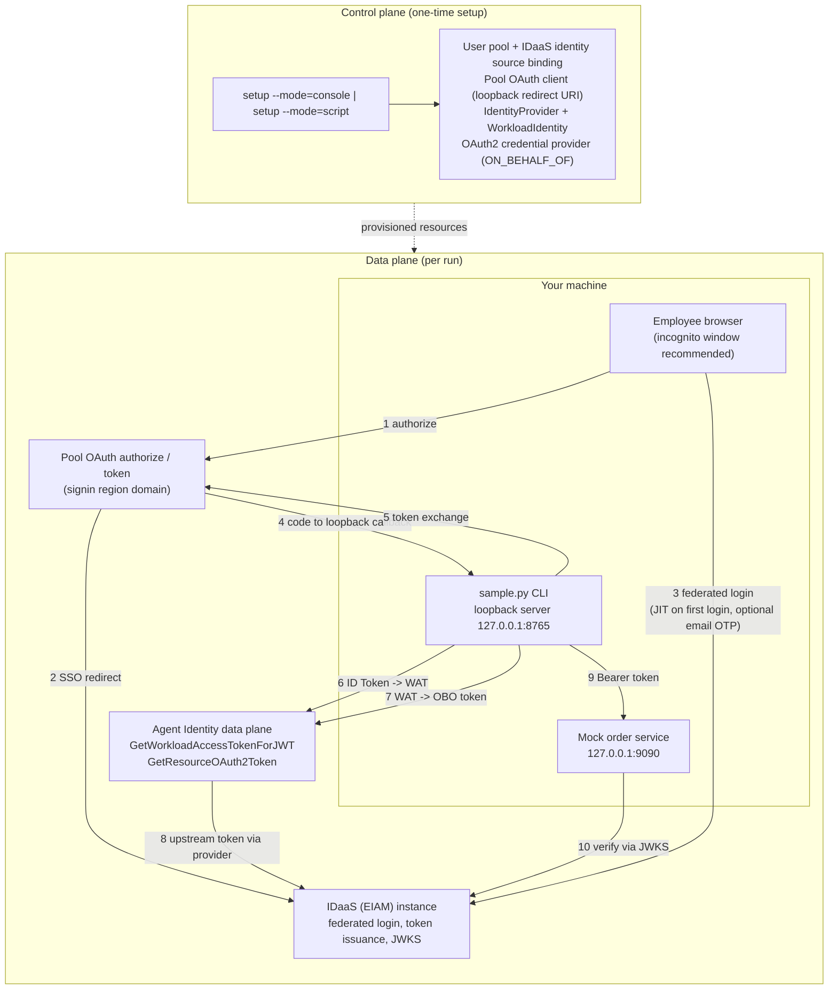

# Agent Identity × IDaaS: Inbound Federated Login + OBO Outbound (CLI Sample)

A CLI sample that demonstrates the full chain of **Agent Identity × IDaaS**: an
employee federates into an Agent Identity user pool via IDaaS, the identity is
lifted from "human" to "workload" (Workload Access Token), exchanged
on-behalf-of for a downstream OAuth2 token, and a mock order service returns
**identity-differentiated data**. It runs standalone on the pure Python 3.9+
standard library; the optional `alibabacloud-credentials` package (Python 3.10+)
enables the aliyun CLI credential chain with automatic background refresh.

> 📖 Deep dives: [docs/architecture.md](./docs/architecture.md) (token
> sequence, API mapping, RPC signing) ·
> [docs/control-plane-console.md](./docs/control-plane-console.md) (console
> walkthrough with masked console screenshots) ·
> [docs/troubleshooting.md](./docs/troubleshooting.md) (every known pitfall).

## 🚀 Overview

**The story in one line**: an enterprise employee logs in through the
corporate IDaaS → the identity is lifted to a Workload Access Token (WAT) →
exchanged outbound **on-behalf-of** the employee → the order service returns
different data depending on **who** is calling and **what scopes** they hold.



The four data-plane steps (each runnable independently; tokens persist under
`.tokens/`):

| Step | Command | What happens |
|---|---|---|
| 1 | `python3 sample.py login` | Browser federated login → loopback callback → pool ID Token |
| 2 | `python3 sample.py exchange-wat` | ID Token → WAT (identity lift: human → workload) |
| 3 | `python3 sample.py obo` | WAT → order-service access token (on-behalf-of outbound) |
| 4 | `python3 sample.py serve-orders` | Local mock order service: verify the token, return data by `sub` / `scope` |

One command chains them all: `python3 sample.py demo`.

## ⚙️ Prerequisites

| Requirement | Description |
|------|------|
| Python 3.9+ | The CLI and the mock order service run standalone on the pure standard library; the optional credential-chain SDK needs Python 3.10+ |
| Platform | Verified on macOS and Linux; Windows should work in theory (pure standard library) but is untested |
| Alibaba Cloud account | Agent Identity service activated in your region |
| aliyun CLI | **Recommended**: `aliyun configure` once → the sample picks up credentials through the credential chain, so **no AK/SK goes into `.env`**. Also usable for diagnostics / equivalent API calls. Not strictly required — the sample implements Alibaba Cloud RPC V1 signing itself |
| `alibabacloud-credentials` *(recommended, optional)* | `pip install -r requirements.txt` enables the credential chain with **automatic OAuth background refresh**; skip it and the sample falls back to a pure-standard-library read of `~/.aliyun/config.json`. See the **Credential chain** section below |
| An IDaaS (EIAM) instance | With at least one employee account that can log in |

## 📦 Installation

### 1. Clone the repository

```bash
git clone https://github.com/aliyun/agent-identity-dev-kit
cd agent_identity_python_samples/idaas-cli-obo_sample
```

### 2. *(Recommended)* Configure credentials + install the optional SDK

```bash
aliyun configure                   # one-time login (OAuth / AK) → writes ~/.aliyun/config.json
pip install -r requirements.txt     # optional: enables credential-chain auto-refresh
```

`aliyun configure` is all you need for credentials — the sample reads them
through the **credential chain**, so **no AK/SK goes into `.env`**. Installing
`requirements.txt` (the optional `alibabacloud-credentials` SDK) turns on
automatic OAuth background refresh; skip it and the sample falls back to a
pure-standard-library read of `~/.aliyun/config.json`. Details in
**🔑 Credential chain** below.

### 3. Create your local `.env`

```bash
cp env.template .env
chmod 600 .env
```

### 4. Fill in `.env` — only **3 required** values

You only fill in **three** values by hand:

| Variable | Source | Description |
|------|------|------|
| `REGION` | Console top bar | Region ID, e.g. `ap-southeast-1` |
| `ORDER_SERVICE_AUDIENCE` | IDaaS console → the enterprise-app detail page | The enterprise service app's **own audience identifier** (e.g. `test-aud`) — **not** the OBO provider's OutboundAudience (`agent-…` form) |
| `IDAAS_ORIGIN` | Your IDaaS instance domain root | e.g. `https://xxx.cloud-idaas.com`; used to auto-fetch the OIDC discovery document for `ORDER_SERVICE_ISSUER` / `ORDER_SERVICE_JWKS_URI` |

Everything else is **automatic**:

- `REGION` + `ENVIRONMENT` derive the endpoints (`CONTROL_ENDPOINT`,
  `DATA_ENDPOINT`, `SIGNIN_BASE_URL`). `POOL_JWKS_BASE` is mirrored from
  `SIGNIN_BASE_URL` **only when you explicitly declare `ENVIRONMENT=production`**
  in `.env`; if that line is absent or set to `pre-release`, `POOL_JWKS_BASE`
  stays empty and pool discovery/JWKS falls back to `DATA_ENDPOINT` (the
  legacy behavior).
- `IDAAS_ORIGIN` → the sample pulls the OIDC discovery document at runtime and
  fills `ORDER_SERVICE_ISSUER` / `ORDER_SERVICE_JWKS_URI` (lazily — only in
  `demo` / `serve-orders` / at the end of `setup`; `login`, `--check`,
  `exchange-wat`, `obo` never trigger it).
  The discovery response is subject to a same-origin check (anti-SSRF / issuer
  confusion): the normalized `(host, port)` of `issuer`/`jwks_uri` must match
  `IDAAS_ORIGIN`. Semantically equivalent forms (explicit `:443`, trailing-dot
  FQDN, punycode, IPv6) are accepted; cross-host, http, and embedded
  `user:password@` are rejected.
- `USER_POOL_ID`, `OAUTH_CLIENT_ID`, `OAUTH_CLIENT_SECRET`, `WI_NAME`,
  `OBO_PROVIDER_NAME` are written back to `.env` by `setup --mode=script`
  (along with the discovery-derived issuer/JWKS).
- Credentials come from the credential chain — leave `ALIYUN_ACCESS_KEY_*`
  empty.
- `OAUTH_REDIRECT_URI`, `ORDER_SERVICE_SCOPES`, `SETUP_*` keep sensible
  defaults.

Full variable reference (all optional unless marked **Required**; also
documented inline in `env.template`, and validated by `python3 sample.py
--check`):

| Variable | Required | Description |
|------|------|------|
| `REGION` | **Yes** | Region ID, e.g. `ap-southeast-1` (console top bar) |
| `ORDER_SERVICE_AUDIENCE` | **Yes** | The enterprise service app's **own audience identifier** (e.g. `test-aud`); **not** the OBO provider's OutboundAudience (`agent-…` form) — passing the latter fails with `Forbidden.IdaasRsNotAuthorized` (verified in production) |
| `IDAAS_ORIGIN` | **Yes** | IDaaS instance domain root (e.g. `https://xxx.cloud-idaas.com`); auto-fetches the discovery document for `ORDER_SERVICE_ISSUER`/`JWKS_URI`. May be left empty if you set `ORDER_SERVICE_ISSUER` explicitly (it is reverse-derived) |
| `ENVIRONMENT` | No | `production` / `pre-release` (case-insensitive, auto-trimmed; any other value raises `EnvError`). Controls the `SIGNIN_BASE_URL` derivation form. **`POOL_JWKS_BASE` is only mirrored when this key is _explicitly declared_ as `production`**; absent/empty = legacy behavior (POOL_JWKS_BASE stays empty). Explicit values for `SIGNIN_BASE_URL`/`POOL_JWKS_BASE` always override |
| `ALIYUN_ACCESS_KEY_ID` / `ALIYUN_ACCESS_KEY_SECRET` | No | **Optional**: leave both empty to use the aliyun CLI credential chain (recommended); explicit values take top priority (backward-compat / CI). **Both must be filled or both empty** — filling only one raises `CredentialError` immediately (no silent fallback). See **🔑 Credential chain** |
| `ALIYUN_SECURITY_TOKEN` | No | STS token for the explicit branch only (leave empty with a long-lived AK) |
| `CONTROL_ENDPOINT` / `DATA_ENDPOINT` | No | Leave empty → auto-derived from `REGION` (`agentidentity.<region>.aliyuncs.com` / `agentidentitydata.<region>.aliyuncs.com`) |
| `SIGNIN_BASE_URL` | No | Leave empty → auto-derived from `REGION` + `ENVIRONMENT` (production: `https://signin-<region>.aliyunagentid.com`; pre-release: `https://signin.<region>.aliyuncs.com`) |
| `POOL_JWKS_BASE` | No | Leave empty → **if `ENVIRONMENT=production` is explicitly declared**, auto-mirrored from `SIGNIN_BASE_URL`; otherwise (absent/pre-release) stays empty and pool discovery/JWKS uses `DATA_ENDPOINT` (backward-compat). Set explicitly to override in either case |
| `USER_POOL_ID` / `OAUTH_CLIENT_ID` / `OAUTH_CLIENT_SECRET` | Auto | Written back by `setup --mode=script`, or copy from the console (`OAUTH_CLIENT_SECRET_FILE`, a 0600 file, also works) |
| `OAUTH_REDIRECT_URI` | Auto (has default) | Default `http://127.0.0.1:8765/callback` |
| `WI_NAME` / `OBO_PROVIDER_NAME` | Auto | Written back by `setup --mode=script`, or copy from the console (WI must have session binding enabled) |
| `ORDER_SERVICE_SCOPES` | No | Comma-separated; default `write:all`; must **match the console-authorized scopes verbatim** and be a subset — exceeding it fails with `Forbidden.ScopeNotGranted` (verified in production). German production console authorizes `read:all` and `write:all` |
| `ORDER_SERVICE_ISSUER` / `ORDER_SERVICE_JWKS_URI` | No | Leave empty → auto-filled at runtime from the `IDAAS_ORIGIN` discovery document, **no manual copying**. If your IDaaS instance uses a custom issuer path, discovery returns the authoritative value |
| `SETUP_*` | No | Resource names & provider config for `setup --mode=script`; keep defaults — except `SETUP_OBO_PROVIDER_CONFIG`, which must point at the IDaaS order-service application |

> The mock order service verifies tokens with its own pure-standard-library
> RS256 implementation (educational). Production code should use
> PyJWT + cryptography.

## 🔑 Credential chain (three ways to authenticate)

The sample resolves Alibaba Cloud RPC credentials through a **three-level
fallback chain** (`lib/credentials.py` → `resolve_creds`); the first level that
yields credentials wins:

| # | Level | Precondition | Behavior |
|---|---|---|---|
| 1 | **Explicit AK/SK** in `.env` | `ALIYUN_ACCESS_KEY_ID` / `ALIYUN_ACCESS_KEY_SECRET` set (non-placeholder) | Used directly; `ALIYUN_SECURITY_TOKEN` is appended when set. **Top priority** — backward-compat / CI / fixed teaching credentials |
| 2 | **SDK default chain** (`alibabacloud_credentials`) | `pip install -r requirements.txt` done | `CredentialClient()` default chain: reads `~/.aliyun/config.json`, and for an OAuth profile refreshes the token **non-interactively in the background** via the refresh_token. **Recommended** |
| 3 | **Standard-library fallback** | Neither of the above | Pure-stdlib parse of `~/.aliyun/config.json` (the `current` profile): `AK` / `StsToken` / `OAuth` modes. No third-party package needed |

**OAuth fallback boundary**: level 3 (standard library) does **not** refresh
tokens. If the cached OAuth/StsToken STS credential is expired, it raises a
`CredentialError` with guidance rather than silently using an expired token.
Two ways out: `pip install -r requirements.txt` so the SDK auto-refreshes
(level 2), or re-run `aliyun configure` to log in again.

**Environment-variable naming** (differs by layer — don't mix them up):

- The explicit layer (level 1) reads the sample's `ALIYUN_ACCESS_KEY_ID` /
  `ALIYUN_ACCESS_KEY_SECRET` / `ALIYUN_SECURITY_TOKEN`.
- The SDK chain (level 2) internally reads `ALIBABA_CLOUD_ACCESS_KEY_ID` /
  `ALIBABA_CLOUD_ACCESS_KEY_SECRET` / `ALIBABA_CLOUD_SECURITY_TOKEN` (the
  `ALIBABA_CLOUD_*` prefix), handled by the SDK itself.

**Recommended setup**: `aliyun configure` once (OAuth login) **+** `pip install
-r requirements.txt` — the sample then authenticates with automatic background
refresh and **no secrets in `.env`**.

**Half-fill is a hard error**: `ALIYUN_ACCESS_KEY_ID` and
`ALIYUN_ACCESS_KEY_SECRET` must **both be filled or both be empty**. Filling
only one raises `CredentialError` immediately with two ways out (fill the other,
or clear both to fall through to the credential chain). This prevents a silent
fallback that could execute destructive control-plane operations under a
different Alibaba Cloud account.

**`--check` credential report** (offline by default): `python3 sample.py
--check` runs a **pure offline health-check** (sub-second, ~0.3–0.4 s including
interpreter startup; no network, no OAuth refresh, no writes to
`~/.aliyun/config.json`). It reports each level's
*capability* in parallel — level 1 reads `.env` explicit config; level 2 only
reports whether the SDK is installed (never calls `get_credential()`); level 3
parses `~/.aliyun/config.json` read-only with STS expiry check. It does **not**
determine the final winning level. Add `--creds-live` for a real resolution:
`python3 sample.py --check --creds-live` executes the full chain, reports the
**exact level + human-readable source** (SDK level shows `provider_name`;
stdlib level shows `~/.aliyun/config.json(profile=X, mode=Y)`), and may trigger
network / OAuth renewal / write-back to `~/.aliyun/config.json`.

**Exit code**: `--check` returns `0` only when all required keys are
present **and** the credential probe finds no deterministic
misconfiguration; otherwise it returns `1` (so CI gates can block on the exit
code). Deterministic misconfigurations are exactly: half-filled explicit AK/SK
(consistently counted in **both** offline and `--creds-live` modes), or an
expired STS credential in the stdlib `~/.aliyun/config.json` profile **and that
level is reachable** (when Level 1 hits, Level 3's stale expiry is not counted
— the three-level chain uses short-circuit semantics, so an unreachable level
does not affect the winning credential).
Leaving both explicit keys empty (the recommended credential-chain posture) and
"SDK installed but not called" both return `0`. See
[docs/troubleshooting.md](./docs/troubleshooting.md) for a full sample output and
the exit-code rules.

The `--check` report also marks keys whose values were **derived by the
program** (not explicitly set by you) with a `（已派生）` suffix. When
troubleshooting 404 / NXDOMAIN / domain mismatch errors, suspect derived
values first.

## 🔧 Resource Setup (control plane — two ways)

The control plane is a one-time setup: user pool → connect IDaaS + user sync
→ pool OAuth client → authorize enterprise service (platform auto-creates
provider) → workload identity + RAM role. Pick **one** of two modes:

### Option 1 — Console walkthrough (recommended if you want to understand each piece)

Run `python3 sample.py setup --mode=console` to print the numbered checklist,
then follow **[docs/control-plane-console.md](./docs/control-plane-console.md)**
— a screenshot-annotated, 6-step walkthrough (masked console screenshots
bundled under `docs/images/`):

1. Create a user pool (**check “auto-create inbound identity provider”**) →
   record `USER_POOL_ID`.
2. “Identity Sources” tab → “Connect IDaaS” (one-click: platform creates the
   IDaaS instance + inbound app). Then in the IDaaS console create a demo
   account, enable SSO & user sync, set sync scope (ou_root), execute sync,
   and verify the account appears in the pool user list.
3. *(Optional)* Enable SCIM provisioning — the main line does not need it.
4. Create the pool OAuth client; the redirect-uri whitelist must include a
   loopback entry `http://127.0.0.1:8765/callback` → record
   `OAUTH_CLIENT_ID` / `OAUTH_CLIENT_SECRET`.
5. “Enterprise Services” → “Authorize Enterprise Service”: the platform
   auto-creates an ON_BEHALF_OF/IDaaS credential provider (quota = 1, name is
   a platform-generated UUID — no manual creation). Then in IDaaS add an M2M
   app, set audience `test-aud`, add scopes `read:all` + `write:all` with
   auto-grant, and back in Agent Identity “Edit Authorization Scope” tick the
   user pool + both scopes → record `OBO_PROVIDER_NAME` and
   `ORDER_SERVICE_AUDIENCE` (the M2M app’s own audience, **not** the provider’s
   OutboundAudience `agent-…` form).
6. Create the IdentityProvider (discovery = this pool) and the
   WorkloadIdentity **with session binding enabled**; associate the inbound
   IdP and attach a runtime RAM role via “Quick Authorize”
   (AgentIdentityData policy — prerequisite for OBO data-plane calls) →
   record `WI_NAME`. `SIGNIN_BASE_URL` / `ORDER_SERVICE_ISSUER` /
   `ORDER_SERVICE_JWKS_URI` are auto-derived or fetched via discovery — no
   manual copying needed (only fill to explicitly override).

### Option 2 — One-shot script (recommended if you just want it running)

```bash
python3 sample.py setup --mode=script          # add --with-scim for SCIM guidance only
```

The script is **idempotent**: each step queries by name first (`[CREATE]` vs
`[REUSE]`), waits for the SSO orchestration to reach `Enabled`, merges the
loopback redirect URI into the whitelist with a read-after-write check, and
only on full success writes the outputs back to `.env` (0600, atomic). A
failed run never writes a half-filled `.env` — fix the reported issue and
re-run; completed steps are skipped.

**Identity echo**: before the first write operation, `setup` prints the
credential source and masked AK (`[setup] 本次使用凭据：…（AK=LTAI…(len=24)，含 STS=否）`)
so you can confirm which account is being used to create resources.

**Known limitation (honest note from pre-release + Singapore production
testing)**: the CLI help for `SetSpecificIdentityProvider` currently lists
**DingTalk only** as the supported identity-source type (production testing
confirmed the API accepts **DingTalk / Feishu / WeCom only — IDaaS binding has
no API and must be done in the console**). When the script's IDaaS binding is
rejected with `InvalidParameter`, it prints fallback guidance and continues
with the remaining steps; finish that single binding in the console (Option 1,
step 2) and re-run the script — it picks up where it left off. Also note
`SETUP_OBO_PROVIDER_CONFIG` (the JSON pointing at the IDaaS order-service
application) must be filled in `.env` beforehand, and the credential-provider
quota is 1 per account (an existing one is reused).

**What the script writes back**: the resources it creates (`USER_POOL_ID`,
`OAUTH_CLIENT_ID`, `OAUTH_CLIENT_SECRET`, `WI_NAME`, `OBO_PROVIDER_NAME`) —
plus, when `IDAAS_ORIGIN` is set, the `ORDER_SERVICE_ISSUER` /
`ORDER_SERVICE_JWKS_URI` pulled from the discovery document at the end of the
run (two-phase writeback: core outputs are saved **first**, then discovery
fills issuer/JWKS in a second pass; a discovery failure never loses the
already-saved `client_secret`). The endpoints (`CONTROL_ENDPOINT`,
`DATA_ENDPOINT`, `SIGNIN_BASE_URL`) are auto-derived from `REGION` +
`ENVIRONMENT`; `POOL_JWKS_BASE` is mirrored only when `ENVIRONMENT=production`
is explicitly declared. The only manual values are the **3 required** ones
(`REGION`, `ORDER_SERVICE_AUDIENCE`, `IDAAS_ORIGIN`) — create the order-service
application on the IDaaS side first (see Option 1, steps 5/6; mind the audience
pitfall — not the provider's OutboundAudience). Run `python3 sample.py --check`
before the demo to confirm everything is in place.

### SCIM (out of scope for v1)

This sample does not automate SCIM provisioning and has not verified it in
pre-release testing. The main line does not need it — the **first federated
login provisions the user just-in-time (JIT)** automatically. SCIM
pre-provisioning (with `externalId` = IDaaS `sub`) is an advanced option for
controlling group membership before first login; see
[docs/architecture.md](./docs/architecture.md#scim-positioning).

Then verify your configuration:

```bash
python3 sample.py --check
```

## 🏃 Running (data plane — 4 steps)

> The CLI prints Chinese output (that's what the code emits). Token values are
> always masked (`eyJhbGci…(len=1498)` style) — full tokens only land in
> `.tokens/` (0600).

### Step 1 — `login`: browser federated login → pool ID Token

```bash
python3 sample.py login              # --port 8766 if 8765 is taken; --timeout 300 by default
```

**Tips before you start** (two scenarios, seemingly opposite — pick by case):

- **First login (or switching accounts): use an incognito/private window** —
  reusing a stale pool session breaks the `session_id` ↔ hosted-credential
  match and the later OBO call fails with `Forbidden.InboundCredentialMissing`.
- **Re-running `demo` with the same account: keep a normal (non-incognito)
  window signed in** — the SSO session carries straight through, so you skip
  the email OTP/MFA step entirely. Incognito windows start from a clean
  slate and would force the full OTP flow again.
- IDaaS may require **email OTP / MFA as a second step** (observed in
  pre-release testing after a policy change) — complete it interactively in
  the browser; it is expected, not a failure.

Expected output (abridged, values masked):

```
[login] 回调服务已就绪：http://127.0.0.1:8765/callback（超时 300s）
[login] 正在打开浏览器完成 IDaaS 联邦登录 …
[login] 提示：建议使用无痕/隐私窗口——复用浏览器旧池会话会导致 session_id 不匹配，
        后续 OBO 报 Forbidden.InboundCredentialMissing。
[login] 提示：IDaaS 登录若启用邮箱 OTP/MFA，请在浏览器内按页面引导完成。
... (complete login & consent in the browser)
[login] 授权码已收到（state 校验通过），正在兑换池令牌 …
[login] 池 ID Token 已获取（eyJhbGci…(len=1536)）
[login] claims 教学断言（仅解码，不验签——JWKS 公网路径见 docs/troubleshooting.md）：
        sub        = user_xxxxxxxx…
        iss        = https://agentidentitydata.<region>.aliyuncs.com/up_xxxxxxxx…
        aud        = client_xxxxxxxx…（应含 OAUTH_CLIENT_ID）
        session_id = 0f3ec1a2-…（示意）
                   └─ session_id 是 OBO 的定位键：region 按 (pool, user, session_id) 查托管入站凭证
        nonce      = k9Xm…（回显校验：通过）
[login] 已落盘 .tokens/id_token（0600）→ 下一步：python3 sample.py exchange-wat
```

### Step 2 — `exchange-wat`: identity lift (ID Token → WAT)

```bash
python3 sample.py exchange-wat
```

> In a real product this call is made **by the Agent framework automatically
> (invisible to the user)**; the CLI only invokes it directly to demonstrate
> the identity being lifted from "human" to "workload". The WAT is a JWE —
> not locally decodable by design — and lives **~5 minutes** (measured), so
> proceed to step 3 immediately.

```
[exchange-wat] 调用 GetWorkloadAccessTokenForJWT（endpoint=agentidentitydata.<region>.aliyuncs.com）…
[exchange-wat] 说明：真实场景中这一步由 Agent 框架自动完成（用户无感）；
                此处用 CLI 直接调用，仅为演示身份从「人」升维为「工作负载」。
[exchange-wat] 成功（RequestId=xxxxxxxx-xxxx-xxxx-xxxx-xxxxxxxxxxxx）
[exchange-wat] WAT 已落盘（eyJhbGci…(len=892)）。注意：WAT 为 JWE 加密令牌，本地不可解码，
        属设计行为；有效期很短（实测约 5 分钟）→ 请立即执行 obo
```

### Step 3 — `obo`: outbound token on behalf of the employee

```bash
python3 sample.py obo
```

```
[obo] 调用 GetResourceOAuth2Token（OAuth2Flow=ON_BEHALF_OF）…
      Provider=idaas-obo-sample-provider Audience=<enterprise-app audience, e.g. test-aud> Scopes=["write:all"]
      契约：业务参数必须全部放 formData body（Scopes 传 JSON 数组字符串，禁止逐个传参）
[obo] 成功（RequestId=xxxxxxxx-xxxx-xxxx-xxxx-xxxxxxxxxxxx）：订单服务 AT 已落盘（eyJhbGci…(len=1498)）
[obo] 订单服务 RT 已落盘（eyJhbGci…(len=743)）；刷新令牌仅作演示，sample 不实现刷新流程
[obo] AT claims（on-behalf-of 委托语义）：
        iss     = https://<your-eiam-instance>…（令牌由 IDaaS 签发）
        aud     = <enterprise-app audience, e.g. test-aud>（受众=订单服务应用）
        scope   = write:all
        sub     = user_xxxxxxxx…（主体=登录员工）
        act.sub = acs:agentidentity:<region>:<account-id>:workloadidentitydirectory/default/workloadidentity/idaas-obo-sample-wi
                  （实际执行者=工作负载身份 ARN：Agent 以用户名义行事）
        exp     = 2026-08-29 18:00:00（余 3599 秒）
[obo] 下一步：python3 sample.py serve-orders（或直接 python3 sample.py demo 全链路）
```

`act.sub` carrying the **Workload Identity ARN** while `sub` stays the
employee is the essence of on-behalf-of delegation — see
[docs/architecture.md](./docs/architecture.md#on-behalf-of-delegation-semantics).

> **If `obo` fails with `EntityNotExists`**: the provider named by
> `OBO_PROVIDER_NAME` no longer exists (it may have been cleaned up, or the
> quota-1 slot was taken by another provider). List what currently exists
> (`ListOAuth2CredentialProviders`, or the console "Credential Providers"
> page) — if the slot is free, re-run `setup --mode=script` to rebuild it
> (outputs are written back to `.env`); if another provider occupies the
> quota, confirm the old one is safe to delete before rebuilding.

### Step 4 — `serve-orders`: the mock order service

```bash
python3 sample.py serve-orders          # --port 9090 by default; Ctrl+C to stop
```

```
[orders] 模拟订单服务已启动：http://127.0.0.1:9090（GET /health | GET /orders | POST /orders）
[orders] Ctrl+C 停止。demo 命令会在后台自动起停本服务。
```

Routes: `GET /health` (no auth) · `GET /orders` (Bearer verified; `read:all`
scope → all orders, otherwise only the caller's own) · `POST /orders`
(`write:all` required, else 403).

> **Fail-closed startup**: `serve-orders` refuses to start if
> `ORDER_SERVICE_ISSUER`, `ORDER_SERVICE_JWKS_URI`, or
> `ORDER_SERVICE_AUDIENCE` is empty/placeholder — an empty issuer would
> silently skip `iss` verification (accepting any token signed by that JWKS
> with a matching `aud`). Two ways out: **(A)** fill `IDAAS_ORIGIN` and let
> discovery auto-populate issuer/JWKS, or **(B)** fill all three explicitly.
> A `DiscoveryError` during startup is downgraded to a stderr warning (the
> server still starts; JWKS-unreachable requests degrade to 503 per-request).

### One-shot — `demo`

```bash
python3 sample.py demo              # --port 8766 if the login callback port 8765 is taken
```

Starts the order service on an ephemeral port in the background, runs
login → exchange-wat → obo **without pausing between steps 2 and 3** (to stay
inside the 5-minute WAT window), calls `GET /orders` and `POST /orders`, then
stops the service. The login loopback port defaults to the one extracted from
`OAUTH_REDIRECT_URI` (usually 8765); pass `--port` to override — the
redirect-uri whitelist ignores loopback ports, so no console change is needed:

```
[demo] 第 1 步：login（浏览器联邦登录，loopback 端口 8765）
[demo] 第 2 步：exchange-wat（WAT 有效期仅约 5 分钟，立即进入第 3 步）
[demo] 第 3 步：obo（on-behalf-of 换取订单服务令牌）
[demo] 第 4 步：用订单服务 AT 调用本地模拟服务
[demo GET /orders] HTTP 200 →
        scope_view=own sub=user_xxxxxxxx… 订单数=0
        （当前 scope 无 read:all → 只能看到本人订单；把你的 sub 配置到
          orders/mock_data.py 的 SUB_ALIAS / ORDERS_BY_SUB 即可看到数据）
[demo POST /orders (write:all)] HTTP 201 →
        scope_view=- sub=- 订单数=-
[demo] 全链路完成：入站联邦登录 → WAT 身份升维 → OBO 出站 → 订单服务按身份返回差异化数据。
[demo] 换一个用户（或无痕窗口换账号）重跑 demo，可见 /orders 返回不同数据。
```

To see "own orders" with your real sub, map it in
`orders/mock_data.py` (`SUB_ALIAS = {"user_xxxxxxxx…": "employee-alice"}`),
or just re-run `demo` with a different account.

### 🌏 Region/environment differences & token lifetimes (verified in production)

The differences below come from an end-to-end production run in Singapore
`ap-southeast-1` (2026-08); pre-release environments keep the default behavior
described in this document:

| Topic | Pre-release | Production (e.g. Singapore `ap-southeast-1`) |
|---|---|---|
| Sign-in domain `SIGNIN_BASE_URL` | Auto-derived when `ENVIRONMENT=pre-release`: `https://signin.<region>.aliyuncs.com` | Auto-derived when `ENVIRONMENT=production` (default): `https://signin-<region>.aliyunagentid.com`. The form is chosen **automatically by `ENVIRONMENT`**; you can still override `SIGNIN_BASE_URL` explicitly — an explicit value always wins |
| Pool discovery / JWKS `POOL_JWKS_BASE` | Left empty (default) → served on `DATA_ENDPOINT` | **Only when `ENVIRONMENT=production` is explicitly declared** in `.env` → auto-mirrored from `SIGNIN_BASE_URL` (the data-plane path returns 404 in production). If `ENVIRONMENT` is absent or `pre-release`, stays empty (legacy behavior). A `[env]` warning is printed to stderr when mirroring occurs. Override `POOL_JWKS_BASE` explicitly if your environment differs |
| Inbound IDaaS identity-source binding | Console only (the API accepts DingTalk / Feishu / WeCom types only) | Also console-only; additionally add `https://signin-<region>.aliyunagentid.com/<poolId>/sso/oidc/callback` to the **redirect whitelist of the inbound app on the IDaaS side** |
| OBO audience / scope | — | `ORDER_SERVICE_AUDIENCE` = the enterprise app's own audience identifier (e.g. `test-aud`, not the provider's OutboundAudience); `ORDER_SERVICE_SCOPES` must be a subset of the app's authorized scopes (see the table above) |
| Data-plane RPC stability | Occasional `MissingParameter.*` during rolling-release windows (the sample auto-retries through) | Mixed old/new instances: an occasional `MissingParameter.Audience` is usually a misleading error from an old instance or an expired WAT — retry through / get a fresh WAT and read the real error code |

Token lifetimes (measured in production; plan step-by-step debugging around them):

| Token | Lifetime | Usage notes |
|---|---|---|
| id_token (pool ID Token) | ~1 hour | Re-run `login` after expiry; while the browser SSO session lives, no re-auth is needed |
| WAT | ~5 minutes | Run `obo` **immediately** after `exchange-wat` (`demo` chains them automatically) |
| Order-service AT (OBO output) | ~20 minutes, **no refresh token** | After expiry re-run `exchange-wat` → `obo`; no re-login needed while the id_token is valid |

## ✅ Verification

The demo (or the four steps) succeeded when all of the following hold:

1. **`demo` printed the final summary line** — inbound federated login → WAT
   identity lift → OBO outbound → identity-differentiated order data.
2. **`GET /orders` responds 200 and is differentiated**: with `read:all` you
   see all orders (`scope_view=all`); without it only your own
   (`scope_view=own`); a fresh/unknown sub yields `count=0` by design.
   Re-running with a **different account** returns different data.
3. **`POST /orders` returns 201 with `write:all`**, and `403
   insufficient_scope` without it.
4. **`obo` printed `act.sub` = the Workload Identity ARN** (the agent acting
   on behalf of the employee) and `sub` = the federated employee.
5. Negative checks (optional): `curl http://127.0.0.1:9090/orders` without a
   token → `401 invalid_request`; with a tampered token → `401
   invalid_token` (the response never echoes the token body).
6. **Offline test suite** (no network, pure standard library): from this
   sample's directory run `python3 -m unittest discover -s tests` — all green
   confirms the sample logic itself is intact.

Cleanup when done — the command deletes **only resources recorded in
`.tokens/created_resources.json`** (written by `setup --mode=script`), never
raw `.env` names, so manually-configured resources are never touched.

**Identity echo (safety visibility)**: before the confirmation prompt,
`cleanup` prints the credential identity that will be used (masked AK ≤4 chars
+ source). Since `.env` may have no AK/SK at all (credential chain), **always
verify the echoed identity matches the account you intend to operate on** —
the resource-name manifest constrains *what* gets deleted but not *which
account* executes the deletion. `cleanup --from-env` (the escape hatch)
additionally prints a prominent `⚠️` warning: it does not verify resource
ownership and the identity comes from the local credential chain (possibly any
profile).

```bash
python3 sample.py cleanup            # prints the manifest, asks for confirmation; --yes skips the prompt
```

Add `--keep-pool` to skip (and keep in the manifest) the user pool entry —
handy when iterating on the demo, since re-creating the pool means waiting
for the SSO orchestration again.

If the manifest is missing, cleanup refuses to delete and points you to the
console walkthrough instead. The explicit (and dangerous) escape hatch is
`python3 sample.py cleanup --from-env --yes` — it builds the deletion list
from the current `.env` values and requires both flags as a double
confirmation.

## 🤝 Support

For questions or inquiries about the Agent Identity SDK:
- Refer to the [official documentation](https://help.aliyun.com/product/agent-identity)
- Contact Alibaba Cloud support
- Submit issues in the repository

---

## 📄 License

This project is licensed under the Apache License 2.0 — see the [LICENSE](../../LICENSE) file at the repository root for details.
