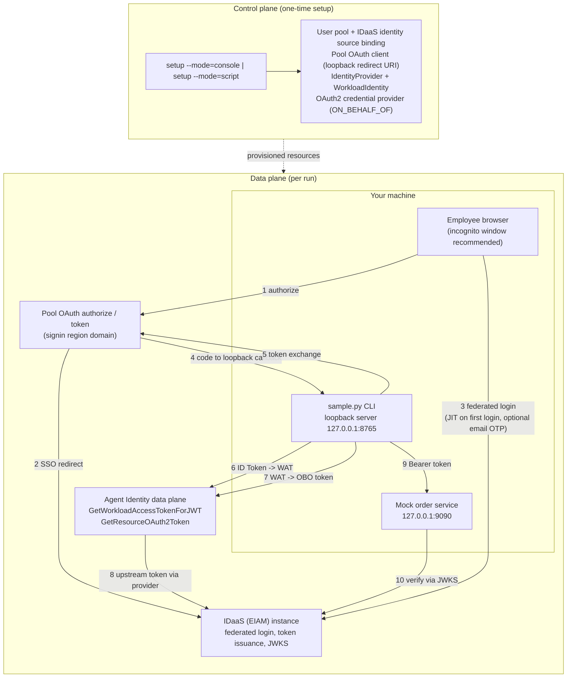

# Agent Identity × IDaaS: Inbound Federated Login + OBO Outbound (CLI Sample)

A zero-dependency CLI sample that demonstrates the full chain of **Agent
Identity × IDaaS**: an employee federates into an Agent Identity user pool via
IDaaS, the identity is lifted from "human" to "workload" (Workload Access
Token), exchanged on-behalf-of for a downstream OAuth2 token, and a mock order
service returns **identity-differentiated data**. Pure Python 3.9+ standard
library — no third-party runtime dependencies.

> 📖 Deep dives: [docs/architecture.md](./docs/architecture.md) (token
> sequence, API mapping, RPC signing) ·
> [docs/control-plane-console.md](./docs/control-plane-console.md) (console
> walkthrough; screenshots pending — see the note at the top of that document) ·
> [docs/troubleshooting.md](./docs/troubleshooting.md) (every known pitfall).

## 🚀 Overview

**The story in one line**: an enterprise employee logs in through the
corporate IDaaS → the identity is lifted to a Workload Access Token (WAT) →
exchanged outbound **on-behalf-of** the employee → the order service returns
different data depending on **who** is calling and **what scopes** they hold.



The four data-plane steps (each runnable independently; tokens persist under
`.tokens/`):

| Step | Command | What happens |
|---|---|---|
| 1 | `python3 sample.py login` | Browser federated login → loopback callback → pool ID Token |
| 2 | `python3 sample.py exchange-wat` | ID Token → WAT (identity lift: human → workload) |
| 3 | `python3 sample.py obo` | WAT → order-service access token (on-behalf-of outbound) |
| 4 | `python3 sample.py serve-orders` | Local mock order service: verify the token, return data by `sub` / `scope` |

One command chains them all: `python3 sample.py demo`.

## ⚙️ Prerequisites

| Requirement | Description |
|------|------|
| Python 3.9+ | The CLI and the mock order service are pure standard library — **zero third-party runtime dependencies** |
| Platform | Verified on macOS and Linux; Windows should work in theory (pure standard library) but is untested |
| Alibaba Cloud account | Agent Identity service activated in your region |
| AccessKey pair | Needed for `setup --mode=script` and the data-plane RPC calls (`exchange-wat`, `obo`); recommend a least-privilege RAM user |
| An IDaaS (EIAM) instance | With at least one employee account that can log in |
| aliyun CLI *(optional)* | For diagnostics / equivalent API calls only — **not required** to run this sample: it implements Alibaba Cloud RPC V1 signing itself |

## 📦 Installation

### 1. Clone the repository

```bash
git clone https://github.com/aliyun/agent-identity-dev-kit
cd agent_identity_python_samples/idaas-cli-obo_sample
```

### 2. Create your local `.env`

```bash
cp env.template .env
chmod 600 .env
```

### 3. Fill in `.env`

Every placeholder (`<YOUR_...>`) must be replaced. Where each value comes
from (also documented inline in `env.template`, and validated by
`python3 sample.py --check`):

| Variable | Source | Description |
|------|------|------|
| `REGION` | Console top bar | Region ID, e.g. `cn-hangzhou` |
| `ALIYUN_ACCESS_KEY_ID` / `ALIYUN_ACCESS_KEY_SECRET` | RAM console → AccessKey management | AK pair; used by `setup --mode=script`, `exchange-wat`, `obo` |
| `ALIYUN_SECURITY_TOKEN` | *(optional)* STS | Only when using temporary credentials |
| `CONTROL_ENDPOINT` | — (generic form) | Control plane, `agentidentity.<region>.aliyuncs.com` |
| `DATA_ENDPOINT` | — (generic form) | Data plane, `agentidentitydata.<region>.aliyuncs.com` |
| `SIGNIN_BASE_URL` | User pool detail page | Pool OAuth root, `https://signin.<region>.aliyuncs.com` |
| `USER_POOL_ID` | setup output / console | User pool ID (`up_...`) |
| `OAUTH_CLIENT_ID` | setup output / console | Pool OAuth client ID (`client_...`) |
| `OAUTH_CLIENT_SECRET` | setup output / console | Pool OAuth client secret (or use `OAUTH_CLIENT_SECRET_FILE`, a 0600 file) |
| `OAUTH_REDIRECT_URI` | — | `http://127.0.0.1:8765/callback` (default) |
| `WI_NAME` | setup output / console | Workload identity name — must have session binding enabled |
| `OBO_PROVIDER_NAME` | setup output / console | Outbound OAuth2 credential provider name |
| `ORDER_SERVICE_AUDIENCE` | IDaaS console → order-service app | Audience, shaped `agent-<outbound-app-clientId>` |
| `ORDER_SERVICE_SCOPES` | — (optional) | Comma-separated; default `read,write.all` |
| `ORDER_SERVICE_ISSUER` / `ORDER_SERVICE_JWKS_URI` | IDaaS discovery document | `issuer` / `jwks_uri` from `GET {IDAAS_ORIGIN}/api/v2/iauths_system/oauth2/.well-known/openid-configuration` (publicly reachable) |
| `SETUP_*` | — (mode B only) | Resource names and provider config for `setup --mode=script`; see the comments in `env.template` |

> The mock order service verifies tokens with its own pure-standard-library
> RS256 implementation (educational). Production code should use
> PyJWT + cryptography.

## 🔧 Resource Setup (control plane — two ways)

The control plane is a one-time setup: user pool → IDaaS binding → pool OAuth
client → outbound provider → workload identity. Pick **one** of two modes:

### Option 1 — Console walkthrough (recommended if you want to understand each piece)

Run `python3 sample.py setup --mode=console` to print the numbered checklist,
then follow **[docs/control-plane-console.md](./docs/control-plane-console.md)**
— a screenshot-annotated, 6-step walkthrough (screenshots pending — see the
note at the top of that document):

1. Create a user pool → record `USER_POOL_ID` (also grab `SIGNIN_BASE_URL`
   from the pool detail page).
2. Bind IDaaS as the identity source; wait for the orchestration phases
   (binding → SCIM → SSO) to reach Enabled.
3. *(Optional)* Enable SCIM provisioning — the main line does not need it.
4. Create the pool OAuth client; the redirect-uri whitelist must include a
   loopback entry `http://127.0.0.1:8765/callback` → record
   `OAUTH_CLIENT_ID` / `OAUTH_CLIENT_SECRET`.
5. Create the order-service app on the IDaaS side, then the OAuth2 credential
   provider in Agent Identity (vendor IDaaS, type ON_BEHALF_OF) → record
   `OBO_PROVIDER_NAME` / `ORDER_SERVICE_AUDIENCE`.
6. Create the IdentityProvider (discovery = this pool) and the
   WorkloadIdentity **with session binding enabled** → record `WI_NAME` and
   the order-service issuer/JWKS from the IDaaS discovery document.

### Option 2 — One-shot script (recommended if you just want it running)

```bash
python3 sample.py setup --mode=script          # add --with-scim for SCIM guidance only
```

The script is **idempotent**: each step queries by name first (`[CREATE]` vs
`[REUSE]`), waits for the SSO orchestration to reach `Enabled`, merges the
loopback redirect URI into the whitelist with a read-after-write check, and
only on full success writes the outputs back to `.env` (0600, atomic). A
failed run never writes a half-filled `.env` — fix the reported issue and
re-run; completed steps are skipped.

**Known limitation (honest note from pre-release testing)**: the CLI help for
`SetSpecificIdentityProvider` currently lists **DingTalk only** as the
supported identity-source type. If binding IDaaS via the script fails with
`InvalidParameter`, do that single binding in the console (Option 1, step 2)
and re-run the script — it will pick up where it left off. Also note
`SETUP_OBO_PROVIDER_CONFIG` (the JSON pointing at the IDaaS order-service
application) must be filled in `.env` beforehand, and the credential-provider
quota is 1 per account (an existing one is reused).

**What the script writes back — and what it does not**: the script only
writes back the resources it creates (`USER_POOL_ID`, `OAUTH_CLIENT_ID`,
`OAUTH_CLIENT_SECRET`, `WI_NAME`, `OBO_PROVIDER_NAME`). You still need to
fill in `SIGNIN_BASE_URL`, `ORDER_SERVICE_AUDIENCE`, `ORDER_SERVICE_ISSUER`
and `ORDER_SERVICE_JWKS_URI` yourself, following the table above (the last
three require creating the order-service application on the IDaaS side first
— see Option 1, steps 5/6). Run `python3 sample.py --check` before the demo
to confirm everything is in place.

### SCIM (out of scope for v1)

This sample does not automate SCIM provisioning and has not verified it in
pre-release testing. The main line does not need it — the **first federated
login provisions the user just-in-time (JIT)** automatically. SCIM
pre-provisioning (with `externalId` = IDaaS `sub`) is an advanced option for
controlling group membership before first login; see
[docs/architecture.md](./docs/architecture.md#scim-positioning).

Then verify your configuration:

```bash
python3 sample.py --check
```

## 🏃 Running (data plane — 4 steps)

> The CLI prints Chinese output (that's what the code emits). Token values are
> always masked (`eyJhbGci…(len=1498)` style) — full tokens only land in
> `.tokens/` (0600).

### Step 1 — `login`: browser federated login → pool ID Token

```bash
python3 sample.py login              # --port 8766 if 8765 is taken; --timeout 300 by default
```

**Tips before you start** (two scenarios, seemingly opposite — pick by case):

- **First login (or switching accounts): use an incognito/private window** —
  reusing a stale pool session breaks the `session_id` ↔ hosted-credential
  match and the later OBO call fails with `Forbidden.InboundCredentialMissing`.
- **Re-running `demo` with the same account: keep a normal (non-incognito)
  window signed in** — the SSO session carries straight through, so you skip
  the email OTP/MFA step entirely. Incognito windows start from a clean
  slate and would force the full OTP flow again.
- IDaaS may require **email OTP / MFA as a second step** (observed in
  pre-release testing after a policy change) — complete it interactively in
  the browser; it is expected, not a failure.

Expected output (abridged, values masked):

```
[login] 回调服务已就绪：http://127.0.0.1:8765/callback（超时 300s）
[login] 正在打开浏览器完成 IDaaS 联邦登录 …
[login] 提示：建议使用无痕/隐私窗口——复用浏览器旧池会话会导致 session_id 不匹配，
        后续 OBO 报 Forbidden.InboundCredentialMissing。
[login] 提示：IDaaS 登录若启用邮箱 OTP/MFA，请在浏览器内按页面引导完成。
... (complete login & consent in the browser)
[login] 授权码已收到（state 校验通过），正在兑换池令牌 …
[login] 池 ID Token 已获取（eyJhbGci…(len=1536)）
[login] claims 教学断言（仅解码，不验签——JWKS 公网路径见 docs/troubleshooting.md）：
        sub        = user_xxxxxxxx…
        iss        = https://agentidentitydata.<region>.aliyuncs.com/up_xxxxxxxx…
        aud        = client_xxxxxxxx…（应含 OAUTH_CLIENT_ID）
        session_id = 0f3ec1a2-…（示意）
                   └─ session_id 是 OBO 的定位键：region 按 (pool, user, session_id) 查托管入站凭证
        nonce      = k9Xm…（回显校验：通过）
[login] 已落盘 .tokens/id_token（0600）→ 下一步：python3 sample.py exchange-wat
```

### Step 2 — `exchange-wat`: identity lift (ID Token → WAT)

```bash
python3 sample.py exchange-wat
```

> In a real product this call is made **by the Agent framework automatically
> (invisible to the user)**; the CLI only invokes it directly to demonstrate
> the identity being lifted from "human" to "workload". The WAT is a JWE —
> not locally decodable by design — and lives **~5 minutes** (measured), so
> proceed to step 3 immediately.

```
[exchange-wat] 调用 GetWorkloadAccessTokenForJWT（endpoint=agentidentitydata.<region>.aliyuncs.com）…
[exchange-wat] 说明：真实场景中这一步由 Agent 框架自动完成（用户无感）；
                此处用 CLI 直接调用，仅为演示身份从「人」升维为「工作负载」。
[exchange-wat] 成功（RequestId=xxxxxxxx-xxxx-xxxx-xxxx-xxxxxxxxxxxx）
[exchange-wat] WAT 已落盘（eyJhbGci…(len=892)）。注意：WAT 为 JWE 加密令牌，本地不可解码，
        属设计行为；有效期很短（实测约 5 分钟）→ 请立即执行 obo
```

### Step 3 — `obo`: outbound token on behalf of the employee

```bash
python3 sample.py obo
```

```
[obo] 调用 GetResourceOAuth2Token（OAuth2Flow=ON_BEHALF_OF）…
      Provider=idaas-obo-sample-provider Audience=agent-<outbound-app-clientId> Scopes=["read", "write.all"]
      契约：业务参数必须全部放 formData body（Scopes 传 JSON 数组字符串，禁止逐个传参）
[obo] 成功（RequestId=xxxxxxxx-xxxx-xxxx-xxxx-xxxxxxxxxxxx）：订单服务 AT 已落盘（eyJhbGci…(len=1498)）
[obo] 订单服务 RT 已落盘（eyJhbGci…(len=743)）；刷新令牌仅作演示，sample 不实现刷新流程
[obo] AT claims（on-behalf-of 委托语义）：
        iss     = https://<your-eiam-instance>…（令牌由 IDaaS 签发）
        aud     = agent-<outbound-app-clientId>（受众=订单服务应用）
        scope   = read write.all
        sub     = user_xxxxxxxx…（主体=登录员工）
        act.sub = acs:agentidentity:<region>:<account-id>:workloadidentitydirectory/default/workloadidentity/idaas-obo-sample-wi
                  （实际执行者=工作负载身份 ARN：Agent 以用户名义行事）
        exp     = 2026-08-29 18:00:00（余 3599 秒）
[obo] 下一步：python3 sample.py serve-orders（或直接 python3 sample.py demo 全链路）
```

`act.sub` carrying the **Workload Identity ARN** while `sub` stays the
employee is the essence of on-behalf-of delegation — see
[docs/architecture.md](./docs/architecture.md#on-behalf-of-delegation-semantics).

> **If `obo` fails with `EntityNotExists`**: the provider named by
> `OBO_PROVIDER_NAME` no longer exists (it may have been cleaned up, or the
> quota-1 slot was taken by another provider). List what currently exists
> (`ListOAuth2CredentialProviders`, or the console "Credential Providers"
> page) — if the slot is free, re-run `setup --mode=script` to rebuild it
> (outputs are written back to `.env`); if another provider occupies the
> quota, confirm the old one is safe to delete before rebuilding.

### Step 4 — `serve-orders`: the mock order service

```bash
python3 sample.py serve-orders          # --port 9090 by default; Ctrl+C to stop
```

```
[orders] 模拟订单服务已启动：http://127.0.0.1:9090（GET /health | GET /orders | POST /orders）
[orders] Ctrl+C 停止。demo 命令会在后台自动起停本服务。
```

Routes: `GET /health` (no auth) · `GET /orders` (Bearer verified; `read.all`
scope → all orders, otherwise only the caller's own) · `POST /orders`
(`write.all` required, else 403).

### One-shot — `demo`

```bash
python3 sample.py demo              # --port 8766 if the login callback port 8765 is taken
```

Starts the order service on an ephemeral port in the background, runs
login → exchange-wat → obo **without pausing between steps 2 and 3** (to stay
inside the 5-minute WAT window), calls `GET /orders` and `POST /orders`, then
stops the service. The login loopback port defaults to the one extracted from
`OAUTH_REDIRECT_URI` (usually 8765); pass `--port` to override — the
redirect-uri whitelist ignores loopback ports, so no console change is needed:

```
[demo] 第 1 步：login（浏览器联邦登录，loopback 端口 8765）
[demo] 第 2 步：exchange-wat（WAT 有效期仅约 5 分钟，立即进入第 3 步）
[demo] 第 3 步：obo（on-behalf-of 换取订单服务令牌）
[demo] 第 4 步：用订单服务 AT 调用本地模拟服务
[demo GET /orders] HTTP 200 →
        scope_view=own sub=user_xxxxxxxx… 订单数=0
        （当前 scope 无 read.all → 只能看到本人订单；把你的 sub 配置到
          orders/mock_data.py 的 SUB_ALIAS / ORDERS_BY_SUB 即可看到数据）
[demo POST /orders (write.all)] HTTP 201 →
        scope_view=- sub=- 订单数=-
[demo] 全链路完成：入站联邦登录 → WAT 身份升维 → OBO 出站 → 订单服务按身份返回差异化数据。
[demo] 换一个用户（或无痕窗口换账号）重跑 demo，可见 /orders 返回不同数据。
```

To see "own orders" with your real sub, map it in
`orders/mock_data.py` (`SUB_ALIAS = {"user_xxxxxxxx…": "employee-alice"}`),
or just re-run `demo` with a different account.

## ✅ Verification

The demo (or the four steps) succeeded when all of the following hold:

1. **`demo` printed the final summary line** — inbound federated login → WAT
   identity lift → OBO outbound → identity-differentiated order data.
2. **`GET /orders` responds 200 and is differentiated**: with `read.all` you
   see all orders (`scope_view=all`); without it only your own
   (`scope_view=own`); a fresh/unknown sub yields `count=0` by design.
   Re-running with a **different account** returns different data.
3. **`POST /orders` returns 201 with `write.all`**, and `403
   insufficient_scope` without it.
4. **`obo` printed `act.sub` = the Workload Identity ARN** (the agent acting
   on behalf of the employee) and `sub` = the federated employee.
5. Negative checks (optional): `curl http://127.0.0.1:9090/orders` without a
   token → `401 invalid_request`; with a tampered token → `401
   invalid_token` (the response never echoes the token body).
6. **Offline test suite** (no network, no third-party dependencies): from
   this sample's directory run `python3 -m unittest discover -s tests` —
   all green confirms the sample logic itself is intact.

Cleanup when done — the command deletes **only resources recorded in
`.tokens/created_resources.json`** (written by `setup --mode=script`), never
raw `.env` names, so manually-configured resources are never touched:

```bash
python3 sample.py cleanup            # prints the manifest, asks for confirmation; --yes skips the prompt
```

Add `--keep-pool` to skip (and keep in the manifest) the user pool entry —
handy when iterating on the demo, since re-creating the pool means waiting
for the SSO orchestration again.

If the manifest is missing, cleanup refuses to delete and points you to the
console walkthrough instead. The explicit (and dangerous) escape hatch is
`python3 sample.py cleanup --from-env --yes` — it builds the deletion list
from the current `.env` values and requires both flags as a double
confirmation.

## 🤝 Support

For questions or inquiries about the Agent Identity SDK:
- Refer to the [official documentation](https://help.aliyun.com/product/agent-identity)
- Contact Alibaba Cloud support
- Submit issues in the repository

---

## 📄 License

This project is licensed under the Apache License 2.0 — see the [LICENSE](../../LICENSE) file at the repository root for details.
