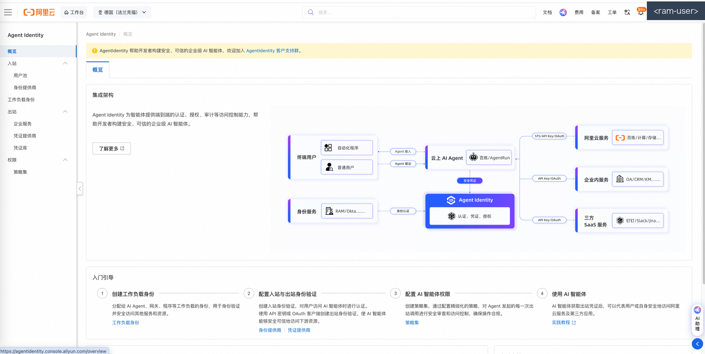
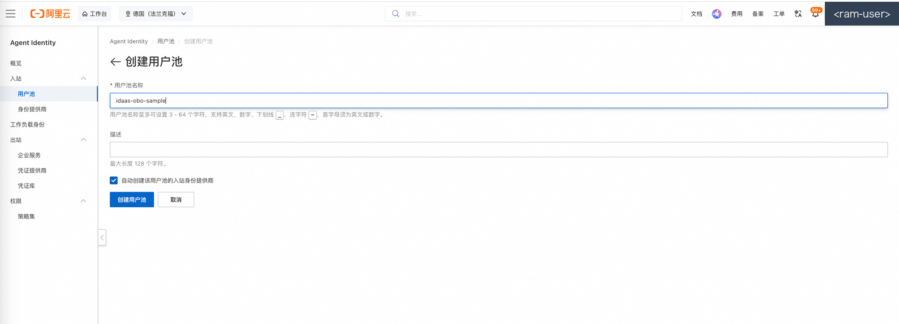
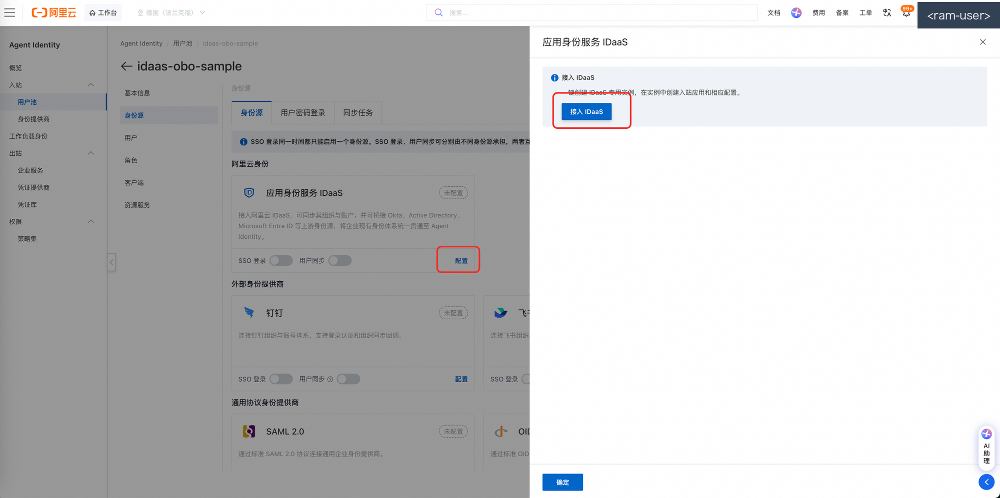
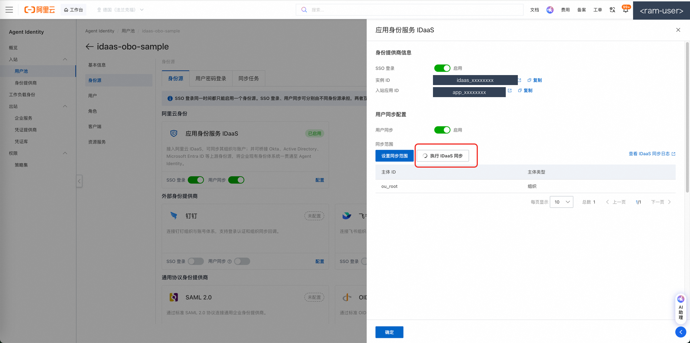
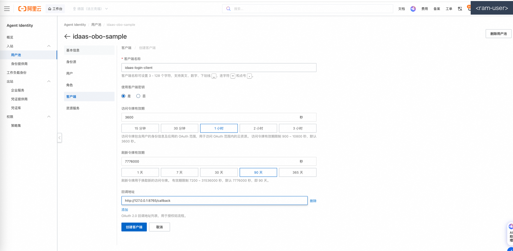
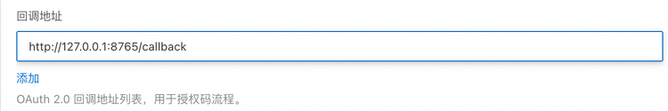
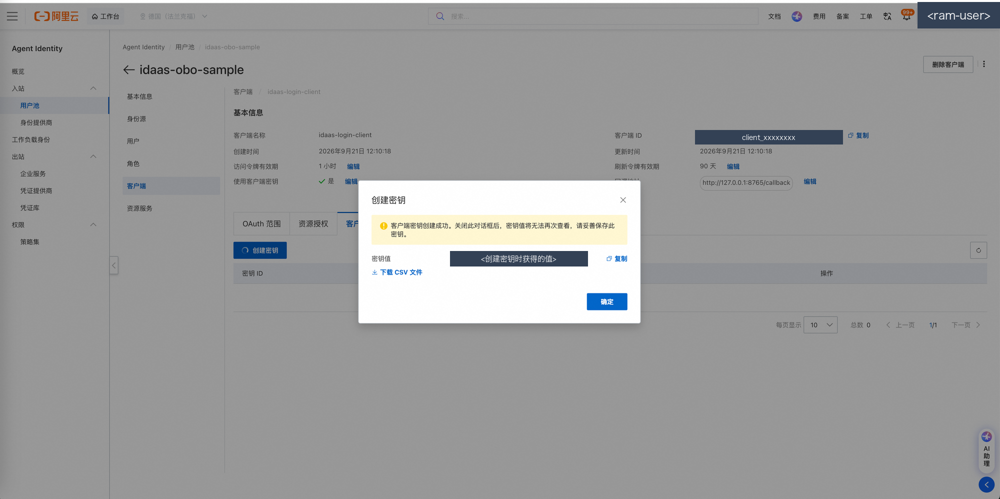
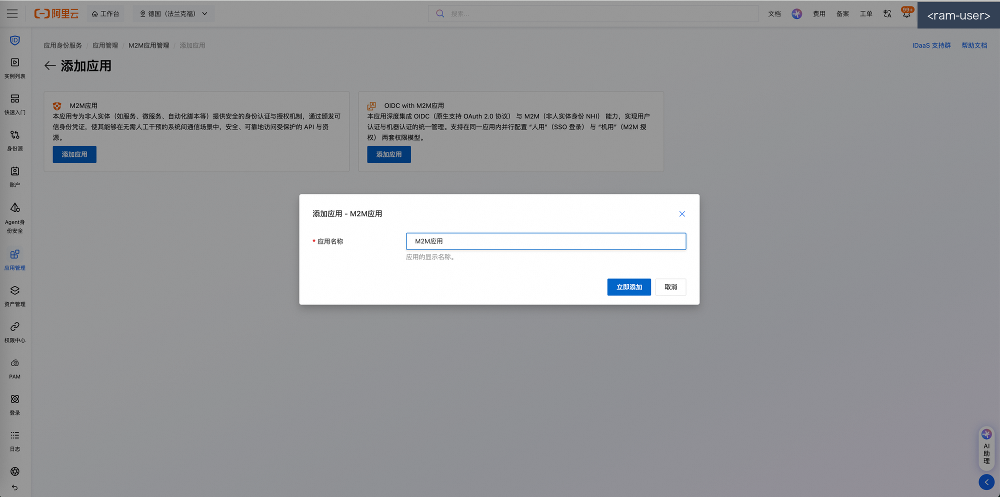
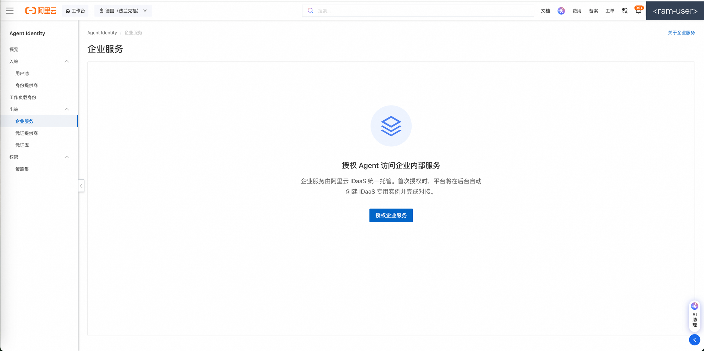
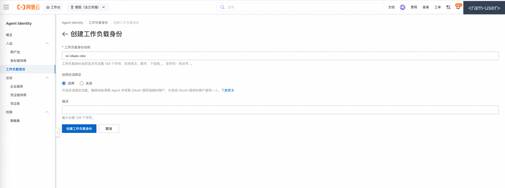

<!-- IMAGES PENDING: screenshots will be added by a follow-up task -->

# Control-Plane Setup via Console (Mode A)

This is the console walkthrough for **Mode A** (`python3 sample.py setup
--mode=console`): creating every control-plane resource by hand in the Alibaba
Cloud console. It mirrors the 6-step checklist printed by the CLI and shows
where each produced value goes in `.env`. The body of this document is written
in Chinese.

> 📌 **关于截图**：文中 `images/` 截图由后续任务补充入库，当前链接暂为空属预期。
> 个别步骤若你的控制台版本没有对应入口（预发/灰度控制台入口可能与正式环境不同），
> 请优先使用每步末尾给出的等价 API/CLI 方式，文档后续将按实际界面补充替代说明。

---

## 脱敏声明与打码规范

本文及本仓库截图**均不含任何真实凭据与真实资源标识**。入库前按下述
checklist 逐项打码：

- [ ] **账号 UID**（主账号/子账号的数字 ID）
- [ ] **前缀类资源 ID**：`up_`（用户池）、`client_`（OAuth 客户端）、`app_`（应用）等后接长十六进制串的 ID
- [ ] **用户名/邮箱**（含浏览器页面里出现的登录账号名）
- [ ] **EIAM 实例子域名**（IDaaS 实例的专属域名）
- [ ] **内网 IP**（VPC 内网地址）
- [ ] **浏览器书签栏**（截图时藏起书签，避免泄露内部系统域名）

文档中的示例值一律使用填充形态：`up_xxxxxxxxxxxxxxxxxxxxxxxxxxxxxxxx`、
`client_xxxxxxxxxxxxxxxxxxxxxxxxxxxxxxxx`、`<企业服务应用 audience 标识，
如 test-aud>`、`<your-eiam-instance>`、`<account-id>` 等，请替换为你的真实值
（只填进本地 `.env`，不要提交到仓库）。

---

## 总览：6 大步与 .env 产出对照

| 步骤 | 做什么 | 回填 .env |
|---|---|---|
| 1 | 创建用户池 | `USER_POOL_ID` |
| 2 | 绑定 IDaaS（身份源联邦） | 无（SSOStatus=Enabled 即可） |
| 3 | （可选）开启 SCIM provisioning | 主线可跳过 |
| 4 | 创建池 OAuth 应用（数据面登录客户端） | `OAUTH_CLIENT_ID`、`OAUTH_CLIENT_SECRET` |
| 5 | 注册出站资源（订单服务应用） | `OBO_PROVIDER_NAME`、`ORDER_SERVICE_AUDIENCE`（企业服务应用自身的 audience 标识） |
| 6 | 创建工作负载身份 + 记录令牌验签源 | `WI_NAME`、`SIGNIN_BASE_URL`、`ORDER_SERVICE_ISSUER`、`ORDER_SERVICE_JWKS_URI` |

---

## 步骤 1：创建用户池

**导航路径**：进入阿里云控制台 → 搜索并进入「云身份 Agent Identity」产品控制台 → 左侧导航「用户池」→ 点击「创建」。

**操作要点**：

1. 用户池名称自定（3~64 字符，账号内唯一；例如 `idaas-obo-sample-pool`），
   地域选择你要演示的 `REGION`（如 `cn-hangzhou`），其余保持默认。
2. 创建完成后进入**用户池详情页**：在详情页基本信息中找到
   **用户池 ID**（`up_` 前缀）。（同页也能看到登录根地址
   `https://signin.<region>.aliyuncs.com`，即第 6 步要记录的 `SIGNIN_BASE_URL`，
   可先顺手记下。）






**产出回填 `.env`**：

```ini
USER_POOL_ID=up_xxxxxxxxxxxxxxxxxxxxxxxxxxxxxxxx
```

（`SIGNIN_BASE_URL` 也在用户池详情页取值，第 6 步统一回填。）

> **等价的 API/CLI 方式**：
> ```bash
> aliyun agentidentity create-user-pool --user-pool-name idaas-obo-sample-pool
> # 查询已有池（按名复用）：
> aliyun agentidentity list-user-pools
> ```
> 参数名以 `aliyun agentidentity <子命令> --help` 输出为准。

---

## 步骤 2：绑定 IDaaS（身份源联邦）

**导航路径**：进入「云身份 Agent Identity → 用户池」→ 点击刚创建的用户池进入详情 → 「设置」→「身份源」→ 选择「IDaaS」。

**操作要点**：

1. 填写 IDaaS 侧应用的 **clientId / 私钥**（该应用在 IDaaS 实例中提前创建好，
   与本池做联邦对接）。
2. 提交后等待**编排相位**依次完成：**绑定 → SCIM 配置 → SSO 配置**。在
   身份源编排/SSO 状态页观察，直至状态为「已启用」（`SSOStatus=Enabled`）。
3. 本步骤无需向 `.env` 抄录任何值——编排完成即可。





> **等价的 API/CLI 方式**：
> ```bash
> aliyun agentidentity set-specific-identity-provider \
>   --user-pool-name idaas-obo-sample-pool --identity-provider-type IDaaS ...
> aliyun agentidentity get-specific-identity-provider \
>   --user-pool-name idaas-obo-sample-pool --identity-provider-type IDaaS
> ```
> ⚠️ 注意：aliyun CLI 帮助标注 `SetSpecificIdentityProvider` 当前**仅支持
> DingTalk** 类型（预发实测；新加坡正式环境实测该 API 仅接受 DingTalk /
> Feishu / WeCom，**IDaaS 类型必须控制台人工绑定**）。IDaaS 类型的绑定以
> **控制台操作为准**；脚本绑定被拒绝时会打印兑底指引并继续后续步骤，请在
> 控制台完成本步骤后再重跑 setup（幂等，会跳过已完成步骤）。

---

## 步骤 3：（可选）开启 SCIM provisioning

**导航路径**：用户池详情 →「设置」→「身份源 / SCIM 配置」→ 开启 SCIM provisioning。

**操作要点**：

- 开启后记录 **SCIM 端点**（Base URL）与凭证获取方式。
- **本 sample 主线不依赖 SCIM**：员工首次联邦登录时用户池会自动 JIT 建档，
  演示链路无需预置用户。SCIM 预置（`externalId` = IDaaS `sub`）适合需要在
  首登前控制用户组/账号状态的进阶场景，详见 [architecture.md 的 SCIM 一节](./architecture.md#scim-positioning)。
- `setup --mode=script --with-scim` 仅打印指引，不做自动化。

（本步骤无专属截图；如控制台无 SCIM 入口，说明当前产品版本未开放，跳过即可。）

---

## 步骤 4：创建池 OAuth 应用（数据面登录客户端）

**导航路径**：用户池详情 →「OAuth 客户端」→ 点击「创建」。

**操作要点**：

1. 客户端名称自定（池内唯一，例如 `idaas-obo-sample-cli`）。
2. **回跳地址（redirect_uri 白名单）必须包含一条 loopback 条目**：
   `http://127.0.0.1:8765/callback`。白名单中含任意一条 loopback 条目
   （`localhost` 或 `127.0.0.1`）即放行且**忽略端口**——所以 `login --port`
   换端口时无需回控制台改白名单。
3. 建议开启**强制 PKCE**；同时按提示创建**客户端密钥**（机密客户端，
   token 兑换时需要 `client_secret`）。
4. 记录 **ClientId**（`client_` 前缀）与 **ClientSecret**（只展示一次，妥善保存）。







**产出回填 `.env`**：

```ini
OAUTH_CLIENT_ID=client_xxxxxxxxxxxxxxxxxxxxxxxxxxxxxxxx
OAUTH_CLIENT_SECRET=<创建密钥时获得的值>
OAUTH_REDIRECT_URI=http://127.0.0.1:8765/callback
```

> **等价的 API/CLI 方式**：
> ```bash
> aliyun agentidentity create-user-pool-client \
>   --user-pool-name idaas-obo-sample-pool --client-name idaas-obo-sample-cli \
>   --redirect-ur-is http://127.0.0.1:8765/callback \
>   --enforce-pkce true --secret-required true
> # 密钥单独创建：
> aliyun agentidentity create-client-secret \
>   --user-pool-name idaas-obo-sample-pool --client-name idaas-obo-sample-cli
> ```
> ⚠️ CLI 多值参数（如 `--redirect-ur-is`）必须传 **JSON 数组单参数**
> （`'["a","b"]'`）；空格分隔只取第一个值。`UpdateUserPoolClient` 是**整体
> 替换**语义，任何写操作后请回读校验（写后必读），避免白名单丢条目。

---

## 步骤 5：注册出站资源（订单服务应用）

先在 **IDaaS 侧**创建企业服务应用，再回到 **Agent Identity 侧**创建指向它的
凭证提供商。

**导航路径（IDaaS 侧）**：进入 IDaaS（EIAM）实例控制台 →「应用」→「添加应用」
→ 选择「企业服务应用」类型创建（模拟订单服务）。记录该应用的**应用
clientId**（provider 配置需要）与其 **audience 标识**（应用详情页，如
`test-aud` 这类值）——后者即 `ORDER_SERVICE_AUDIENCE`。⚠️ **不是** OBO
provider 的 OutboundAudience（`agent-…` 形态）：误传将报
`Forbidden.IdaasRsNotAuthorized`（正式环境实测）。



**导航路径（Agent Identity 侧）**：进入「云身份 Agent Identity」→「凭证提供商」
→「创建 OAuth2 凭证提供商」。

**操作要点**：

1. 提供商名称自定（例如 `idaas-obo-sample-provider`）——回填
   `OBO_PROVIDER_NAME`。
2. 厂商选择 **IDaaS**，授权类型选择 **ON_BEHALF_OF**。
3. 配置（OAuth2ProviderConfig）指向上一步创建的 IDaaS 订单服务应用
   （clientId / clientSecret 等，字段结构以
   `aliyun agentidentity create-oauth2-credential-provider --help` 为准），
   并确保 IDaaS 侧已完成该应用的授权边（应用授权给目标）与认证方式/密钥配置。
4. 记录 `ORDER_SERVICE_AUDIENCE`：IDaaS 控制台该**企业服务应用详情页的
   audience 标识**（如 `test-aud`）；**不是** provider 的 OutboundAudience
   （`agent-…` 形态，误传报 `Forbidden.IdaasRsNotAuthorized`）。



**产出回填 `.env`**：

```ini
OBO_PROVIDER_NAME=idaas-obo-sample-provider
ORDER_SERVICE_AUDIENCE=<企业服务应用的 audience 标识，如 test-aud>
```

> **等价的 API/CLI 方式**：
> ```bash
> aliyun agentidentity create-oauth2-credential-provider \
>   --credential-provider-vendor IDaaS \
>   --o-auth2-credential-provider-name idaas-obo-sample-provider ...
> ```
> ⚠️ 实测**每个账号凭证提供商配额 = 1**：已存在时会提示复用；如需重建须先
> 删除旧 provider（注意会影响引用它的既有链路）。查询列表（ListOAuth2CredentialProviders）
> **不要带分页参数**，带分页参数预发实测报 `ServiceUnavailable`。

---

## 步骤 6：创建工作负载身份（OBO 委托主体）并记录令牌验签源

本步骤创建两样东西：**IdentityProvider**（信任本池的 discovery）与
**WorkloadIdentity**（OBO 的委托主体），并记录订单服务令牌的验签源。

**导航路径（IdentityProvider）**：进入「云身份 Agent Identity」→「身份提供商」
→「创建」，discovery 地址填本池的：
`https://{DATA_ENDPOINT}/{USER_POOL_ID}/.well-known/openid-configuration`
（`DATA_ENDPOINT` 形态 `agentidentitydata.<region>.aliyuncs.com`）。

**导航路径（WorkloadIdentity）**：进入「云身份 Agent Identity」→「工作负载身份」
→「创建」，关联上一步的 IdentityProvider。

**操作要点**：

1. **务必开启 SessionBindingEnabled（会话绑定）**——否则后续 OBO 报
   `Forbidden.InboundCredentialMissing`。
2. 记录工作负载身份名（例如 `idaas-obo-sample-wi`）——回填 `WI_NAME`。
3. 记录**池登录根地址**：用户池详情页展示的登录地址，形态
   `https://signin.<region>.aliyuncs.com`（完整地址含 `https://` 前缀）
   ——回填 `SIGNIN_BASE_URL`。
4. 记录订单服务令牌验签源：浏览器或 curl 请求 IDaaS 实例的 discovery：

   ```bash
   curl https://<your-eiam-instance>.aliyunidaas.com/api/v2/iauths_system/oauth2/.well-known/openid-configuration
   ```

   返回 JSON 中的 `issuer` → `ORDER_SERVICE_ISSUER`；`jwks_uri` →
   `ORDER_SERVICE_JWKS_URI`（均为公网可达地址）。




**产出回填 `.env`**：

```ini
WI_NAME=idaas-obo-sample-wi
SIGNIN_BASE_URL=https://signin.<region>.aliyuncs.com
ORDER_SERVICE_ISSUER=https://<your-eiam-instance>.aliyunidaas.com/api/v2/iauths_system/oauth2
ORDER_SERVICE_JWKS_URI=https://<your-eiam-instance>.aliyunidaas.com/api/v2/iauths_system/oauth2/jwks
```

（以上为示意形态，以你的 IDaaS discovery 实际返回为准。）

> **等价的 API/CLI 方式**：
> ```bash
> aliyun agentidentity create-identity-provider \
>   --identity-provider-name idaas-obo-sample-idp \
>   --discovery-url https://agentidentitydata.<region>.aliyuncs.com/up_xxxxxxxx…/.well-known/openid-configuration
> aliyun agentidentity create-workload-identity \
>   --workload-identity-name idaas-obo-sample-wi \
>   --identity-provider-name idaas-obo-sample-idp \
>   --session-binding-enabled true
> ```

---

## 手动删除资源（模式 A / 手动配置的清理路径）

`python3 sample.py cleanup` 只会删除 `setup --mode=script` 记录在
`.tokens/created_resources.json` 清单内的资源；**手动创建（模式 A）的资源不在
清单内，cleanup 会拒绝删除并指向本节**。请按下列逆序在控制台手动删除
（先删依赖方、后删被依赖方；每步都先核对名称与地域再点删除）：

| 顺序 | 删除什么 | 入口 |
|---|---|---|
| 1 | OAuth2 凭证提供商（配额=1，删除前确认无其他链路引用） | 「凭证提供商」列表 → 删除 |
| 2 | 工作负载身份 | 「工作负载身份」列表 → 删除 |
| 3 | IdentityProvider | 「身份提供商」列表 → 删除 |
| 4 | 池 OAuth 客户端（密钥随客户端一并失效） | 用户池详情 → 「OAuth 客户端」→ 删除 |
| 5 | 用户池（会移除池内全部客户端/会话数据，不可恢复） | 「用户池」列表 → 删除 |

> 注意：订单服务等 IDaaS 侧应用不在 Agent Identity 管辖范围，如需一并清理
> 请到 IDaaS 控制台对应应用页操作。
>
> 等价的 API/CLI 方式（示例，参数名以 `--help` 为准）：
> ```bash
> aliyun agentidentity delete-oauth2-credential-provider --oauth2-credential-provider-name <名称>
> aliyun agentidentity delete-workload-identity --workload-identity-name <名称>
> aliyun agentidentity delete-identity-provider --identity-provider-name <名称>
> aliyun agentidentity delete-user-pool-client --user-pool-name <池名> --client-name <客户端名>
> aliyun agentidentity delete-user-pool --user-pool-name <池名>
> ```

---

## 抄录完成后

1. 运行体检，逐项确认缺失项已补齐：

   ```bash
   python3 sample.py --check
   ```

2. 开始数据面四步（或一键 `demo`）：

   ```bash
   python3 sample.py login
   ```

偏好脚本一键创建？改用模式 B：`python3 sample.py setup --mode=script`
（需要 AK 凭证；幂等，已完成步骤自动跳过——详见 README 的 Resource Setup 一节）。
