# Control-Plane Setup via Console (Mode A)

This is the console walkthrough for **Mode A** (`python3 sample.py setup
--mode=console`): creating every control-plane resource by hand in the Alibaba
Cloud console. It mirrors the 6-step checklist printed by the CLI and shows
where each produced value goes in `.env`. The body of this document is written
in Chinese.

---

## 脱敏声明与打码规范

本文及本仓库截图**均不含任何真实凭据与真实资源标识**。入库前按下述
checklist 逐项打码：

- [ ] **账号 UID**（主账号/子账号的数字 ID）
- [ ] **前缀类资源 ID**：`up_`（用户池）、`client_`（OAuth 客户端）、`app_`（应用）等后接长十六进制串的 ID
- [ ] **用户名/邮箱**（含浏览器页面里出现的登录账号名）
- [ ] **EIAM 实例子域名**（IDaaS 实例的专属域名）
- [ ] **内网 IP**（VPC 内网地址）
- [ ] **浏览器书签栏**（截图时藏起书签，避免泄露内部系统域名）

文档中的示例值一律使用填充形态：`up_xxxxxxxxxxxxxxxxxxxxxxxxxxxxxxxx`、
`client_xxxxxxxxxxxxxxxxxxxxxxxxxxxxxxxx`、`<企业服务应用 audience 标识，
如 test-aud>`、`<your-eiam-instance>`、`<account-id>` 等，请替换为你的真实值
（只填进本地 `.env`，不要提交到仓库）。

---

## 总览：6 大步与 .env 产出对照

| 步骤 | 做什么 | 回填 .env |
|---|---|---|
| 1 | 创建用户池（勾选自动创建入站身份提供商） | `USER_POOL_ID` |
| 2 | 接入 IDaaS（身份源联邦）+ 用户同步 | 无（SSOStatus=Enabled 且同步成功即可） |
| 3 | （可选）开启 SCIM provisioning | 主线可跳过 |
| 4 | 创建池 OAuth 应用（数据面登录客户端） | `OAUTH_CLIENT_ID`、`OAUTH_CLIENT_SECRET` |
| 5 | 授权企业服务（平台自动创建 OBO 凭证提供商） | `OBO_PROVIDER_NAME`、`ORDER_SERVICE_AUDIENCE` |
| 6 | 创建工作负载身份（OBO 委托主体）+ 关联 RAM 角色 | `WI_NAME` |

> **无需手工抄录的项**：`SIGNIN_BASE_URL` 由 `REGION` + `ENVIRONMENT` 自动派生（形态
> production：`https://signin-<region>.aliyunagentid.com`；pre-release：
> `https://signin.<region>.aliyuncs.com`），`ORDER_SERVICE_ISSUER` /
> `ORDER_SERVICE_JWKS_URI` 由 `IDAAS_ORIGIN` 自动拉 discovery 文档填充——三者
> 均无需在控制台抄录，仅显式覆盖时才取。`POOL_JWKS_BASE` 留空即可：仅当你在 `.env` 中**显式
> 声明** `ENVIRONMENT=production` 时它才自动镜像为 `SIGNIN_BASE_URL`（新加坡等正式
> 环境池 discovery/JWKS 走登录域）；若 `ENVIRONMENT` 缺失或为 `pre-release`，
> `POOL_JWKS_BASE` 保持留空，池 discovery/JWKS 走 `DATA_ENDPOINT`（向后兼容）。
> 模式 A 下你手工回填的是控制台产出的资源 ID
> （`USER_POOL_ID`、`OAUTH_CLIENT_ID`/`SECRET`、`WI_NAME`、`OBO_PROVIDER_NAME`）
> 与 3 项必填（`REGION`、`ORDER_SERVICE_AUDIENCE`、`IDAAS_ORIGIN`）；若改用模式 B
> （`setup --mode=script`），资源 ID 会自动回写。

> **平台托管口径小结**：
> - OBO 凭证提供商由「授权企业服务」自动创建，无需手建；
> - M2M clientId/secret 平台托管，客户不配；
> - 本地链路不经 AI 网关，无需策略集；
> - IDaaS 类型入站绑定仅控制台（CLI 当前仅支持 DingTalk/Feishu/WeCom）。

> **文档示例名 ↔ 截图实际名对照表**（以下名称均可自定义，`setup --mode=script` 默认名不改）：
>
> | 资源 | 文档示例名 | 截图实际名（德国实测） |
> |---|---|---|
> | 用户池 | `idaas-obo-sample-pool` | `idaas-obo-sample` |
> | 池 OAuth 客户端 | `idaas-obo-sample-cli` | `idaas-login-client` |
> | 工作负载身份 | `idaas-obo-sample-wi` | `wi-idaas-obo` |
> | 入站 IdP | `idaas-obo-sample-idp` | `idp-idaas-obo-sample` |
> | OBO provider | `idaas-obo-sample-provider` | 平台自动生成 UUID 形态（如 `idaas-xxxxxxxx-…`） |

---

## 步骤 1：创建用户池

**导航路径**：进入阿里云控制台 → 搜索并进入「云身份 Agent Identity」产品控制台 → 左侧导航「用户池」→ 点击「创建」。

**操作要点**：

1. 用户池名称自定（3~64 字符，账号内唯一；例如 `idaas-obo-sample`），
   地域选择你要演示的 `REGION`（如 `eu-central-1`）。
2. **勾选「自动创建入站身份提供商」**——平台会为池自动生成一个入站 IdP，
   后续步骤 6 的工作负载身份关联此 IdP 即可完成入站联邦。若未勾选，后续需手动创建 IdentityProvider。
3. 创建完成后进入**用户池详情页**：在详情页基本信息中找到
   **用户池 ID**（`up_` 前缀）。（同页也能看到登录根地址，但
   `SIGNIN_BASE_URL` 已由 `REGION` + `ENVIRONMENT` 自动派生，**无需手工抄录**；
   仅当你的环境登录域形态特殊、需显式覆盖时才顺手记下。）


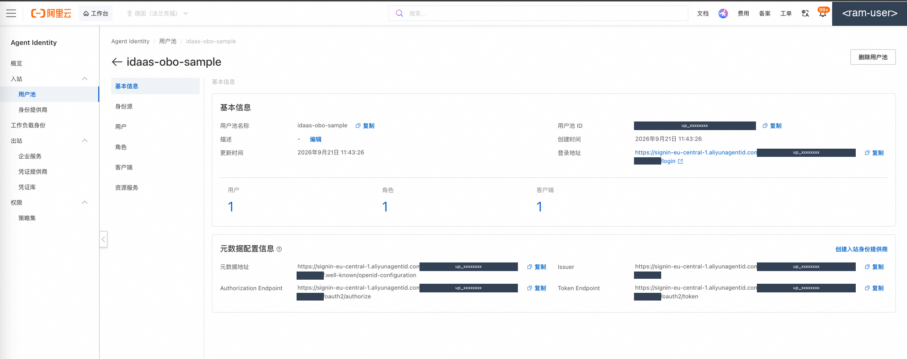

**产出回填 `.env`**：

```ini
USER_POOL_ID=up_xxxxxxxxxxxxxxxxxxxxxxxxxxxxxxxx
```

（`SIGNIN_BASE_URL` 由 `REGION` + `ENVIRONMENT` 自动派生，一般无需手工回填；仅需覆盖时才在用户池详情页取值。）

> **等价的 API/CLI 方式**：
> ```bash
> aliyun agentidentity create-user-pool --user-pool-name idaas-obo-sample-pool
> # 查询已有池（按名复用）：
> aliyun agentidentity list-user-pools
> ```
> 参数名以 `aliyun agentidentity <子命令> --help` 输出为准。

---

## 步骤 2：接入 IDaaS（身份源联邦）+ 用户同步

**导航路径**：进入「云身份 Agent Identity → 用户池」→ 点击刚创建的用户池进入详情 → 「身份源」页签 → 点「接入 IDaaS」。

**操作要点**：

1. 点击「接入 IDaaS」，平台一键创建 IDaaS 实例与入站应用（无需手动填写
   clientId/私钥，平台自动完成对接）。
2. 提交后等待**编排相位**依次完成：**绑定 → SCIM 配置 → SSO 配置**。在
   身份源编排/SSO 状态页观察，直至状态为「已启用」（`SSOStatus=Enabled`）。
3. 在 IDaaS 控制台创建演示账户（如 `testuser`），确保该账户可登录。
4. 回到用户池「身份源」页，**开启 SSO 与用户同步**。
5. **设置同步范围**：选择「阿里云 IDaaS」，范围勾选 `ou_root`（全部用户），保存。
6. **执行同步**：点击「立即同步」，等待同步任务完成。
7. **验证**：进入用户池「用户列表」，确认 `testuser` 已出现在池中。
8. 本步骤无需向 `.env` 抄录任何值——编排完成且同步成功即可。

> **JIT 首登建档与用户同步的关系**：用户同步是「演示前预置」，确保池中已有账户可供登录；
> JIT（Just-In-Time）首登建档是「运行时兼容」，当用户池开启了 JIT，即使未执行同步，
> 首次联邦登录时也会自动在池中建档。本样例推荐先执行同步（可控、可预期），
> JIT 作为安全网兼容未同步场景。


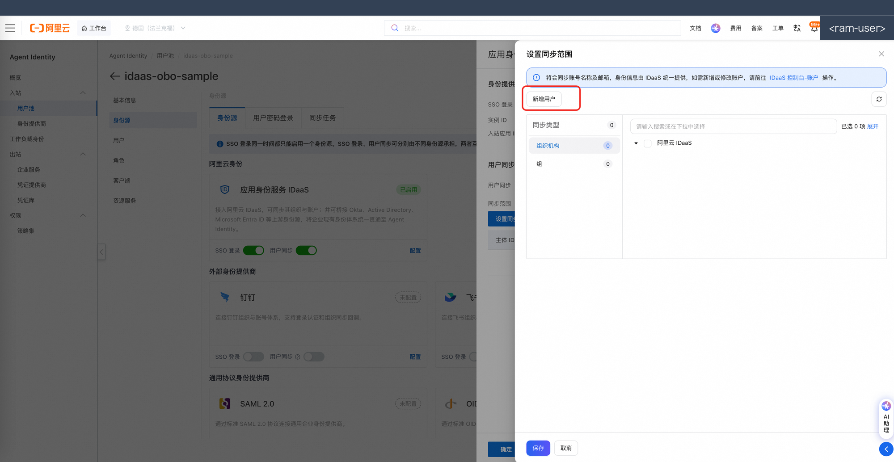

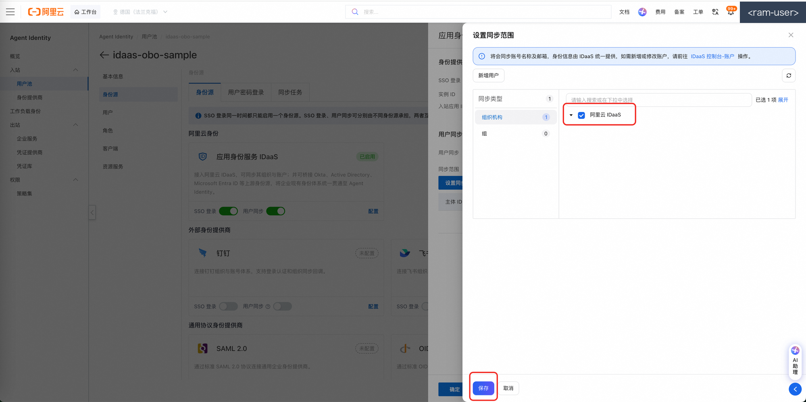

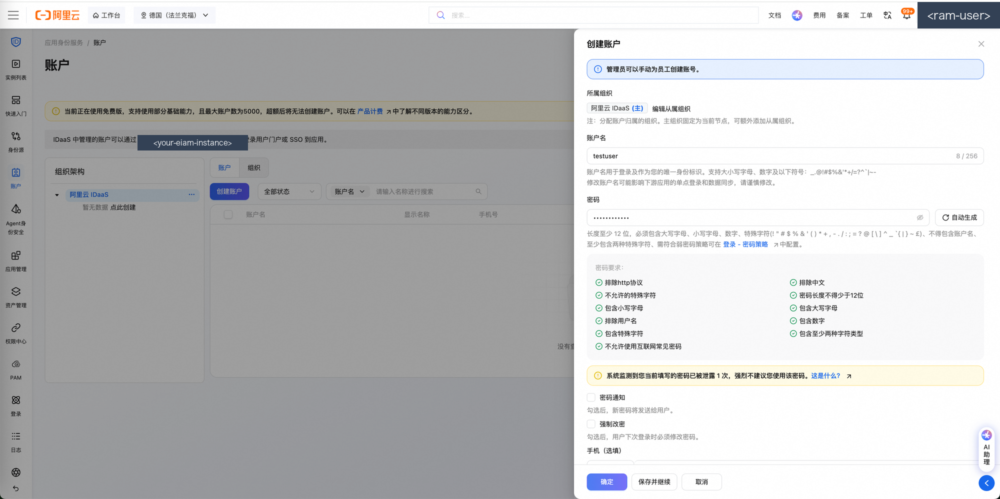

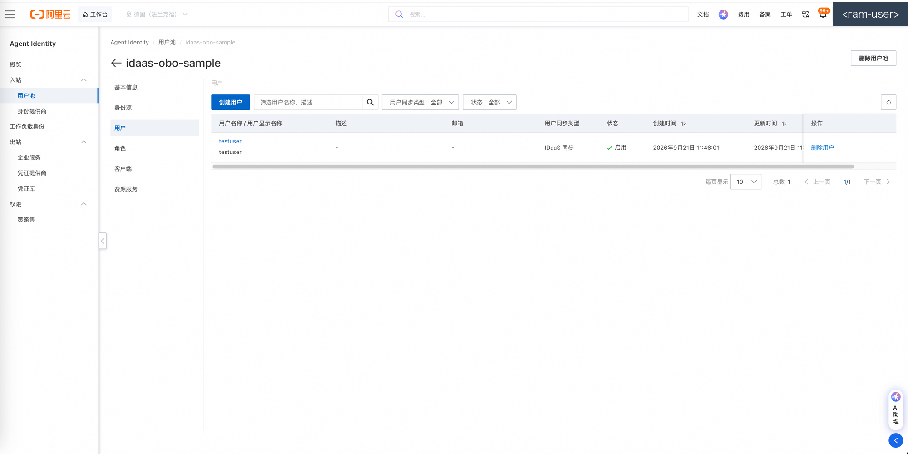

> **等价的 API/CLI 方式**：
> ```bash
> aliyun agentidentity set-specific-identity-provider \
>   --user-pool-name idaas-obo-sample-pool --identity-provider-type IDaaS ...
> aliyun agentidentity get-specific-identity-provider \
>   --user-pool-name idaas-obo-sample-pool --identity-provider-type IDaaS
> ```
> ⚠️ 注意：aliyun CLI 帮助标注 `SetSpecificIdentityProvider` 当前**仅支持
> DingTalk** 类型（预发实测；新加坡正式环境实测该 API 仅接受 DingTalk /
> Feishu / WeCom，**IDaaS 类型必须控制台人工绑定**）。IDaaS 类型的绑定以
> **控制台操作为准**；脚本绑定被拒绝时会打印兑底指引并继续后续步骤，请在
> 控制台完成本步骤后再重跑 setup（幂等，会跳过已完成步骤）。

---

## 步骤 3：（可选）开启 SCIM provisioning

**导航路径**：用户池详情 →「设置」→「身份源 / SCIM 配置」→ 开启 SCIM provisioning。

**操作要点**：

- 开启后记录 **SCIM 端点**（Base URL）与凭证获取方式。
- **本 sample 主线不依赖 SCIM**：员工首次联邦登录时用户池会自动 JIT 建档，
  演示链路无需预置用户。SCIM 预置（`externalId` = IDaaS `sub`）适合需要在
  首登前控制用户组/账号状态的进阶场景，详见 [architecture.md 的 SCIM 一节](./architecture.md#scim-positioning)。
- `setup --mode=script --with-scim` 仅打印指引，不做自动化。

（本步骤无专属截图；如控制台无 SCIM 入口，说明当前产品版本未开放，跳过即可。）

---

## 步骤 4：创建池 OAuth 应用（数据面登录客户端）

**导航路径**：用户池详情 →「OAuth 客户端」→ 点击「创建」。

**操作要点**：

1. 客户端名称自定（池内唯一，例如 `idaas-obo-sample-cli`）。
2. **回跳地址（redirect_uri 白名单）必须包含一条 loopback 条目**：
   `http://127.0.0.1:8765/callback`。白名单中含任意一条 loopback 条目
   （`localhost` 或 `127.0.0.1`）即放行且**忽略端口**——所以 `login --port`
   换端口时无需回控制台改白名单。
3. 建议开启**强制 PKCE**；同时按提示创建**客户端密钥**（机密客户端，
   token 兑换时需要 `client_secret`）。
4. 记录 **ClientId**（`client_` 前缀）与 **ClientSecret**（只展示一次，妥善保存）。


**产出回填 `.env`**：

```ini
OAUTH_CLIENT_ID=client_xxxxxxxxxxxxxxxxxxxxxxxxxxxxxxxx
OAUTH_CLIENT_SECRET=<创建密钥时获得的值>
OAUTH_REDIRECT_URI=http://127.0.0.1:8765/callback
```

> **等价的 API/CLI 方式**：
> ```bash
> aliyun agentidentity create-user-pool-client \
>   --user-pool-name idaas-obo-sample-pool --client-name idaas-obo-sample-cli \
>   --redirect-ur-is http://127.0.0.1:8765/callback \
>   --enforce-pkce true --secret-required true
> # 密钥单独创建：
> aliyun agentidentity create-client-secret \
>   --user-pool-name idaas-obo-sample-pool --client-name idaas-obo-sample-cli
> ```
> ⚠️ CLI 多值参数（如 `--redirect-ur-is`）必须传 **JSON 数组单参数**
> （`'["a","b"]'`）；空格分隔只取第一个值。`UpdateUserPoolClient` 是**整体
> 替换**语义，任何写操作后请回读校验（写后必读），避免白名单丢条目。

---

## 步骤 5：授权企业服务（平台自动创建 OBO 凭证提供商）

本步骤分为两段：① Agent Identity 控制台「授权企业服务」（平台自动创建
provider）；② IDaaS 控制台添加 M2M 应用并配置授权。

### 5a. 授权企业服务（Agent Identity 控制台）

**导航路径**：「云身份 Agent Identity」→「企业服务」页 → 点「授权企业服务」。

> **包装层关系**：「企业服务」是平台对 ON_BEHALF_OF/IDaaS 凭证提供商的包装入口——
> 控制台不单独暴露「凭证提供商创建/详情」入口，企业服务页即 provider 页。
> 点「授权企业服务」即自动创建该 provider；企业服务详情页展示的就是
> provider 的名称/ARN/IDaaS 实例绑定。授权类型 ON_BEHALF_OF(OBO) 与厂商 IDaaS
> 由平台设定、无手工表单。

**操作要点**：

1. 点击「授权企业服务」按钮，平台自动创建 ON_BEHALF_OF/IDaaS 凭证提供商。
   - **授权类型**：ON_BEHALF_OF(OBO)——由平台设定，无表单可填；
   - **厂商**：IDaaS——由平台设定，无表单可填；
   - **企业服务（即 OBO 凭证提供商）名称**：平台自动生成（UUID 形态，如 `idaas-xxxxxxxx-…`），
     样例自动发现，无需抄录；
   - **每账号配额 = 1**：已存在时复用，无需重复创建。
2. 创建完成后在企业服务详情页可见自动生成的 provider 名称/ARN/IDaaS 实例信息。
   → 记录 `OBO_PROVIDER_NAME`（详情页可见）。


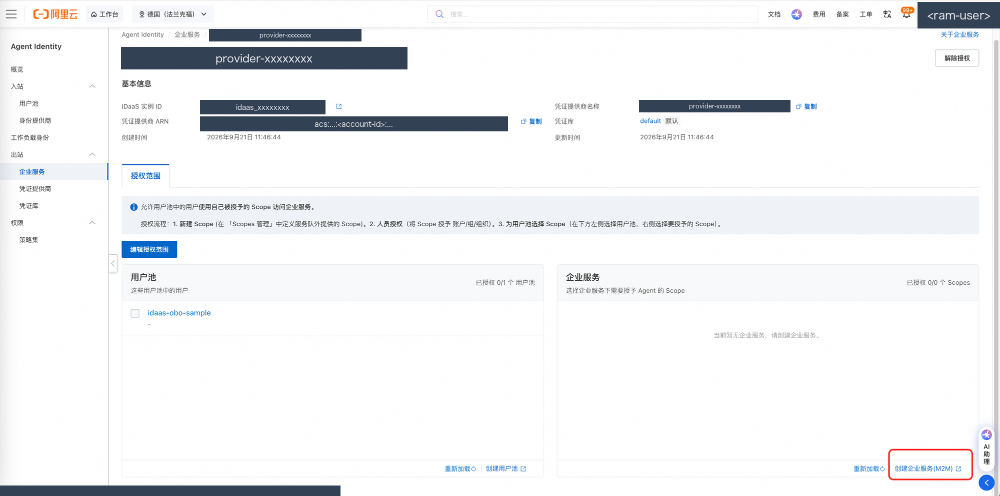

### 5b. M2M 应用授权四连（IDaaS 控制台 + Agent Identity 控制台）

| 序号 | 入口 | 操作 | 预期结果 |
|---|---|---|---|
| 1 | IDaaS 控制台 →「应用」→「添加应用」 | 添加 M2M 应用（模拟订单服务） | M2M 应用创建成功，可进入应用详情 |
| 2 | M2M 应用详情 →「功能权限开放」 | 填受众 `test-aud`（即 `ORDER_SERVICE_AUDIENCE`） | 受众标识设置成功 |
| 3 | 同页 Scopes 区域 | 增加 `read:all` 与 `write:all`，授权方式选「自动授权」 | 双 Scope 已添加且授权方式=自动 |
| 4 | 回 Agent Identity 控制台 →「编辑授权范围」 | 勾选用户池 + 双 Scope（`read:all`、`write:all`），提交 | 授权范围生效，OBO 可携带该 Scope |

> ❗ `ORDER_SERVICE_AUDIENCE` 填 M2M 应用「功能权限开放」页的受众标识（如 `test-aud`）；
> **不是** provider 的 OutboundAudience（`agent-…` 形态）——误传报
> `Forbidden.IdaasRsNotAuthorized`（正式环境实测）。

> ❗ `ORDER_SERVICE_SCOPES` 必须与控制台授权 scope **逐字一致**（德国实测控制台为
> `read:all` 与 `write:all`）。超出授权范围将报 `Forbidden.ScopeNotGranted`。


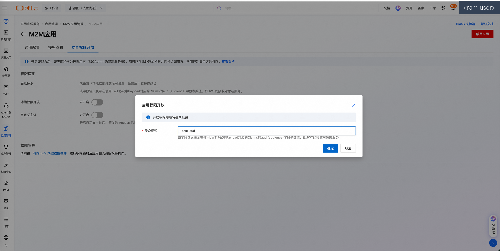

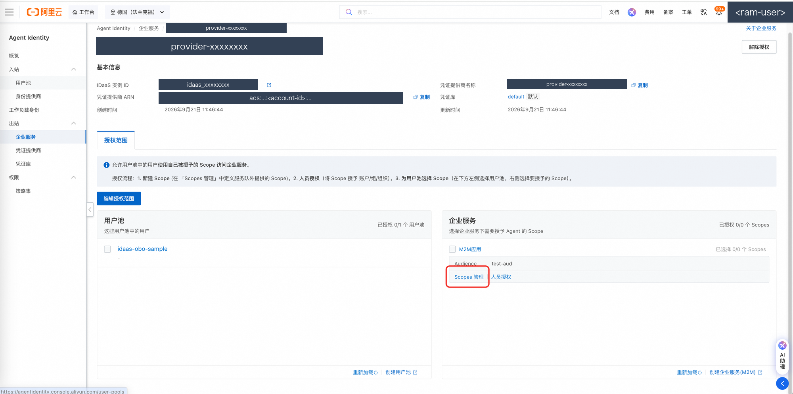

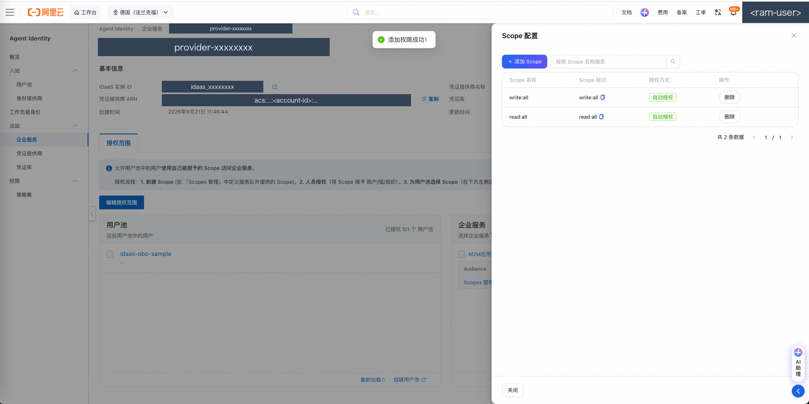

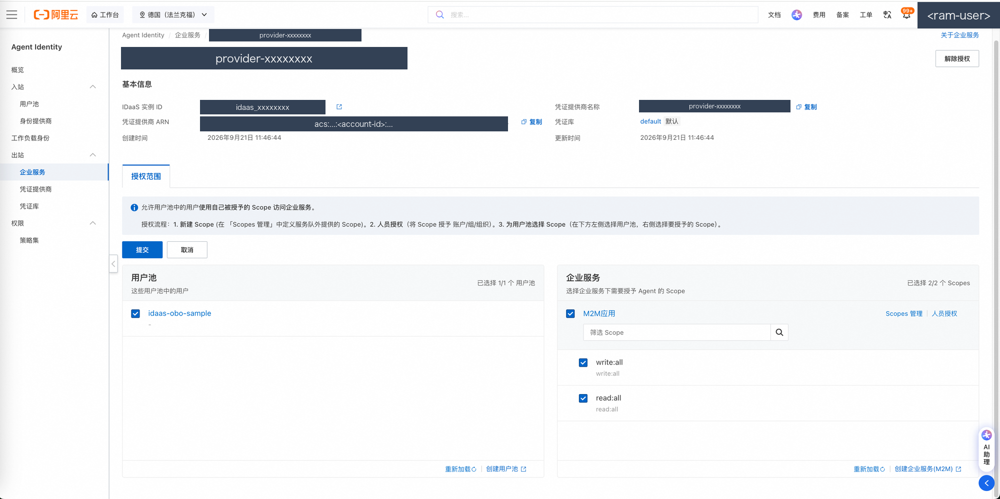

**产出回填 `.env`**：

```ini
OBO_PROVIDER_NAME=<企业服务（即 OBO 凭证提供商）名称为平台自动生成，样例自动发现，无需抄录；仅显式覆盖时才填>
ORDER_SERVICE_AUDIENCE=test-aud
```

> **平台托管口径**：provider 与 M2M 密钥均由平台托管，客户无需配置 clientId/clientSecret。
> CLI 无等价操作——「授权企业服务」仅控制台可操作。
> ❗ 实测**每个账号凭证提供商配额 = 1**：已存在时会提示复用；如需重建须先
> 删除旧 provider（注意会影响引用它的既有链路）。查询列表（ListOAuth2CredentialProviders）
> **不要带分页参数**，带分页参数预发实测报 `ServiceUnavailable`。

---

## 步骤 6：创建工作负载身份（OBO 委托主体）+ 关联 RAM 角色

本步骤创建两样东西：**IdentityProvider**（信任本池的 discovery）与
**WorkloadIdentity**（OBO 的委托主体），并关联运行时 RAM 角色以获取数据面权限。

**导航路径（IdentityProvider）**：进入「云身份 Agent Identity」→「身份提供商」
→「创建」，discovery 地址填本池的：
`https://{DATA_ENDPOINT}/{USER_POOL_ID}/.well-known/openid-configuration`
（`DATA_ENDPOINT` 形态 `agentidentitydata.<region>.aliyuncs.com`）。

**导航路径（WorkloadIdentity）**：进入「云身份 Agent Identity」→「工作负载身份」
→「创建」，关联上一步的 IdentityProvider。

**操作要点**：

1. **务必开启 SessionBindingEnabled（会话绑定）**——否则后续 OBO 报
   `Forbidden.InboundCredentialMissing`。
2. 记录工作负载身份名（例如 `wi-idaas-obo`）——回填 `WI_NAME`。
3. **关联入站 IdP**：选择步骤 1 自动创建的入站身份提供商（如 `idp-idaas-obo-sample`）。
4. **关联运行时 RAM 角色**：点击「快速授权」挂载 AgentIdentityData 类策略
   （OBO 数据面权限前提，授权后 WI 才能调用 GetResourceOAuth2Token 等数据面 API）。
5. `SIGNIN_BASE_URL` / `ORDER_SERVICE_ISSUER` / `ORDER_SERVICE_JWKS_URI`
   由样例自动派生或运行时经 discovery 拉取，**无需手工抄录**，仅显式覆盖时才取。
   `POOL_JWKS_BASE` 留空即可：仅当 `.env` 中**显式声明**
   `ENVIRONMENT=production` 时才自动镜像为 `SIGNIN_BASE_URL`；否则保持留空
   走 `DATA_ENDPOINT`（向后兼容）。
6. 如需手动核对或显式覆盖 `ORDER_SERVICE_ISSUER` / `ORDER_SERVICE_JWKS_URI`，可
   浏览器/curl 请求 IDaaS 实例的 discovery：

   ```bash
   curl https://<your-eiam-instance>.aliyunidaas.com/api/v2/iauths_system/oauth2/.well-known/openid-configuration
   ```

   返回 JSON 中的 `issuer` / `jwks_uri` 即 sample 自动拉取的权威值（公网可达）。


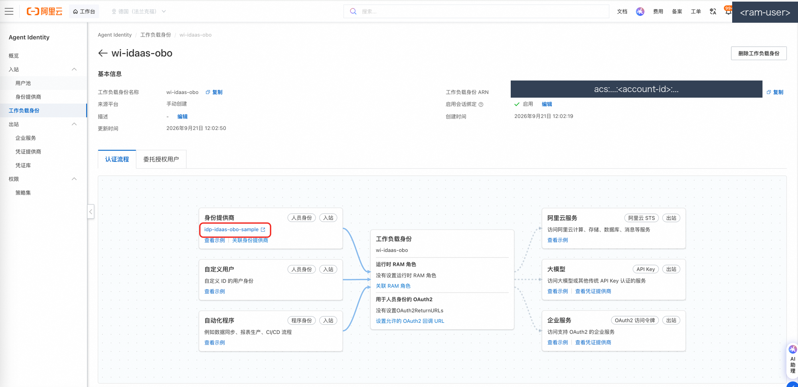

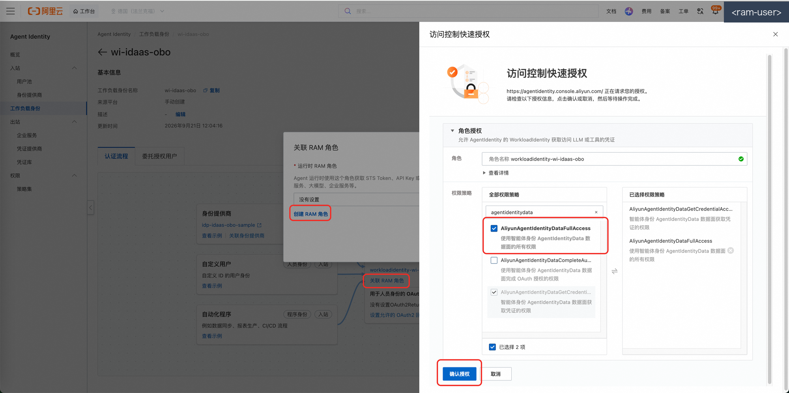

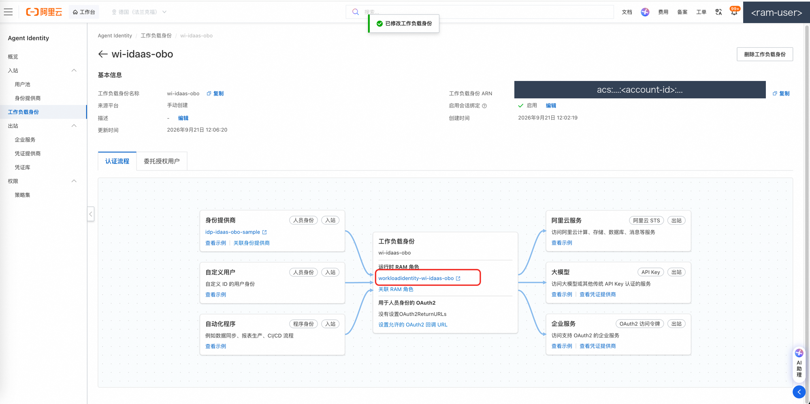

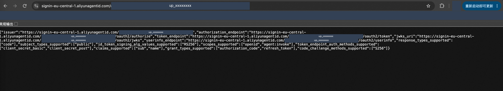

**产出回填 `.env`**：

```ini
WI_NAME=wi-idaas-obo
```

（`SIGNIN_BASE_URL` 由 `REGION` + `ENVIRONMENT` 自动派生、`POOL_JWKS_BASE` 仅在
显式声明 `ENVIRONMENT=production` 时镜像为 `SIGNIN_BASE_URL`（否则留空走
`DATA_ENDPOINT`）、`ORDER_SERVICE_ISSUER` 与 `ORDER_SERVICE_JWKS_URI` 由
`IDAAS_ORIGIN` 自动拉 discovery 填充，均无需手工回填；仅需覆盖时才显式填写，
显式值永远优先。）

> **等价的 API/CLI 方式**：
> ```bash
> aliyun agentidentity create-identity-provider \
>   --identity-provider-name idp-idaas-obo-sample \
>   --discovery-url https://agentidentitydata.<region>.aliyuncs.com/up_xxxxxxxx…/.well-known/openid-configuration
> aliyun agentidentity create-workload-identity \
>   --workload-identity-name wi-idaas-obo \
>   --identity-provider-name idp-idaas-obo-sample \
>   --session-binding-enabled true
> ```

---

## 手动删除资源（模式 A / 手动配置的清理路径）

`python3 sample.py cleanup` 只会删除 `setup --mode=script` 记录在
`.tokens/created_resources.json` 清单内的资源；**手动创建（模式 A）的资源不在
清单内，cleanup 会拒绝删除并指向本节**。请按下列逆序在控制台手动删除
（先删依赖方、后删被依赖方；每步都先核对名称与地域再点删除）：

| 顺序 | 删除什么 | 入口 |
|---|---|---|
| 1 | OAuth2 凭证提供商（配额=1，删除前确认无其他链路引用） | 「凭证提供商」列表 → 删除 |
| 2 | 工作负载身份 | 「工作负载身份」列表 → 删除 |
| 3 | IdentityProvider | 「身份提供商」列表 → 删除 |
| 4 | 池 OAuth 客户端（密钥随客户端一并失效） | 用户池详情 → 「OAuth 客户端」→ 删除 |
| 5 | 用户池（会移除池内全部客户端/会话数据，不可恢复） | 「用户池」列表 → 删除 |

> 注意：订单服务等 IDaaS 侧应用不在 Agent Identity 管辖范围，如需一并清理
> 请到 IDaaS 控制台对应应用页操作。
>
> 等价的 API/CLI 方式（示例，参数名以 `--help` 为准）：
> ```bash
> aliyun agentidentity delete-oauth2-credential-provider --oauth2-credential-provider-name <名称>
> aliyun agentidentity delete-workload-identity --workload-identity-name <名称>
> aliyun agentidentity delete-identity-provider --identity-provider-name <名称>
> aliyun agentidentity delete-user-pool-client --user-pool-name <池名> --client-name <客户端名>
> aliyun agentidentity delete-user-pool --user-pool-name <池名>
> ```

---

## 抄录完成后

1. 运行体检，逐项确认缺失项已补齐：

   ```bash
   python3 sample.py --check
   ```

以下为本地终端三段文字实录（占位 `.env` + 空凭据环境实测，退出码以当前代码行为为准）：

① `env.template` 的 3 项必填（`REGION`、`ORDER_SERVICE_AUDIENCE`、`IDAAS_ORIGIN`）：

```console
$ cat .env
REGION=eu-central-1
ORDER_SERVICE_AUDIENCE=test-aud
IDAAS_ORIGIN=https://your-eiam-instance.cloud-idaas.com

$ echo $?
0
```

② `python3 sample.py --check` 的离线体检报告（资源 ID 未回填故体检未通过，退出码 1）：

```console
$ python3 sample.py --check
[check] 环境体检（.env 文件：<sample-dir>/.env）

  [OK] REGION = eu-central-1
  [OK] ENVIRONMENT = production（已派生）
  [OPTIONAL-EMPTY] ALIYUN_ACCESS_KEY_ID（可选，未填，走凭据链）
  [OPTIONAL-EMPTY] ALIYUN_ACCESS_KEY_SECRET（可选，未填，走凭据链）
  [OPTIONAL-EMPTY] ALIYUN_SECURITY_TOKEN（可选，未填，走凭据链）
  [OK] CONTROL_ENDPOINT = agentidentity.eu-central-1.aliyuncs.com（已派生）
  [OK] DATA_ENDPOINT = agentidentitydata.eu-central-1.aliyuncs.com（已派生）
  [OK] SIGNIN_BASE_URL = https://signin-eu-central-1.aliyunagentid.com（已派生）
  [OPTIONAL-EMPTY] POOL_JWKS_BASE（可选，未填）
  [MISSING] USER_POOL_ID
            -> 在哪取值：用户池 ID（up_ 前缀）：setup 产出，或控制台「用户池」列表抄录。
  [MISSING] OAUTH_CLIENT_ID
            -> 在哪取值：池 OAuth 客户端 ID（client_ 前缀）：setup 产出，或控制台用户池详情「OAuth 客户端」页抄录。
  [MISSING] OAUTH_CLIENT_SECRET
            -> 在哪取值：池 OAuth 客户端密钥：setup 产出，或控制台客户端详情创建密钥后抄录；也可只填 OAUTH_CLIENT_SECRET_FILE（0600 文件优先）。
  [OPTIONAL-EMPTY] OAUTH_CLIENT_SECRET_FILE（可选，未填）
  [OK] OAUTH_REDIRECT_URI = http://127.0.0.1:8765/callback（已派生）
  [MISSING] WI_NAME
            -> 在哪取值：工作负载身份名：setup 产出，或控制台「工作负载身份」列表抄录（须 SessionBindingEnabled=true，否则 OBO 报 InboundCredentialMissing）。
  [MISSING] OBO_PROVIDER_NAME
            -> 在哪取值：出站资源凭证提供商名：setup 产出，或控制台「凭证提供商」列表抄录（配额=1，若已存在将提示复用）。
  [OK] ORDER_SERVICE_AUDIENCE = test-aud
  [OK] ORDER_SERVICE_SCOPES = write:all（已派生）
  [OPTIONAL-EMPTY] ORDER_SERVICE_ISSUER（可选，未填）
  [OPTIONAL-EMPTY] ORDER_SERVICE_JWKS_URI（可选，未填）
  [OK] IDAAS_ORIGIN = https://your-eiam-instance.cloud-idaas.com

[check] ENVIRONMENT 生效值：production（来源：未在 .env/环境变量声明，默认 production）

[check] 体检未通过：存在缺失项。请编辑 <sample-dir>/.env 补齐上述 [MISSING] 项后重试；若用控制台准备资源，先运行 python3 sample.py setup --mode=console 查看点选清单。

[check] 凭据链状态（离线体检：不触发网络 / 刷新 / 写盘）：
  [1] .env 显式 ALIYUN_ACCESS_KEY_*：未填（两项均空/占位）→ 交凭据链降级
  [2] alibabacloud_credentials SDK：已安装（离线口径不调用 get_credential()，
      实际是否命中请用 --creds-live 确认）
  [3] 标准库 ~/.aliyun/config.json（只读）：不可用
        未找到 aliyun CLI 配置文件：<empty-temp-home>/aliyun-config.json。标准库降级路径需要 `aliyun configure` 生成的 profile。请任选一种方式修复：
          1) 执行 `aliyun configure --profile default --mode AK` 配置 AK/SK；
          2) 或安装 `alibabacloud-credentials` 走 SDK 主路径（支持更多凭据源）；
          3) 或在 sample .env 显式填 ALIYUN_ACCESS_KEY_ID/SECRET（最高优先）。
  提示：离线体检只报告各级「能力」，不判定最终生效级（SDK 级需真实调用）。
       运行 python3 sample.py --check --creds-live 获取精确命中级别与来源。

[check] 令牌产物（.tokens/，0600）：
  [ABSENT] id_token（尚未生成）
  [ABSENT] wat（尚未生成）
  [ABSENT] order_at（尚未生成）
  order_rt: 不存在

$ echo $?
1
```

③ `setup --mode=console` 打印的 6 步资源清单（纯打印、不触云，退出码 0）：

```console
$ python3 sample.py setup --mode=console
==================== 管控面资源准备清单（模式 A：控制台点选） ====================
按编号在阿里云控制台完成以下步骤，把产出抄录进 .env（详见
docs/control-plane-console.md，含每步的入口路径与 CLI 等价命令）。

1. 创建用户池
   控制台「云身份 Agent Identity → 用户池 → 创建」，名称自定（3~64 字符）。
   → 记录 USER_POOL_ID（up_ 前缀）
   （CLI 等价：aliyun agentidentity create-user-pool --user-pool-name <名称>）

2. 接入 IDaaS（身份源联邦）
   用户池详情 →「身份源」页签 →「接入 IDaaS」，平台一键创建 IDaaS 实例与入站应用。
   创建完成后在 IDaaS 控制台建演示账户（如 testuser），开启 SSO 与用户同步、
   设置同步范围（阿里云 IDaaS/ou_root）、执行同步，验证池用户列表出现该账户。
   → 无需抄录（SSOStatus=Enabled 且用户同步成功即可）
   （CLI 等价：aliyun agentidentity set-specific-identity-provider /
    get-specific-identity-provider —— 注意 CLI 帮助标注当前仅支持 DingTalk，
    IDaaS 绑定以控制台操作为准）

3. （可选）开启 SCIM provisioning，记录 SCIM 端点
   本 sample 主线不依赖 SCIM（首次登录自动 JIT 建档），可跳过。

4. 创建池 OAuth 应用（数据面登录客户端）
   用户池详情 → OAuth 客户端 → 创建：回跳地址（redirect_uri 白名单）必须包含
   http://127.0.0.1:8765/callback（含任意一条 loopback 条目即放行且忽略端口），
   建议开启强制 PKCE。
   → 记录 OAUTH_CLIENT_ID 与 OAUTH_CLIENT_SECRET
   （CLI 等价：aliyun agentidentity create-user-pool-client --redirect-ur-is
    http://127.0.0.1:8765/callback --enforce-pkce true --secret-required true；
    密钥用 create-client-secret）

5. 授权企业服务（平台自动创建 OBO 凭证提供商）
   控制台「企业服务」页 → 点「授权企业服务」，平台自动创建 ON_BEHALF_OF/IDaaS
   凭证提供商（每账号配额 1，名称为平台自动生成 UUID 形态，无需手建）。
   随后在 IDaaS 控制台添加 M2M 应用 →「功能权限开放」填受众 test-aud、
   Scopes 增 read:all 与 write:all 并选自动授权 → 回控制台「编辑授权范围」
   勾选用户池 + 双 Scope 提交。
   provider 与 M2M 密钥均平台托管，客户无需配置。
   → 记录 OBO_PROVIDER_NAME（控制台企业服务详情页可见）与
     ORDER_SERVICE_AUDIENCE（IDaaS M2M 应用功能权限开放页的受众标识，如 test-aud；
     不是 provider 的 OutboundAudience agent-… 形态）
   （CLI 等价：无——授权企业服务仅控制台操作）

6. 创建工作负载身份（OBO 委托主体）
   创建 IdentityProvider（discovery 指向本池）与 WorkloadIdentity
   （务必开启 SessionBindingEnabled，否则 OBO 报 InboundCredentialMissing）。
   关联入站 IdP、关联运行时 RAM 角色并「快速授权」挂 AgentIdentityData 类策略
   （OBO 数据面权限前提）。
   → 记录 WI_NAME；
   → SIGNIN_BASE_URL / ORDER_SERVICE_ISSUER / ORDER_SERVICE_JWKS_URI
     由样例自动派生或运行时经 discovery 拉取，无需手工抄录；
     仅显式覆盖时才取。
   （CLI 等价：aliyun agentidentity create-identity-provider /
    create-workload-identity --session-binding-enabled true）

抄录完成后运行：python3 sample.py --check 体检，随后 python3 sample.py login。
=================================================================================

提示：所有 <YOUR_...> 占位符在 <sample-dir>/.env 中替换；SCIM 为可选能力，主线无需配置。
提示：偏好脚本一键创建可改用：python3 sample.py setup --mode=script

$ echo $?
0
```

2. 开始数据面四步（或一键 `demo`）：

   ```bash
   python3 sample.py login
   ```

偏好脚本一键创建？改用模式 B：`python3 sample.py setup --mode=script`
（凭据走凭据链——`aliyun configure` 一次即可，或在 `.env` 显式填 AK/SK；幂等，
已完成步骤自动跳过——详见 README 的 Resource Setup 与「🔑 凭据链」两节）。
